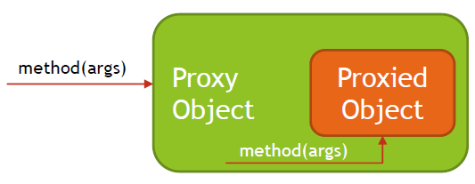

## Container, Dependency Injection and IoC

### What is dependency injection and what are the advantages?

Dependency Injection is a technique where objects don't create their own dependencies. Instead, they declare what they need, and the framework supplies these dependencies to the objects.

**Types of Dependency Injection:**
- Constructor Injection
- Setter Injection
- Interface Injection

**Advantages of using Dependency Injection**
- Increases code reusability
- Increases code readibility
- Increases code maintainability
- Increases code testability
- Reduces coupling
- Increases cohesion

> [!NOTE]  
> Dependency Injection is a design pattern that solves the problem of flexible dependencies creation

> [!IMPORTANT]
> It is recommended to use interface for creating Spring beans as it allows for 
> - use of JDK Dynamic proxy
> - hides the implementation details
> - easily switch the beans

### What is meant by Application Context?

Application Context is a central part of Spring application. It holds bean definitions and contains registry of application components. It allows you to retrieve assembled and configured beans.

**Application Context:**
- Initiates Beans
- Configures Beans
- Assemblies Beans
- Manages Beans Lifecycle
- Is a Bean Factory
- Is a Resource Loader
- Has ability to push events to registered even listeners
- Exposes Environment which allows to resolve properties

**Common Application Context types:**
- AnnotationConfigApplicationContext
- AnnotationConfigWebApplicationContext
- ClassPathXmlApplicationContext
- FileSystemXmlApplicationContext
- XmlWebApplicationContext

### What is the concept of a "Container" and what is its lifecycle?

Container is an execution environment which provides additional technical services for your code to use. Usually containers use IoC technique, that allows you to focus on
creating business aspect of the code, while technical aspects like communication details (HTTP, REST, SOAP) are provided by execution environment.

Spring provides a container for beans. It manages lifecycle of the beans and also provides additional services through usage of Application Context.

**Spring Container Lifecycle:**
1. Application is started.
1. Spring container is created.
1. Containers reads configuration.
1. Beans definitions are created from configuration.
1. BeanFactoryPostProcessors are processing bean definitions.
1. Instances of Spring Beans are created.
1. Spring Beans are configured and assembled - resolve property values and inject dependencies
1. BeanPostProcessors are called.
1. Application Runs.
1. Application gets shutdown.
1. Spring Context is closed.
1. Destruction callbacks are invoked.

### How are you going to create a new instance of an ApplicationContext?

**Non Web Applications Way:**
- AnnotationConfigApplicationContext
- ClassPathXmlApplicationContext
- FileSystemXmlApplicationContext
 
**Web Applications Way:**
- Servlet 2 - web.xml, ContextLoaderListener, DispatcherServlet
- Servlet 3 - XmlWebApplicationContext
- Servlet 3 - AnnotationConfigWebApplicationContext

**Spring Boot Way:**
- SpringBootConsoleApplication CommandLineRunner
- SpringBootWebApplication Embedded Tomcat

### Can you describe the lifecycle of a Spring Bean in an ApplicationContext?

1. Context is Created:
   1. Beans Definitions are created based on Spring Bean Configuration.
   2. BeanFactoryPostProcessors are invoked.

1. Bean is Created:
   1. Instance of Bean is Created.
   2. Properties and Dependencies are set.
   3. BeanPostProcessor::postProcessBeforeInitialization gets called.
   4. @PostConstruct method gets called.
   5. InitializingBean::afterPropertiesSet method gets called.
   6. @Bean(initMethod) method gets called
   7. BeanPostProcessor::postProcessAfterInitialization gets called.

1. Bean is Ready to use.

1. Bean is Destroyed:
   1. @PreDestroy method gets called.
   2. DisposableBean::destroy method gets called.
   3. @Bean(destroyMethod) method gets
   
### How are you going to create an ApplicationContext in an integration test?

1. Make sure that you have spring test dependency added:

```xml
<dependency>
    <groupId>org.springframework</groupId>
    <artifactId>spring-test</artifactId>
    <scope>test</scope>
</dependency>
```
2. Add Spring Runner to your test
```java
@RunWith(SpringRunner.class)
```
3. Add Context Configuration to your test
```java
@ContextConfiguration(classes = ApplicationConfiguration.class)
```

### What is the preferred way to close an application context? Does Spring Boot do this for you?

- Standalone Non Web Applications
  - Register Shutdown hook by calling ConfigurableApplicationContext#registerShutdownHook - Recommended way
  - Call ConfigurableApplicationContext#close
- Web Application
  - ContextLoaderListener will automatically close context when web container will stop web application
- Spring Boot
  - Application Context will be automatically closed
  - Shutdown hook will be automatically registered
  - ContextLoaderListener applies to Spring Boot Web Applications as well
  
### Can you describe: Dependency Injection using Java Configuration

When using Dependency Injection using Java Configuration you need to explicitly define all your beans and you need to use @ Autowire on @Bean method level to inject dependencies.

```java
@Configuration
public class ApplicationConfiguration {
    @Bean
    @Autowired
    public SpringBean1 springBean1(SpringBean2 springBean2, SpringBean3 springBean3) {
        return new SpringBean1(springBean2, springBean3);
    }

    @Bean
    public SpringBean2 springBean2() {
        return new SpringBean2();
    }

    @Bean
    public SpringBean3 springBean3() {
        return new SpringBean3();
    }
}
```

### Can you describe: Dependency Injection using annotations (@Component, @Autowired)

- Create classes annotated with @Component annotations
```java
@Component
public class SpringBean1
```
```java
@Component
public class SpringBean2
```
```java
@Component
public class SpringBean3
```
- Define dependencies when required
```java
@Autowired
private SpringBean2 springBean2;

@Autowired
private SpringBean3 springBean3;
```
- Create Configuration with Component Scanning Enabled
```java
@ComponentScan
public class ApplicationConfiguration {
}
```

### Can you describe: Component scanning

Process in which Spring is scanning Classpath in search for classes annotated with stereotypes annotations (@Component, @Repository, @Service, @Controller, …) and based on those creates beans definitions.

- Simple component scanning within Configuration package and all subpackages
```java
@ComponentScan
public class ApplicationConfiguration {
}
```

- Advanced Component Scanning Rules
```java
@ComponentScan(
	basePackages = "com.codeleapster.spring.notes.module01.question10.annotations.beans",
	//basePackageClasses = SpringBean1.class,
	includeFilters = @ComponentScan.Filter(type = FilterType.REGEX, pattern = ".*Bean.*"),
	excludeFilters = @ComponentScan.Filter(type = FilterType.REGEX, pattern = ".*Bean1.*")
)
public class ApplicationConfigurationAdvanced {
}
```
### Can you describe: Sterotypes

Stereotypes are annotations applied to classes to describe role which will be performed by this class. Spring discovered classes annotated by stereotypes and creates bean definitions based on those types.

**Types of stereotypes:**
- Component - generic component in the system, root stereotype, candidate for autoscanning
- Service - class will contain business logic
- Repository - class is a data repository (used for data access objects, persistence)
- Controller - class is a controller, usually a web controller (used with @ RequestMapping

### Can you describe: Meta-Annotations

Meta-annotations are annotations that can be used to create new annotations.

**Example of Meta-Annotation:**
@RestController annotation is using @Controller and ResponseBody to define its behavior
```java
@Target({ElementType.TYPE})
@Retention(RetentionPolicy.RUNTIME)
@Documented
@Controller
@ResponseBody
public @interface RestController {
    @AliasFor(
        annotation = Controller.class
    )
    String value() default "";
}
```

### Can you describe: Scopes for Spring beans. What is the default scope?

|Scope|Description|
|--------|-------|
|Singleton|Single Bean per Spring Container - Default|
|Prototype| New Instance each time Bean is Requested|
|Request| New Instance per each HTTP Request|
|Session|New Instance per each HTTP Session|
|Application|One Instance per each ServletContext|
|Websocket|One Instance per each WebSocket|

### Are beans lazily or eagerly instantiated by default? How do you alter this behavior?

**Lazy and Eager Instance Creation vs Scope Type:**
- Singleton Beans are eagerly instantiated by default
- Prototype Beans are lazily instantiated by default (instance is created when bean is requested)
  - …however, if Singleton Bean has dependency on Prototype Bean, then Prototype Bean Instance will be created eagerly to satisfy dependencies for Singleton Bean

**Altering Behavior:**
- You can change default behavior for all beans by @ComponentScan annotation
  ```java
  @ComponentScan(lazyInit = true)
  ```
  - Setting lazyInit to true, will make all beans lazy, even Singleton Beans
  - Setting lazyInit to false (default), will create Singleton Beans Eagerly and Prototype Beans Lazily
- You can also change default behavior by using @Lazy annotation:
  - @Lazy annotation takes one parameter - Whether lazy initialization should occur
  - By default @Lazy is used to mark bean as lazily instantiated
  - You can use @Lazy(false) to force Eager Instantiation - use case for @ComponentScan(lazyInit = true ) when some beans always needs to be instantiated eagerly
- @Lazy can be applied to
  - Classed annotated with @Component makes bean Lazy or as specified by @Lazy parameter
  - Classes annotated with @Configuration annotation make all beans provided by configuration lazy or as specified by @Lazy parameter
  - Method annotated with @Bean annotation makes bean created by method Lazy or as specified by @Lazy parameter

### What is a property source? How would you use @PropertySource?

PropertySource is Spring Abstraction on Environment Key-Value pairs, which can come from:
- JVM Properties
- System Environmental Variables
- JNDI Properties
- Servlet Parameters
- Properties File Located on Filesystem
- Properties File Located on Classpath

You read properties with usage of @PropertySource or @PropertySources annotation:
```java
@PropertySources({
        @PropertySource("file:${app-home}/app-db.properties"),
        @PropertySource("classpath:/app-defaults.properties")
})
```

You access properties with the usage of @Value annotation:
```java
@Value("${db.host}")
private String dbHost;
```

### What is a BeanFactoryPostProcessor and what is it used for? When is it invoked? Why would you define a static @Bean method? What is a ProperySourcesPlaceholderConfigurer used for?

BeanFactoryPostProcessor is an interface that contains single method postProcessBeanFactory, implementing it allows you to create logic that will modify Spring Bean Metadata before any Bean is created. BeanFactoryPostProcessor does not create any beans, however it can access and alter Metadata that is used later to create Beans.

BeanFactoryPostProcessor is invoked after Spring will read or discover Bean Definitions, but before any Spring Bean is created. 

Because BeanFactoryPostProcessor is also a Spring Bean, but a special kind of Bean that should be invoked before other types of beans get created, Spring needs to have ability to create it before any other beans. This is why BeanFactoryPostProcessors needs to be registered from static method level.

```java
@Bean
public static CustomBeanFactoryPostProcessor customerBeanFactoryPostProcessor() {
	return new CustomBeanFactoryPostProcessor();
}
```

PropertySourcesPlaceholderConfigurer is a BeanFactoryPostProcessor that is used to resolve properties placeholder in Spring Beans on fields annotated with @Value("${ property_name}").

```java
@Value("${app.env}")
private String appEnv;

@Value("${app.envid}")
private String appEnvId;
```

### What is a *BeanPostProcessor* and how is it different to a BeanFactoryPostProcessor? What do they do? When are they called?

BeanPostProcessor is an interface that allows you to create extensions to Spring Framework that will modify Spring Beans objects during initialization. This interface contains two methods:
- postProcessBeforeInitialization
- postProcessAfterInitialization

Implementing those methods allows you to modify created and assembled bean objects or even switch object that will represent the bean.

Main difference compared to BeanFactoryPostProcessor is that BeanFactoryPostProcessor works with Bean Definitions while *BeanPostProcessor* works with Bean Objects.

*BeanFactoryPostProcessor* and *BeanPostProcessor* in Spring Container Lifecycle
1. Beans Definitions are created based on Spring Bean Configuration.
2. BeanFactoryPostProcessors are invoked.
3. Instance of Bean is Created.
4. Properties and Dependencies are set.
5. *BeanPostProcessor::postProcessBeforeInitialization* gets called.
6. @PostConstruct method gets called.
7. InitializingBean::afterPropertiesSet method gets called.
8. @Bean(initMethod) method gets called
9. *BeanPostProcessor::postProcessAfterInitialization* gets called.

Recommended way to define *BeanPostProcessor* is through static @Bean method in Application Configuration. This is because *BeanPostProcessor* should be created early, before other Beans Objects are ready.

```java
@Bean
public static CustomBeanPostProcessor customerBeanPostProcessor() {
	return new CustomBeanPostProcessor();
}
```

It is also possible to create *BeanPostProcessor* through regular registration in Application Configuration or through Component Scanning and @Component annotation, however because in that case bean can be created late in processes, recommended way is options provided above.

### What is an initialization method and how is it declared on a Spring bean?

Initialization method is a method that you can write for Spring Bean if you need to perform some initialization code that depends on properties and/or dependencies injected into Spring Bean.

You can declare Initialization method in three ways:
- Create method in Spring Bean annotated with *@PostConstruct*
- Implement *InitializingBean::afterPropertiesSet*
- Create Bean in Configuration class with *@Bean* method and use @Bean(initMethod)

### What is destroy method, how is it declared?

Destroy method is a method in Spring Bean that you can use to implement any cleanup logic for resources used by the Bean. Method will be called when Spring Bean will be taken out of use, this is usually happening when Spring Context is closed.

You can declare destroy method in following ways:
- Create method annotated with *@PreDestroy* annotation
- Implement *DisposableBean::destroy*
- Create Bean in Configuration class with @Bean method and use @Bean(destroyMethod)

### How would you enable JSR-250 annotations like @PostConstruct and @PreDestroy?

When using *AnnotationConfigApplicationContext* support for PostConstruct and PreDestroy is added automatically.

Those annotations are handled by *CommonAnnotationBeanPostProcessor* which is automatically registered by *AnnotationConfigApplicationContext*.

### When/how will initialization, destroy methods get called?

Context is Created:
1. Beans Definitions are created based on Spring Bean Configuration.
2. *BeanFactoryPostProcessors* are invoked.

Bean is Created:
1. Instance of Bean is Created.
2. Properties and Dependencies are set.
3. *BeanPostProcessor::postProcessBeforeInitialization* gets called.
4. *@PostConstruct* method gets called.
5. *InitializingBean::afterPropertiesSet* method gets called.
6. *@Bean(initMethod)* method gets called
7. *BeanPostProcessor::postProcessAfterInitialization* gets called.

Bean is Ready to use.

Bean is Destroyed (usually when context is closed):
1. *@PreDestroy* method gets called.
2. *DisposableBean::destroy* method gets called.
3. *@Bean(destroyMethod)* method gets called.

### What does component-scanning do?

Component Scanning is the process in which Spring is scanning Classpath in search for classes annotated with stereotypes annotations (@Component, @Repository, @Service, @Controller, …) and based on those creates beans definitions.

- Simple component scanning within Configuration package and all subpackages
```java
@ComponentScan
public class ApplicationConfiguration {
}
```
- Advanced Component Scanning Rules
```java
@ComponentScan(
        basePackages = "com.codeleapster.spring.notes.module01.question15.advanced.beans",
        includeFilters = @ComponentScan.Filter(type = FilterType.REGEX, pattern = ".*Bean"),
        excludeFilters = @ComponentScan.Filter(type = FilterType.REGEX, pattern = ".*(Controller|Service).*")
)
public class ApplicationConfiguration {
}
```

### What is the behavior of the annotation @ Autowired with regards to field injection, constructor injection and method injection?

*@Autowired* is an annotation that is processed by *AutowiredAnnotationBeanPostProcessor* which can be put onto class constructor , field, setter method or config method. Using this annotation enables automatic Spring Dependency Resolution that is primary based on types.

@Autowired has a property *required* which can be used to tell Spring if dependency is required or optional. By default dependency is required. If *@Autowired* with required dependency is used on top of constructor or method that contains multiple arguments, then all arguments are considered required dependency unless argument is of type *Optional*, is marked as *@Nullable* , or is marked as *@Autowired(required = false).*

If *@Autowired* is used on top of *Collection* or *Map* then Spring will inject all beans matching the type into *Collection* and key-value pairs as BeanName-Bean into *Map* . Order of elements depends on usage of *@Order*, *@Priority* annotations and implementation of *Ordered* interface.

@Autowired uses following steps when resolving dependency:
1. Match exactly by type, if only one found, finish.
2. If multiple beans of same type found, check if any contains *@Primary* annotation, if yes, inject *@Primary* bean and finish.
3. If no exactly one match exists, check if *@Qualifier* exists for field, if yes use *@Qualifier* to find matching bean.
4. If still no exactly one bean found, narrow the search by using bean name.
5. If still no exactly one bean found, throw exception (NoSuchBeanDefinitionException, NoUniqueBeanDefinitionException, ...)

***@Autowired* with field injection is used like this:**

```java
@Autowired
public DbRecordsReader recordsReader;

@Autowired
protected DbRecordsBackup recordsBackup;

@Autowired
private DbRecordsProcessor recordsProcessor;

@Autowired
DbRecordsWriter recordsWriter;
```

- Autowired fields can have any visibility level
- Injection is happening after Bean is created but before any init method (*@PostConstruct, InitializingBean, @Bean(initMethod)*) is called
- By default field is required, however you can use *Optional*, *@Nullable* or *@Autowired(required = false)* to indicate that field is not required.

***@Autowired* can be used with constructor like this:**

```java
@Autowired
public RecordsService(DbRecordsReader recordsReader, DbRecordsProcessor recordsProcessor) {
    this.recordsReader = recordsReader;
    this.recordsProcessor = recordsProcessor;
}
```

Constructor can have any access modifier (public, protected, private , package private).

If there is only one constructor in class, there is no need to use @Autowired on top of it, Spring will use this default constructor anyway and will inject dependencies into it.

If class defines multiple constructor, then you are obligated to use @Autowired to tell Spring which constructor should be used to create Spring Bean. If you will have a class with multiple constructor without any of constructor marked as Autowired then Spring will throw NoSuchMethodException.

By default all arguments in constructor are required, however you can use Optional, @Nullable or @Autowired(required = false) to indicate that parameter is not required.

**@Autowired can be used with method injection like this:**
```java
@Autowired
public void setRecordReader(DbRecordsReader recordsReader) {
  this.recordsReader = recordsReader;
}
```

@Autowired method can have any visibility level and also can contain multiple parameters. If method contains multiple parameters, then by default it is assumed that in Autowired method all parameters are required. If Spring is unable to resolve all dependencies for this method, NoSuchBeanDefinitionException or NoUniqueBeanDefinitionException will be thrown.

When using @Autowired(required = false) with method, it will be invoked only if Spring can resolve all parameters.

If you want Spring to invoke method only with arguments partially resolved, you need to use @Autowired method with parameter marked as Optional, @Nullable or @Autowired(required=false) to indicate that this parameter is not required.

### What do you have to do, if you would lilke to inject something into a private field? How does this impact testing?

Injection of dependency into private field can be done with @Autowired annotation:
```Java
@Autowired
private ReportWriter reportWriter;
```
Injection of property into private field can be done with @Value annotation:
```Java
@Value("${report.global.name}")
private String reportGlobalName;
```

Private Field cannot be accessed from outside of the class, to resolve this when writing Unit Test you can use following solutions:
- Use *SpringRunner* with *ContextConfiguration* and *@MockBean*
- Use *ReflectionTestUtils* to modify private fields
- Use *MockitoJUnitRunner* to inject mocks
- Use *@TestPropertySource* to inject test properties into private fields

### How does the @Qualifier annotation complement the use of @Autowired?

*@Qualifier* annotation gives you additional control on which bean will be injected, when multiple beans of the same type are found. By adding additional information on which bean you want to inject, *@Qualifier* resolves issues with *NoUniqueBeanDefinitionException*

You can use *@Qualifier* in three ways:
- At injection point with bean name as value
- At injection and bean definition point
- Custom Qualifier Annotation Definition

### What is a proxy object and what are the two different types of proxies Spring can create? What are the limitations of these proxies (per type)? What is the power of a proxy object and where are the disadvantages?

Proxy Object is an object that adds additional logic on top of object that is being proxied without having to modify code of proxied object. Proxy object has the same public methods as object that is being proxied and it should be as much as possible indistinguishable from proxied object. When method is invoked on Proxy Object, additional code, usually before and after sections are invoked, also code from proxied object is invoked by Proxy Object.



**Spring Framework supports two kind of proxies:**
- JDK Dynamic Proxy used by default if target object implements interface
- CGLIB Proxy use when target does not implement any interface

**Limitations of JDK Dynamic Proxy:**
- Requires proxy object to implement the interface
- Only interface methods will be proxied
- No support for self invocation

**Limitations of CGLIB Proxy:**
- Does not work for final classes
- Does not work for final methods
- No support for self invocation

**Proxy Advantages:**
- Ability to change behavior of existing beans without changing original code
- Separation of concerns (logging, transactions, security, …)

**Proxy Disadvantages:**
- May create code hard to debug
- Needs to use unchecked exception for exceptions not declared in original method
- May cause performance issues if before/after section in proxy code is using IO (Network, Disk)
- May cause unexpected equals operator (==) results since Proxy Object and Proxied Object are two different objects

### What are advantages of Java Config? What are the limitations?

Advantages of Java Config over XML Config:
- Compile Time Feedback due to Type-checking
- Refactoring Tools for Java without special support/plugins work out of the box with Java Config (special support needed for XML Config)

Advantages of Java Config over Annotation Based Config:
- Separation of concerns - beans configuration is separated from beans implementation
- Technology agnostic - beans may not depend on concrete IoC/DI implementation - makes it easier to switch technology
- Ability to integrate Spring with external libraries
- More centralized location of bean list

Limitations of Java Config:
- Configuration class cannot be final
- Configuration class methods cannot be final
- All Beans have to be listed, for big applications, it might be a challenge compared to Component Scanning

### What does the @Bean annotation do?

@Bean annotation is used in @Configuration class to inform Spring that instance of class returned by method annotated with @Bean will return bean that will be managed by Spring.

@Bean also allows you to:
- Specify init method - will be called after instance is created and assembled
- Specify destroy method - will be called when bean is discarded (usually when context is getting closed)
- Specify name for the bean - by default bean has name autogenerated based on method name, however this can be overridden
- Specify alias/aliases for the bean
- Specify if Bean should be used as candidate for injection into other beans - default true
- Configure Autowiring mode - by name or type (Deprecated since Spring 5.1)

### What is the default bean id if you only use @Bean? How can you override this?

When using @Bean without specifying name or alias, default bean id will be created based on name of the method which was annotated with @Bean annotation.

```java
@Bean
public SpringBean1 springBean1() {
    return new SpringBean1();
}
```

You can override this behavior by specifying name or aliases for the bean.

```java
@Bean(name = "2ndSpringBean")
public SpringBean2 springBean2() {
    return new SpringBean2();
}

@Bean(name = {"3rdSpringBean", "thirdSpringBean"})
public SpringBean3 springBean3() {
    return new SpringBean3();
}
```

### Why are you not allowed to annotate a final class with @Configuration? How do @Configuration annotated classes support singleton beans? Why can’t @Bean methods be final either?

Class annotated with *@Configuration* cannot be final because Spring will use CGLIB to create a proxy for *@Configuration* class. CGLIB creates subclass for each class that is supposed to be proxied, however since final class cannot have subclass CGLIB will fail. This is also a reason why methods cannot be final, Spring needs to override methods from parent class for proxy to work correctly, however final
method cannot be overridden, having such a method will make CGLIB fail.

If *@Configuration* class will be final or will have final method, Spring will throw *BeanDefinitionParsingException*.

Spring supports Singleton beans in *@Configuration* class by creating CGLIB proxy that intercepts calls to the method. Before method is executed from the proxied class, proxy intercept a call and checks if instance of the bean already exists, if instance of the bean exists, then call to method is not allowed and already existing instance is returned, if instance does not exists, then call is allowed, bean is created and instance is returned and saved for future reuse. To make method call interception CGLIB proxy needs to create subclass and also needs to override methods.

Easiest way to observe that calls to original *@Configuration* class are proxied is with usage of debugger or by printing stacktrace When looking at stacktrace you will notice that class which serves beans is not original class written by you but it is different class, which name contains *$$EnhancerBySpringCGLIB*

### How do you configure profiles? What are possible use cases where they might be useful?

Spring Profiles are configured by:
- Specifying which beans are part of which profile
- Specifying which profiles are active

You can specify beans being part of profile in following ways:
- Use @Profile annotation at @Component class level - bean will be part of profile/profiles specified in annotation
- Use @Profile annotation at @Configuration class level - all beans from this configuration will be part of profile/profiles specified in annotation
- Use @Profile annotation at @Bean method of @Configuration class - instance of bean returned by this method will be part of profile/profiles specified in annotation
- Use @Profile annotation to define custom annotation - @Component / @Configuration / @Bean method annotated with custom annotation will be part of profile/profiles specified in annotation

If Bean does not have profile specified in any way, it will be created in every profile. You can use ‘!’ to specify in which profile bean should not be created.

You can activate profiles in following way:
- Programmatically with usage of ConfigurableEnvironment
- By using spring.profiles.active property
- On JUnit Test level by using @ActiveProfiles annotation
- In Spring Boot Programmatically by usage of SpringApplicationBuilder
- In Spring Boot by application.properties or on yml level

Spring Profiles are useful in following cases:
- Changing Behavior of the system in Different Environments by changing set of Beans that are part of specific environments, for example prod, cert, dev
- Changing Behavior of the system for different customers
- Changing set of Beans used in Development Environment and also during Testing Execution
- Changing set of Beans in the system when monitoring or additional debugging capabilities should be turned on

### Can you use @Bean together with @Profile?

Yes, @Bean annotation can be used together with @Profile inside class annotated with @Configuration annotation on top of method that returns instance of the bean.

If, method annotated with @Bean does not have @Profile, that beans that this bean will exists in all profiles.

You can specify one, multiple profiles, or profile in which bean should not exists:

```java
@Profile("database")
@Profile({"database", "file"})
@Profile("!prod")
```

### Can you use @Component together with @Profile?

Yes, @Profile annotation can be used together with @Component on top of class representing spring bean.

If, class annotated with @Component does not have @Profile, that means that this bean will exists in all profiles.

You can specify one, multiple profiles, or profile in which bean should not exists:

```java
@Profile("database")
@Profile({"database", "file"})
@Profile("!prod")
```

### How many profiles can you have?

Spring Framework does not specify any explicit limit on number of profiles, however since some of the classes in Framework, like *ActiveProfilesUtils* used by default implementation of *ActiveProfilesResolver* are using array to iterate over profiles, this enforces inexplicit limit that is equal to maximum number of elements in array that you can have in Java , which is
Integer.MAX_VALUE i.e., 2147483647 (i.e., 2<sup>31</sup>−1).

### How do you inject scalar/literal values into Spring beans?

To inject scalar/literal values into Spring Beans, you need to use @Value annotation.

@Value annotation has one field value that accepts:
- Simple value
- Property reference
- SpEL String

@Value annotation can be used on top of:
- Field
- Constructor Parameter
- Method - all fields will have injected the same value
- Method parameter - Injection will not be performed automatically if @Value is not present on method level or if @Autowired is not present at method level
- Annotation type

Inside @Value you can specify:
- Simple value 
  - @Value("John"), @Value("true")
- Reference a property
  - @Value("${app.department.id}")
- Perform SpEL inline computation
  - @Value("#{'Wall Street'.toUpperCase()}")
  - @Value("#{5000 * 0.9}")
  - @Value("#{'${app.department.id}'.toUpperCase()}")
- Inject values into array, list, set, map

### What is @Value used for?

@Value is used for:
- Setting simple values of Spring Bean Fields, Method Parameters, Constructor Parameters
- Injecting property/environment values into Spring Bean Fields, Method Parameters, Constructor Parameters
- Injecting results of SpEL expressions into Spring Bean Fields, Method Parameters, Constructor Parameters
- Injecting values from other Spring Beans into Spring Bean Fields, Method Parameters, Constructor Parameters
- Injecting values into collections (arrays, lists, sets, maps) from literals, property/environment values, other Spring Beans
- Setting default values of Spring Bean Fields, Method Parameters, Constructor Parameters when referenced value is missing

### What is Spring Expression Language (SpEL for short)?

Spring Expression Language (SpEL) is an expression language that allows you to query and manipulate objects graphs during the runtime. SpEL is used in different products across Spring portfolio.

SpEL can be used independently with usage of *ExpressionParser* and *EvaluationContext* or can be used on top of fields, method parameters, constructor arguments via @Value annotation @Value("#{ … }")

SpEL supported features:
- Literal expressions
- Boolean and relational operators
- Regular expressions
- Class expressions
- Accessing properties, arrays, lists, and maps
- Method invocation
- Relational operators
- Assignment
- Calling constructors
- Bean references
- Array construction
- Inline lists
- Inline maps
- Ternary operator
- Variables
- User defined functions
- Collection projection
- Collection selection
- Templated expressions

[Spring documentaion: Language Reference](https://docs.spring.io/spring-framework/reference/core/expressions/language-ref.html)

SpEL expressions are usually interpreted during runtime, this is good since it provides a lot of dynamic features. However, in some cases performance is more important than number of features available, for those cases Spring Framework 4.1 introduced possibility to compile expressions.

Compilation of Spring Expression is done by creating real Java Class that embodies expression, this results in much faster Expression Evaluation. Because during compilation, reference types of properties are unknown, Compiled Expressions are best to use when types of referenced types are not changing.

Compiler is turned off by default, you can turn it on by:
- Parser Configuration
- System Property - *spring.expression.compiler.mode*

Compiler can operation in three modes (*SpelCompilerMode*)
- Off - default
- Immediate - compile upon first expression interpretation
- Mixed - compiler dynamically switched between interpreted and compiled mode, compiled form is generated after few invocations, if exception will be thrown during compiled form evaluation, then fallback to interpreted form will occur, and then after few invocation compiler will switch to compiled mode again

Compiled Mode does not support following expressions:
- Expressions involving assignment
- Expressions relying on the conversion service
- Expressions using custom resolvers or accessors
- Expressions using selection or projection

### What is the Environment abstraction in Spring?

Environment Abstraction is part of Spring Container that models two key aspect of application environment:
- Profiles
- Properties

Environment Abstraction is represent on code level by classes that implements *Environment* interface. This interface allows you to resolve properties and also to list profiles. You can receive reference to class that implements *Environment* by calling *EnvironmentCapable* class, implemented by *ApplicationContext*. Properties can also be retrieved by using @Value("${...}") annotation.

Environment Abstraction role in context of profiles is to determine which profiles are currently active, and which are activated by default.

Environment Abstraction role in context of properties is to provide convenient, standarized and generic service that allows to resolve properties and also to configure property sources. Properties may come from following sources:
- Properties Files
- JVM system properties
- System Environment Variables
- JNDI
- Servlet Config
- Servlet Context Parameters

Default property sources for standalone applications are configured in *StandardEnvironment* which includes JVM system properties and System Environment Variables. When running Spring Application in Servlet Environment, property sources will be configured based on *StandardServletEnvironment*, which additionally includes Servlet Config and Servlet Context Parameters, optionally it might include *JndiPropertySource*

To add additional properties files as property sources you can use *@PropertySource* annotation.

### Where can properties in the environment come from - there are many sources for properties - check the documentation if not sure. Spring Boot adds even more.

Property Sources in Spring Application vary based on type of applications that is being executed:
- Standalone Application
- Servlet Container Application
- Spring Boot Application

Property Sources for Standalone Spring Framework Application:
- Properties Files
- JVM system properties
- System Environment Variables

Property Sources for Servlet Container Spring Framework Application:
- Properties Files
- JVM system properties
- System Environment Variables
- JNDI
- ServletConfig init parameters
- ServletContext init parameters

Property Sources for Spring Boot Application:
- Devtools properties from ~/.spring-boot-devtools.properties (when devtools is active)
- @TestPropertySource annotations on tests
- Properties attribute in @SpringBootTest tests
- Command line arguments
- Properties from SPRING_APPLICATION_JSON property
- ServletConfig init parameters
- ServletContext init parameters
- JNDI attributes from java:comp/env
- JVM system properties
- System Environment Variables
- RandomValuePropertySource - ${random.*}
- application-{profile}.properties and YAML variants - outside of jar
- application-{profile}.properties and YAML variants - inside jar
- application.properties and YAML variants - outside of jar
- application.properties and YAML variants - inside jar
- @PropertySource annotations on @Configuration classes
- Default properties - SpringApplication.setDefaultProperties

### What can you reference using SpEL?

You can reference following using SpEL:
- Static Fields from class - *T(com.example.Person).DEFAULT_NAME*
- Static Methods from class - *T(com.example.Person).getDefaultName()*
- Spring Bean Property - *@person.name*
- Spring Bean Method - *@person.getName()*
- SpEL Variables - *#personName*
- Object property on reference assigned to SpEL variables - *#person.name*
- Object method on reference assigned to SpEL variables - *#person.getName()*
- Spring Application Environment Properties - *environment['app.file.property']*
- System Properties - *systemProperties['app.vm.property']*
- System Environment Properties - *systemEnvironment['JAVA_HOME']*

### What is the difference between $ and # in @Value expressions?

@Value annotation supports two types of expressions:
- Expressions starting with $ - used to reference a property in Spring Environment Abstraction
- Expressions starting with # - SpEL expressions parsed and evaluated by SpEL
