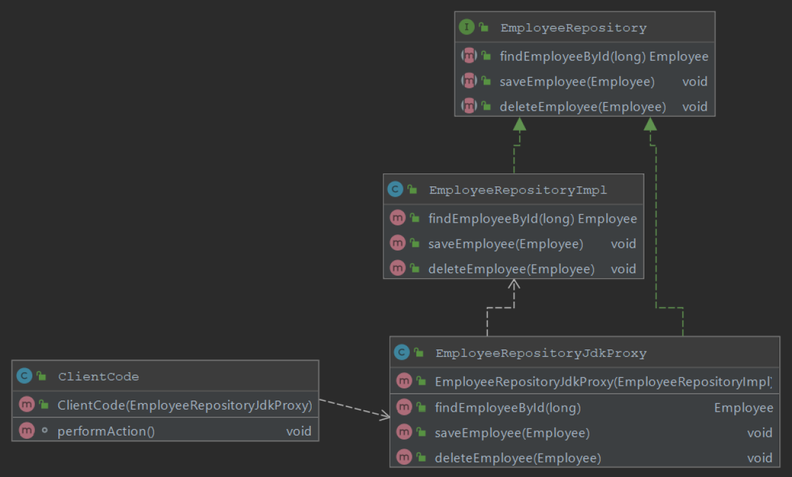
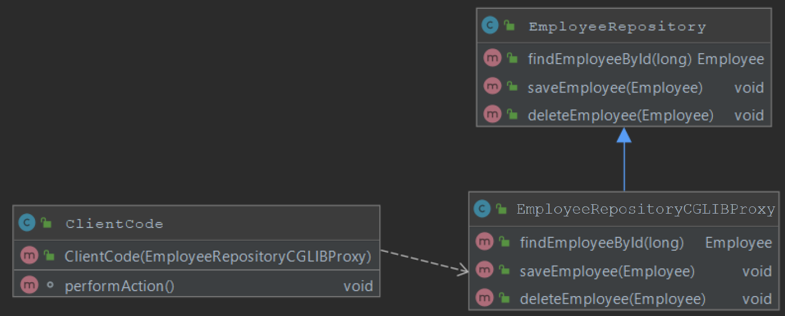
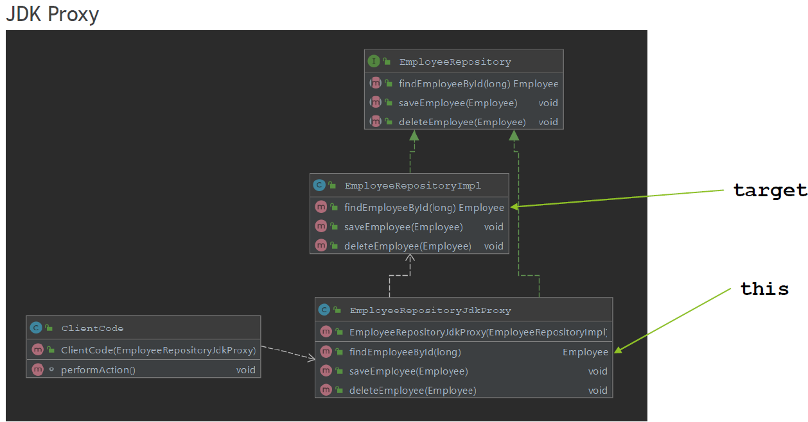
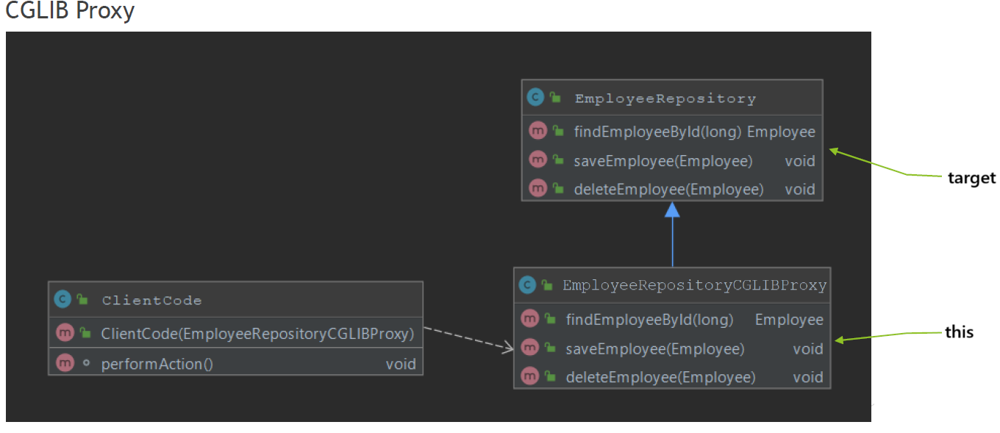

## Aspect Oriented Programming

### What is AOP?

AOP - Aspect Oriented Programming is a programming paradigm that complements Object oriented Programming (OOP) by providing a way to separate groups of cross cutting concerns from business logic code. This is achieved by ability to add additional behavior to the code without having to modify the code itself. This is
achieved by specifying:
- Location of the code which behavior should be altered - Pointcut is matched with Join point
- Code which should be executed that implements cross cutting concern - Advice

### Which problem does it solve?

Aspect Oriented Programming solves following challenges:
- Allows proper implementation of Cross Cutting Concerns
- Solves Code Duplications by eliminating the need to repeat the code for functionalities across different layers, such functionalities may include logging, performance logging, monitoring, transactions, caching
- Avoids mixing unrelated code, for example mixing transaction logic code (commit, rollback) with business code makes code harder to read, by separating concerns code is easier to read, interpret, maintain

### Name three typical cross cutting concerns.

Common cross cutting concerns are:
- Logging
- Performance Logging
- Caching
- Security
- Transactions
- Monitoring

### What two problems arise if you don't solve a cross cutting concern via AOP?

Implementing cross-cutting concerns without using AOP, produces following challenges:
- Code duplications - Before/After code duplicated in all locations when normally Advise would be applied; refactoring by extraction helps but does not fully solve the problem
- Mixing of concerns - business logic code mixed with logging, transactions, caching makes code hard to read and maintain.

### What is a pointcut, a joinpoint, an advice, an aspect, weaving?

**Join Point** in aspect oriented programming is a point in execution of a program in which behavior can be altered by AOP.

In Spring AOP Join Point is always method execution.

```java
public interface CurrencyService {
    float getExchangeRate(String from, String to); //Joinpoint

    float getExchangeRate(String from, String to, int multiplier); //Joinpoint

    String getCurrencyLongName(CurrencyId currencyId); //Joinpoint

    String getCurrencyCountryName(CurrencyId currencyId); //Joinpoint
}
```

Aspect Oriented Programming concept in general, distinguishes additional Join Points, some of them include:
- Method Execution / Invocation
- Constructor Execution / Invocation
- Reference / Assignment to Field
- Exception Handler
- Execution of Advice
- Execution of Static Initializer / Object Initializer

**Pointcut** is a predicate used to match join point. Additional code, called Advice is executed in all parts of the program that are matching pointcut. Spring uses the AspectJ pointcut expression language by default.

Example of Pointcut Expressions:
- execution - Match Method Execution
  
  `execution(* com.codeleapster.spring.notes.module02.question02.bls.CurrencyService.getExchangeRate(..))`

- within - Match Execution of given type or types inside package
  
  `within(com.codeleapster.spring.notes.module02.question02.bls.*)`

- @within - Match Execution of type annotated with annotation
  
  `@within(com.codeleapster.spring.notes.module02.question02.annotations.Secured)`

- @annotation - Match join points where the subject of the join point has the given annotation
  
  `@annotation(com.codeleapster.spring.notes.module02.question02.annotations.InTransaction)`

- bean - Match by spring bean name
  
  `bean(currency_service)`

- args - Match by method arguments
  
  `args(String, String, int)`

- @args - Match by runtime type of the method arguments that have annotations of the given type
  
  `@args(com.codeleapster.spring.notes.module02.question02.annotations.Validated)`

- this - Match by bean reference being an instance of the given type (for CGLIB-based proxy)
  
  `this(com.codeleapster.spring.notes.module02.question02.bls.CurrencyService)`

- target - Match by target object being an instance of the given type
  
  `target(com.codeleapster.spring.notes.module02.question02.bls.CurrencyService)`

- @target - Match by class of the executing object having an annotation of the given type
  
  `@target(com.codeleapster.spring.notes.module02.question02.annotations.Secured)`


**Advice** is additional behavior that will be inserted into the code, at each join point matched by pointcut.

```java
@Pointcut("@annotation(com.codeleapster.spring.notes.module02.question02.annotations.InTransaction)")
public void transactionAnnotationPointcut() { // Pointcut
}

@Before("transactionAnnotationPointcut")
public void beforeTransactionAnnotationAdvice() {
    System.out.println("Before - transactionAnnotationPointcut"); // Advice
}

@Before("this(com.codeleapster.spring.notes.module02.question02.bls.CurrenciesRepositoryImpl)") //Inline Pointcut and Advice
public void beforeThisCurrenciesRepository() {
    System.out.println("Before - this(CurrenciesRepositoryImpl)");
}
```

**Aspect** brings together Pointcut and Advice. Usually it represents single behavior implemented by advice that will be added to all join points matched by pointcut.

```java
@Component
@Aspect
public class CurrenciesRepositoryAspect { // Aspect
    
    @Before("this(com.codeleapster.spring.notes.module02.question02.bls.CurrenciesRepositoryImpl)") // Pointcut
    public void beforeThisCurrenciesRepository() {
        System.out.println("Before - this(CurrenciesRepositoryImpl)"); // Advice
    }
}
```

**Weaving** is the process of applying aspects, which modifies code behavior at join points that have matching pointcuts and associated advices. During weaving aspects and application code is combined which enables execution of cross cutting concerns.

Types of weaving:

- Compile Time Weaving - byte code is modified during the compilation, aspects are applied, code is modified at join points matching pointcuts by applying advices
- Load Time Weaving - byte code is modified when classes are loaded by class
loaders, during class loading aspects are applied, code is modified at join points
matching pointcuts by applying advices
- Runtime Weaving - used by Spring AOP, for each object/bean subject to aspects,
proxy object is created (JDK Proxy or CGLIB Proxy), proxy objects are used instead
of original object, at each join point matching pointcut, method invocation is
changed to apply code from advice

### How does Spring solve (implement) a cross cutting concern?

Spring Implements cross-cutting concerns with usage of Spring AOP module. Spring AOP uses AspectJ expression syntax for Pointcut expressions, which are matched against Join Point, code is altered with logic implemented in advices. In Spring AOP Joint Point is always method invocation.

Spring AOP uses Runtime Weaving, and for each type subject to aspects, to intercepts calls, spring creates one type of proxy:

- JDK Proxy - created for classes that implements interface
- CGLIB Proxy - created for class that are not implementing any interface

It is possible to force Spring to use CGLIB Proxy with usage of `@EnableAspectJAutoProxy(proxyTargetClass = true)`

**JDK Proxy**



**CGLIB Proxy**



### Which are the limitations of the two proxy types? 

JDK Dynamic Proxy Limitations:
- Does not support self invocation
- Class must implement interface
- Only method implementing the interface will be proxied
  
CGLIB Proxy Limitations:
- Does not support self invocation
- Class for which proxy should be created cannot not be final
- Method which should be proxied cannot be final
- Only public/protected/package methods will be proxied, private methods are not proxied

### What visibility must Spring bean methods have to be proxied using Spring AOP?

Spring Bean Method needs to have following visibility level to be proxied:
- JDK Dynamic Proxy - public
- CGLIB Proxy - public/protected/package

### What are the advice types supported in Spring.

Spring supports following advice types:
- `@Before` - executed before joint point matched by pointcut is executed
- `@After` - executed after joint point matched by pointcut is executed
- `@AfterThrowing` - executed when exception is thrown from joint point matched by pointcut
- `@AfterReturning` - executed after joint point matched by pointcut is executed successfully without any exception
- `@Around` - allows you to take full control over joint point matched by pointcut, most powerful advice, allows you to implement all advices from above, you need to call `ProceedingJoinPoint::proceed()` to execute original code

### Give examples of usage of each Advice type? 

Some examples of usage for each Advice type:
- @Before
  - Authorization, Security
  - Logging
  - Data Validation
- @After
  - Logging
  - Resource Cleanup
- @AfterThrowing
  - Logging
  - Error Handling
- @AfterReturning
  - Logging
  - Data Validation for method result
- @Around
  - Transactions
  - Distributed Call Tracing
  - Authorization, Security

### Which two advices can you use if you would like to try and catch exceptions?

To catch exceptions you can use two advices:
- @AfterThrowing with `throwing` field set and exception passed as argument
- @Around with `try ... catch` block implemented

### How do you enable the detection of the @Aspect annotation? What does @EnableAspectJAutoProxy do?

To enable detection of `@Aspect` annotation you need to:
- Have `@Configuration` class with `@EnableAspectJAutoProxy`
  - Without `@EnableAspectJAutoProxy` Spring will not scan for @Aspect
- Have beans for `@Aspect` annotated classes created
  - Use `@ComponentScan` with `@Component` at class annotated with `@Aspect`
  - Use `@Bean` in Configuration class and create Spring Aspect Bean manually
- Have `aspectjweaver` / `spring-aop` on classpath
  - It is easiest to use `org.springframework:spring-aspects` dependency to have those included
  - Without required dependencies on classpath spring will fail with `ClassNotFoundException` or `NoClassDefFoundError` during creation of Proxy objects for Spring Beans subject to aspects

Annotation `@EnableAspectJAutoProxy` enables detection of `@Aspect` classes and creates proxy object for beans subject to aspects. Internally process of creating proxies is done by `AnnotationAwareAspectJAutoProxyCreator`. By creating a proxy for each bean subject to aspects, spring intercepts the calls and implements Before / After / AfterReturning / AfterThrowing / Around advices. It is important to remember that `@Aspect` will not create Spring Beans on it’s own, you need to use Component Scanning or manually create beans for `@Aspect` classes.

### Pointcut Expressions

Pointcut designator types supported by Spring AOP:
- execution
- within
- args
- bean
- this
- target
- @annotation
- @args
- @within
- @target

### Pointcut - execution

Pointcut designator - `execution` - matches method execution

**General Form:**

`execution([visibility modifiers] [return type] [package].[class].[method]([arguments]) [throws exceptions])`

**Description:**
- `[visibility modifiers]` 
  - public/protected
  - if omitted all are matched, can be used with negation, for example `!protected`
- `[return type]` 
  - void, primitive or Object type
  - cannot be omitted
  - can be used with wildcard *
  - can be used with negation, for example `!int`
- `[package]`
  - package in which class is located
  - may be omitted if class is located within same package as aspect
  - wildcard * may be used to match all packages
  - wildcard .. may be used to match all sub packages
- `[Class]`
  - Class name to match against
  - may be omitted
  - may be used with * wildcard
  - matches subclasses of the class as well
- `[method]`
  - Name of the method
  - whole or partial method name can be used with * wildcard
- `[arguments]`
  - May be empty to match methods without any arguments
  - may be used with wildcard .. to match zero or more arguments
  - may be used with wildcard * to match all types of specific argument
  - may be used with ! Negation
- `[throws expections]`
  - Match method that throws exceptions from given list
  - can be used with negation !

### Pointcut - within

Pointcut designator - `within` - matches execution within specified class/classes, optionally you can specify class package

**General Form:**

`within([package].[class])`

**Description:**
- `[package]`
  - package in which class is located
  - may be omitted if class is located within same package as aspect
  - wildcard * may be used to match all packages
  - wildcard .. may be used to match all sub packages
- `[Class]`
  - Class name to match against
  - may be used with * wildcard

### Pointcut - args

Pointcut designator - `args` - matches execution of method with matching arguments

**General Form:**

`args([parameter_type1, parameter_type2, ..., parameter_typeN])`

**Description:**
- `[parameter_typeN]`
  - simple or object type
  - may be * to indicate one parameter of any type
  - may be .. to indicate zero or more arguments
  - you can specify type with the package

### Pointcut - bean

Pointcut designator - `bean` - matches execution of method with matching Spring Bean Name

**General Form:**

`bean([beanName])`

**Description:**
- `[beanName]`
  - name of the Spring Bean (automatically generated by framework, or set manually)

### Pointcut - this

Pointcut designator - `this` - matches execution against type of proxy that was generated by Spring AOP

**General Form:**

`this([type])`

**Description:**
- `[type]`
  - type of the proxy, matches if generated proxy is of specified proxy

### Pointcut - target

Pointcut designator - `target` - matches execution against type of object invoked by proxy

**General Form:**

`target([type])`

**Description:**
- `[type]`
  - type of the target object invoked by proxy, matches if target object is of specified type.

> [!NOTE]
> Pointcut designator - this, target





### Pointcut - annotation

Pointcut designator - `@annotation` - matches method execution annotated with specified annotation

**General Form:**

`@annotation([annotation_type])`

**Description:**
- `[annotation_type]`
  - type of annotation used to annotated method which should match pointcut expression

### Pointcut - @args

Pointcut designator - `@args` - matches method execution with argument, which types (classes) are annotated with specified annotation type, note that class should be annotated, not the argument of method itself

**General Form:**

`@args([annotation_type])`

**Description:**
- `[annotation_type]`
  - type of annotation used on top of class, which represents type of argument

### Pointcut - @within

Pointcut designator - `@within` - matches method executions inside classes annotated with specified annotation

**General Form:**

`@within([annotation_type])`

**Description:**
- `[annotation_type]`
  - type of annotation used on top of class, inside which method execution should be matched

### Pointcut - @target

Pointcut designator - `@target` - matches method executions inside proxied target class that is annotated with specified annotation

**General Form:**

`@target([annotation_type])`

**Description:**
- `[annotation_type]`
  - type of annotation used on top of proxied class, inside which method execution should be matched

> [!NOTE]
> Pointcut expressions can be combined together with usages of logical operators:
> - ! - negation
> - || - logical OR
> - && - logical AND

### What would be the correct pointcut expression to match both getter and setter methods?

To match getters and setter, `execution` Pointcut Expression can be used together with ability to combine them with logical operators.

Expression that will match getters and setter can look like this:

``execution(* com.beans.EmployeeBean.get*()) || execution(* com.beans.EmployeeBean.set*(*))``

### What is the JoinPoint argument used for?

JoinPoint argument is an object that can be used to retrieve additional information about join point during execution. JoinPoint needs to be the first parameter of Advice, only in that case Spring Framework will inject JoinPoint into advice method.

Join Point is supported in following advice types:
- Before
- After
- After Returning
- After Throwing

Examples of information that you can retrieve from JoinPoint:
- String representation of Join Point
- Arguments of Joint Point (for example Method Arguments)
- Signature of Joint Point (for example Method Signature)
- Kind / Type of Joint Point
- Target / This object being proxied

### What is a ProceedingJoinPoint? When is it used?

`ProceedingJoinPoint` is an object that can be provided to `@Around` advice as first argument, it is a type of JoinPoint which can be used to change method arguments during method execution in runtime or block execution of original method entirely.

`ProceedingJoinPoint` is used in `@Around` advice, it contains all methods from
JoinPoint and also adds:
- proceed - executes original method
- proceed(args) - executes original method with provided arguments

`ProceedingJoinPoint` can be used in following use cases:
- Conditionally block method execution
- Filter arguments
- Inject additional argument