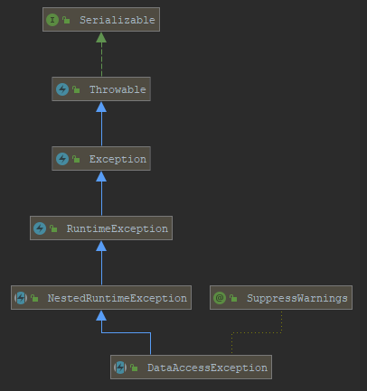
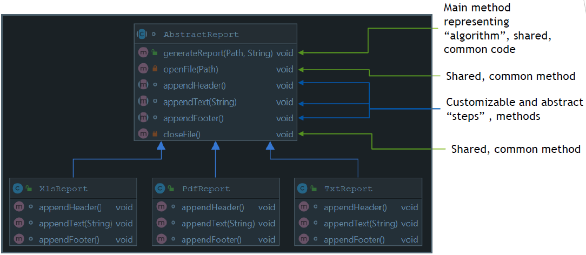
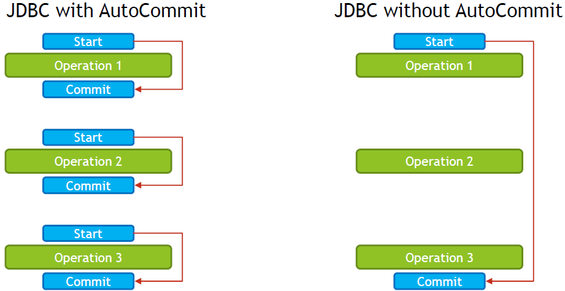
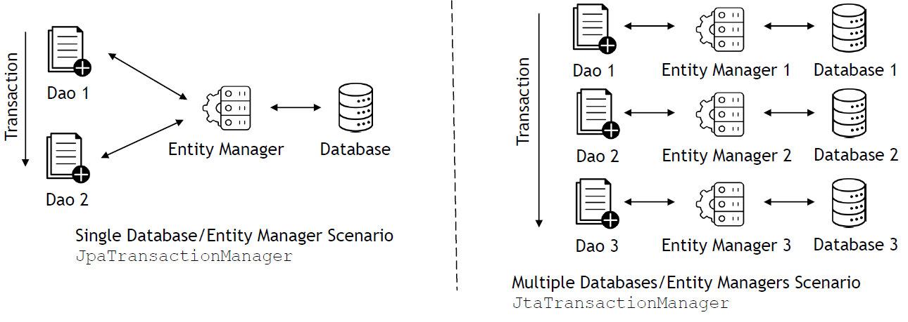
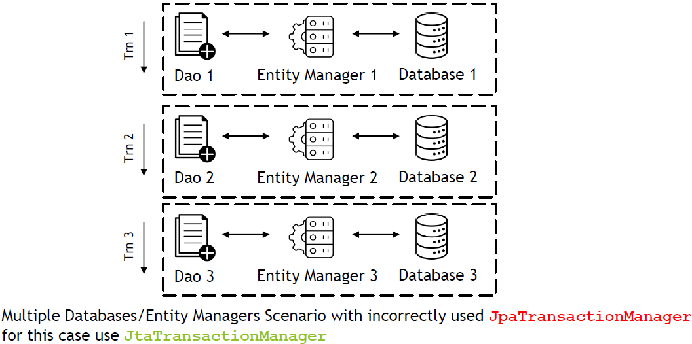

## Data Management: JDBC, Transactions, Spring Data JPA

### What is the difference between checked and unchecked exceptions? Why does Spring prefer unchecked exceptions? What is the data access exception hierarchy?

**Checked exception** - Exception that is extending `java.lang.Exception` (expect `java.lang.RuntimeException`) class that has to be explicitly declared in throws part of method signature of method that is throwing an exception and has to be explicitly handled by code that invokes the method. If code that is calling the method with checked exception does not handle exception, it has to declare it in throws part of method signature.

- **Pros:**
  - Developer using API always has a list of exceptional situations that has to be handled
  - Fast compile time feedback on check if all exceptional situations were handled
- **Cons**
  - May result in cluttered code
  - Coupling between callee and caller

**Unchecked exception** - Exception that is extending `java.lang.RuntimeException` class, does not have to be explicitly declared in `throws` part of method signature of method that is throwing an exception and does not have to be explicitly handled by code that invokes the method. Developer has freedom of choice if error handling should be implemented or not.

- **Pros:**
  - Reduces cluttered code
  - Reduces coupling between callee and caller
- **Cons:**
  - May result in missing situations in which error handling should be implemented
  - Lack of compile time feedback on error handling

**DataAccessException Hierarchy**



- Data Access Exception is a Runtime Exception
- Examples of concrete Data Access Exceptions
  - CannotAcquireLockException
  - CannotCreateRecordException
  - DataIntegrityViolationException
- Purpose of this hierarchy is to create abstraction layer on top of Data Access APIs to avoid coupling with concrete implementation of Data Access APIs

### How do you configure a DataSource in Spring? Which beans are used for development/test databases?

Data Source is represented by generic interface `javax.sql.DataSource` which represent any data source for sql database.

To configure data source in Spring you need to create a `@Configuration` class that will return `javax.sql.DataSource` bean.

For example you can use following types of `javax.sql.DataSource`:
- `DriverManagerDataSource` - basic JDBC driver connection source
- `BasicDataSource` - Apache DBCP for Connection Pooling
- `ComboPooledDataSource` - C3P0 for Connection Pool
- `SmartDataSource`
- `AbstractDataSource`
- `SingleConnectionDataSource`
- `TransactionAwareDataSourceProxy`
- `DataSourceTransactionManager`

Configuration of Data Source in Spring is dependent on type of application that is executed.

**Type of execution:**
- Standalone - Data Source is configured in `@Configuration` class and is created as a bean of one of supported data source types.
- Spring Boot - Data Source is configured through `application.properties`
- Application Server - Data Source should be fetched from JNDI via `JndiDataSourceLookup` / `JndiTemplate`, application server is responsible for creating and managing data source requested in resources configurations of deployment descriptors

When working with development/test databases, following beans are very useful:
- `EmbeddedDatabaseBuilder` allows to easily configure H2/HSQLDB embedded database with schema/data initialization scripts.
- `DataSourceInitializer` / `ResourceDatabasePopulator` - allows to use schema/data initialization scripts without usage of `EmbeddedDatabaseBuilder`

### What is Template design pattern and what is the JDBC template?

Template design pattern is a behavioral design pattern that can be used to encapsulate algorithm/main flow with it steps in a way to achieve steps customization and shared code reusability. It is achieved by creating abstract class that contains algorithm definition/main flow with shared code, and child classes extending abstract class which are customizing step or steps of the algorithm.

Template design pattern can be used to achieve greater code reusability, **however** since it is using inheritance, which is very strong relationship between classes it can limit future flexibility of the system. You should use this pattern with caution and you should analyze if strategy design pattern will not give you similar results. Strategy uses composition instead of inheritance and in some cases instead of using template method, strategy can be used to achieve code reusability and also code flexibility.

Below you can find class diagram for report subsystem written with usage of template design pattern.



`JdbcTemplate` is a class located in `org.springframework.jdbc.core` package. Goal of this class is to simplify use of JDBC by providing implementation of JDBC workflow, leaving application to provide SQL statements and results extractions. 

Jdbc Template executes SQL queries or updates, initiates iteration over ResultSet, ResultSet mapping, also it catches exceptions and translates them into generic exceptions.

Code that interacts with Jdbc Template needs to provide implementation of callback
interfaces which allows specific steps of JDBC workflow customization:
- PreparedStatementCreator
- ResultSetExtractor
- PreparedStatementSetter
- RowMapper

### What is a callback? What are the three JdbcTemplate callback interfaces that can be used with queries? What is each used for?

A callback is a code or reference to the code that can be passed as an argument to the method. This method will execute passed callback during execution.

On Java level callback can be:
- Class that implements interface
- Anonymous class
- Lambda expression JDK 8
- Reference Method JDK 8

Jdbc Template Callbacks that can be used with queries:
- `RowMapper` - Interface for processing `ResultSet` data on per row basis, implementation should call `ResultSet.get*(..)` methods, but should not call `ResultSet.next()`, it should only extract values from current row and based on those values should create object, which will be returned from `mapRow` method, implementation is usually stateless
- `RowCallbackHandler` - interface for processing `ResultSet` data on a per row basis, implementation should call `ResultSet.get*(..)` methods, but should not call `ResultSet.next()`, it should only extract values from current row, implementation is usually stateful, it keeps accumulated data in some object, `processRow` method from this class does not return any value, instead method saves results into for example object field that will keep state
- `ResultSetExtractor` - interface for processing entire `ResultSet` data, all rows needs to be processed and implementation should call `ResultSet.next()` method to move between rows, implementation is usually stateless, implementation should not close `ResultSet` , it will be closed by Jdbc Template.

Jdbc Template other Callbacks:
- `PreparedStatementCreator` - should create `PreparedStatement` based on `Connection` provided by `JdbcTemplate`, implementation should provide SQL and parameters
- `PreparedStatementSetter` - should set values on `PreparedStatement` provided by `JdbcTemplate`, implementation should only set parameters, SQL will be set by `JdbcTemplate`
- `CallableStatementCreator` - should create `CallableStatement` based on `Connection` provided by Jdbc`Template , implementation should provide SQL and parameters
- `PreparedStatementCallback` used internally by `JdbcTemplate` generic interface allowing number of operations on single `PreparedStatement`
- `CallableStatementCallback` used internally by `JdbcTemplate` generic interface allowing number of operations on single `CallableStatement`

### Can you execute a plain SQL statement with the JDBC template?

Yes, JDBC Template allows execution of plain SQL statements with following methods:
- query
- queryForList
- queryForObject
- queryForMap
- queryForRowSet
- execute
- update
- batchUpdate

### When does the JDBC template acquire (and release) a connection, for every method called or once per template? Why?

Connection lifecycle in JDBC Template depends on transactions being involved or not.

If JDBC Template is used without transaction, then connection is acquired and released for every method call. Reason for this strategy, is to minimize amount of time when resource (connection) has to be held.

If JDBC Template is used together with transaction, then `DataSourceUtils` which is using `TransactionSynchronizationManager` will reuse connection between method calls as long as transaction is not committed or rolled back. Reason for this strategy is that connection cannot be closed when transaction is in progress, since closing connection would also rollback any changes made.

JDBC Template uses `getConnection()` from `DataSource` class through
`DataSourceUtils` class. If DataSource is plain JDBC Connection source, then
connection is actually opened/closed, however if Connection Pool, like DBCP or C3P0
is used, then connection is not being opened/closed, however it is acquired or
released from/to the pool.

### How does the JdbcTemplate support generic queries? How does it return objects and lists/maps of objects?

Jdbc Template supports generic queries with following methods:
- **queryForObject** – returns single object, expects query to return only one record, if this requirement is not matched `IncorrectResultSizeDataAccessException` will be thrown 
- **queryForList** – returns list of objects of declared type, expects query to return results with only one column, otherwise `IncorrectResultSetColumnCountException` will be thrown 
- **queryForMap** – returns map for single row with keys representing column names and values representing database record value, expects query to return only one record, if this requirement is not matched `IncorrectResultSizeDataAccessException` will be thrown
- **queryForRowSet** – returns `SqlRowSet` object that contains metadata information (like column names) and allows to read results data and iterate through records.

All ofthe methods above have many versions, allowing you to specify not only query itself, but also parameters to the query and custom row mapper if required.

Jdbc Template returns objects, lists/map by using following:
- **objects** - `queryForObject` - `SingleColumnRowMapper` for generic types and `RowMapper` for custom types
- **lists** - `queryForList` - `SingleColumnRowMapper` for generic types
- **maps** - `queryForMap` - `ColumnMapRowMapper` for any query

### What is a transaction? What is the difference between a local and a global transaction?

Transaction is an operation that consist of series of tasks, in which all of those tasks should be performed, or none of the tasks should be performed. Those tasks are being treated as one unit of work. If all tasks in transaction are successful, changes made by those tasks are preserved, if at least one of the tasks is unsuccessful, changes made by tasks that were already completed will be reverted and any tasks awaiting execution will no be executed.

Transaction should follow ACID principle:
- **Atomicity** - All changes are applied or none changes are applied
- **Consistency** - system should go from one valid state to other valid state, any constraints on data should never be left in invalid state
- **Isolation** - one transaction cannot affect other one, concurrent execution of transaction should leave system in the same state as if sequential execution of transaction would be performed
- **Durability** - guarantees that if transaction has been committed, data will be preserved, even in case of system/power failure

**Global transaction** is a kind of transaction that spans multiple transactional resources. Those resources can be anything, but usually include databases (can be more then one) and queues. In Java, popular standard for managing global transaction is JTA, which is an API for using transaction system provided by Application Server.

**Local transaction** are resource specific transaction, they do not span across multiple transactional resources. Local transactions are much simpler than global transaction however main disadvantage is lack of ability to treat series of tasks dealing with multiple transactional resources such as databases or databases and queues as single unit of work.

### Is a transaction a cross cutting concern? How is it implemented by Spring?

Transaction is a cross cutting concern and in Spring it is implemented with usage of `@Transactional` annotation.

If `@Transactional` annotation is present on top of the method or entire class, then each call to the method in the class will be proxied by `TransactionInterceptor` and `TransactionAspectSupport` classes. Those classes will interact with `PlatformTransactionManager` to commit transaction upon successful method execution or rollback upon exception. Exact behavior will be dependent on transaction propagation and isolation level settings, which can be set in `@Transactional` annotation.

### How are you going to define a transaction in Spring? What does @Transactional do? What is the PlatformTransactionManager?

To use transactions in Spring Framework, you need to:
- Enable transaction management by using @EnableTransactionManagement annotation on top of your Configuration class
- Create bean method in configuration class that will return bean implementing interface `PlatformTransactionManager`, examples of transactions managers:
  - `DataSourceTransactionManager`
  - `JtaTransactionManager`
  - `JpaTransactionManager`
  - ...
- Use `@Transactional` annotation on top of classes or methods that should
involve transaction management.

`@Transactional` annotation can be used on top of classes or methods to enable transaction management for entire class or specified methods. When method with `@Transactional` annotation is called, invocation is proxied by `TransactionInterceptor` and `TransactionAspectSupport` which are using `PlatformTransactionManager` to manage transaction.

Transaction is being started at the beginning of the method (if none transaction exists), and it is being committed at the end of successful execution. Transaction can be rolled back upon exception being thrown. This behavior is dependent on transaction propagation type.

`@Transactional` annotation allows you to configure following attributes:
- Transaction Manager
- Propagation Type
- Isolation Level
- Timeout for Transaction
- Read Only Flag
- Define which exception types will cause transaction rollback
- Define which exception types will not cause transaction rollback

`PlatformTransactionManager` is an interface that is used by declarative Spring’s AOP Transaction Management to create, commit and rollback transactions.

`PlatformTransactionManager` contains following methods:
- `getTransaction` - returns currently active transaction or creates new one
- `commit` - commits transaction, or rolls back transaction if it was marked for
rollback
- `rollback` - performs rollback of transaction

### Is the JDBC template able to participate in an existing transaction?

Yes, JDBC Template is able to participate in existing transaction. It will support both, transaction created with `@Transactional` annotation and also programmatically created transaction.

JDBC Template is able to participate in existing transaction by usage of `DataSourceUtils` and `TransactionSynchronizationManager`. `TransactionInterceptor` and `TransactionAspectSupport` are also using
`PlatformTransactionManager` together with `DataSourceTransactionManager` which will set transaction in
`TransactionSynchronizationManager` for JDBC Template (or other components) to reuse.

### What is a transaction isolation level? How many do we have and how are they ordered?

Transaction Isolation determines how changes made under one transaction are visible in other transactions and to other users of the system. Higher isolation level means that changes from one transaction are not visible and lower isolation level means that changes from one transactions may “slip” into selects executed under other transaction. 

Higher transaction isolation level make data being visible in more consistent way, lower transaction isolation level makes data less consistent but increases overall throughput and concurrency of the system.

There are three challenges that may occur due to Transaction Isolation Level:
- Phantom Read
- Non repeatable Read
- Dirty read

**Phantom read:**
- Transaction A - first read
  - select id, first_name, last_name from employees where id between 5 and 10
- Transaction B - write
  - insert into employees values(7, ‘John’, ‘Doe’);
- Transaction A - second read
  - select id, first_name, last_name from employees where id between 5 and 10

High Isolation Level will make second read returning same values as first read, lower isolation level will include new row with id 7 in second read.

To prevent phantom read, you need to pick isolation level that uses range locks.

**Non-repeatable read:**
- Transaction A - first read
  - select id, first_name, last_name from employees where id = 5
- Transaction B - write & commit
  - update employees set last_name = ‘Doe’ where id = 5
- Transaction A - second read
  - select id, first_name, last_name from employees where id = 5

High Isolation Level will make second read returning same values as first read, lower isolation level will read new values for record 5.

To prevent non-repeatable reads you need to use isolation level that uses read write locks on data being processed.

**Dirty read:**
- Transaction A - first read
  - select id, first_name , last_name from employees where id = 5
- Transaction B - write (commit does not have to happen)
  - update employees set last_name = ‘Doe’ where id = 5
- Transaction A - second read
  - select id, first_name , last_name from employees where id = 5

High Isolation Level will make second read returning same values as first read, lower isolation level will read new values for record 5, even if Transaction B will not commit the data.

To prevent dirty reads you need to use isolation level that prevents uncommitted changes by other transaction being visible in your transaction.

**Most Relational Databases support 4 transaction levels:**
- Serializable
  - Highest Isolation Level
  - Read Write Locks held until end of transaction
  - Range Locks held until end of transaction
- Repeatable Read
  - Read Write Locks held until end of transaction
- Read Committed
  - Read Locks held until end of select statement
  - Write Locks held until end of transaction
- Read Uncommitted
  - Lowest isolation level
  - It is possible to see changes from other transactions that are not committed

In Spring Framework, you can use `@Transactional` annotation to set isolation level.

```java
@Transactional(isolation = Isolation.SERIALIZABLE)

@Transactional(isolation = Isolation.REPEATABLE_READ)

@Transactional(isolation = Isolation.READ_COMMITTED)

@Transactional(isolation = Isolation.READ_UNCOMMITTED)
```

|Isolation Level|Phantom Read|Non-Repeatable Read|Dirty Read|Concurrency|
|--------|-------|--------|-------|--------|
|Serializable|Not Possible|Not Possible|Not Possible|Very Poor|
|Repeatable Read|Possible|Not Possible|Not Possible|Poor|
|Read Committed|Possible|Possible|Not Possible|Good|
|Read Uncommitted|Possible|Possible|Possible|Very Good|

### What is @ EnableTransactionManagement for?

`@EnableTransactionManagement` annotation is used on top of `@Configuration` class to enable annotation driven transaction management by `@Transactional` annotation in Spring Framework.

When `@EnableTransactionManagement` is used, `TransactionInterceptor` and `TransactionAspectSupport` will be used to proxy each call to `@Transactional` class or method, which will use `PlatformTransactionManager` to manage transaction.

`@EnableTransactionManagement` allows you to specify following values:
- Mode - sets advice mode for `@Transactional` annotation, indicates how calls to methods should be intercepted, `PROXY` is default mode, you can switch it to more advanced `ASPECTJ` weaving advice, which supports local calls.
- Order - indicates order of advice execution when more then one advice applies to `@Transactional` join point
- proxyTargetClass - indicates whether `CGLIB Proxy` classes should be created or if `JDK Proxies` should be created (default), this field is used only when `Mode` is set to `PROXY`

### What does transaction propagation mean?

Transaction propagation defines how existing transaction is re-used when calling `@Transactional` method with transaction already running.

Transaction propagation can be defined in `@Transactional` annotation in `propagation` field as one of following options:
- `REQUIRED` - support a current transaction, create a new one if none exists
- `SUPPORTS` - support a current transaction, execute non-transactionally if none exists
- `MANDATORY` - support a current transaction, throw an exception if none exists
- `REQUIRES_NEW` - create a new transaction, and suspend the current transaction if one exists
- `NOT_SUPPORTED` - execute non-transactionally, suspend the current transaction if one exists
- `NEVER` - execute non-transactionally, throw an exception if a transaction exists
- `NESTED` - execute within a nested transaction if a current transaction exists, else behave like `REQUIRED`

### What happens if one @Transactional annotated method is calling another @Transactional annotated method on the same object instance?

JDK Proxy and CGLIB Proxy in Spring Beans AOP do not support self invocation, so when one method with `@Transactional` annotation calls different method with `@Transactional` annotation from the same class, nothing happens, transaction interceptor will not be called.

To enable self invocation support, you need to configure Spring Aspects with AspectJ, to do that you need to:
- Have dependency to `spring-aspects`
- Include `aspectj-maven-plugin`
- Configure Transaction Support with `@EnableTransactionManagement(mode = AdviceMode.ASPECTJ)`

### Where can the @Transactional annotation be used? What is a typical usage if you put it at class level?

`@Transactional` can be used on top of **class** or **method**, in **classes** or **interfaces**.

If used on top of class, it applies to all public methods in this class.

If used on top of method, it needs to have public access modifier, if used on top of protected / package-visible / private method, transaction management will not be applied.

### What does declarative transaction management mean?

Declarative transaction management means that instead of handling transactions manually through the code, methods which should be executed in transactions are declared with `@Transactional` annotation.

### What is the default rollback policy? How can you override it?

Default rollback policy in Spring Framework is set to automatic rollback, but only when unchecked exception is being thrown from the method annotated with @Transactional annotation. When checked exception is being thrown from the method, transaction is not being rolled back.

You can override this policy by setting `rollbackFor` / `rollbackForClassName` or `noRollbackFor` / `noRollbackForClassName` field in `@Transactional` annotation.

### What is the default rollback policy in a JUnit test, when you use the @RunWith(SpringJUnit4ClassRunner.class) in JUnit 4 or @ExtendWith(SpringExtension.class) in JUnit 5, and annotate your @Test annotated method with @Transactional?

Default rollback policy in `@Test` methods annotated with `@Transactional` is always rollback. This means that after test execution transaction will always be rolled back. The reason for this is that each test method should be able to change state of database or call other classes that will change state of the database, however for the tests to be repeatable, changes should be reverted after `@Test` method execution.

You can change this behavior by using `@Rollback` annotation set to false

### Why is the term "unit of work" so important and why does JDBC AutoCommit violate this pattern?

JDBC AutoCommit violates Unit of Work, because it makes every SQL statement being invoked in a separate transaction that is committed after SQL is executed, this makes impossible to implement Unit of Work consisting of multiple SQL operations.



### What do you need to do in Spring if you would like to work with JPA?

Following steps are required to work with JPA in Spring Framework:
- Declare maven dependencies:
  - JPA API - `javax.persistence:javax.persistence-api`
  - Spring ORM - `org.springframework:spring-orm`
  - ORM of your choice, for example `org.hibernate:hibernate-core`
  - Database Driver, for example `org.hsqldb:hsqldb`
  - Optionally, but recommended, Spring Data JPA - `org.springframework.data:spring-data-jpa`
- Define DataSource Bean
- Define PlatformTransactionManager, in case of JPA `JpaTransactionManager`
- Define `EntityManagerFactoryBean`
  - `LocalContainerEntityManagerFactoryBean` for standalone application
  - `EntityManagerFactory` from JNDI
  - `LocalEntityManagerFactoryBean` for Test purposes
- Define `@Entity` classes with at least on `@Id` field
- Define DAO classes, or use Spring Data JPA Repositories

### Are you able to participate in a given transaction in Spring while working with JPA?

Yes, JPA in Spring uses `JpaTransactionManager`, which supports cases when `DataSource` is used directly, so it allows mixing JPA and JDBC code under one transaction.

When using Spring Framework on Java EE platform, it is possible to reuse existing transactions as well by using `JtaTransactionManager`, which will delegate transaction management to Java EE container.

### Which PlatformTransactionManager(s) can you use with JPA?

JPA can work with following transaction managers:
- `JpaTransactionManager` - recommended when working with one database and one Entity Manager
- `JtaTransactionManager` - recommended when working with multiple databases and Entity Managers, or when working with multiple databases and other transactional resources, for example one transaction needs to span Database and JMS Topic



Usage of `JpaTransactionManager` in case of multiple Databases / Transactional Resources / Entity Managers will cause each transaction, span only one resource, this is why `JtaTransactionManager` is required in this case.



### What do you have to configure to use JPA with Spring? How does Spring Boot make this easier?

Following steps are required to work with JPA in Spring Framework:
- Declare maven dependencies:
  - JPA API - `javax.persistence:javax.persistence-api`
  - Spring ORM - `org.springframework:spring-orm`
  - ORM of your choice, for example `org.hibernate:hibernate-core`
  - Database Driver, for example `org.hsqldb:hsqldb`
  - Optionally, but recommended, Spring Data JPA - `org.springframework.data:spring-data-jpa`
- Define `DataSource` Bean
- Define `PlatformTransactionManager`, in case of JPA `JpaTransactionManager`
- Define `EntityManagerFactoryBean`
  - `LocalContainerEntityManagerFactoryBean` for standalone application
  - `EntityManagerFactory` from JNDI
  - `LocalEntityManagerFactoryBean` for Test purposes
- Define `@Entity` classes with at least on `@Id` field
- Define DAO classes, or use Spring Data JPA Repositories

Spring Boot simplifies JPA setup by:
- Providing `spring-boot-starter-data-jpa` dependency which includes all required dependencies
- Providing auto-configuration for JPA
- Automatically defines `PlatformTransactionManager`, `EntityManager` and other required beans
- Allows Data Source to be configured via properties
- Provides out-of-the box support for `Hikari Connection Pool`
- Provides default properties to JPA
- Automatically creates DAO beans for Repositories

### What is a Repository interface?

Repository interface is a Java interface that describes `Dao` with expected behaviors, based on which Spring Data will automatically generate `Dao` logic. Repository interface takes `Domain Class` and `ID` of type to manage.

Custom Repository interface needs to extend one of following interface:
- `Repository` - basic marker repository
- `CrudRepository` - adds generic methods for CRUD operations
- `PagingAndSortingRepository` - adds findAll methods for paging/sorting
- `JpaRepository` - JPA specific extension of Repository

```java
// You define expected behaviors
public interface EmployeeDao extends CrudRepository<Employee, Integer> {
  Employee findByEmail(String email);
  List<Employee> findByLastName(String lastName);
  List<Employee> findBySalaryBetween(float min, float max);
}
```

```java
// Framework generates Dao logic automatically based interfaces from package pointed in @EnableJpaRepositories
@Configuration
@EnableJpaRepositories(basePackages={"com.project.dao"})
public class JpaConfiguration
...
```

### How do you define a Repository interface? Why is it an interface not a class?

To define Repository interface, you need to follow those steps:
- Create Java Interface that extends one of: `Repository`, `CrudRepository`,
`PagingAndSortingRepository`, `JpaRepository`
- Create class with `@Entity` annotation
- Inside `@Entity` class, create a simple primary key annotated with @Id annotation or create class that will represent complex key annotated with `@EmbeddedId` annotation at field level and `@Embeddable` at key class definition level
- Use `@EnableJpaRepositories` to point out package to scan for Repositories

Repository interface is an interface, not a class for Spring Data to be able to use JDK Dynamic Proxy to intercept all calls to repository and also to allow creation of custom base repositories for every Dao based on `SimpleJpaRepository` configured at `@EnableJpaRepositories` level.

```java
public interface EmployeeDao extends CrudRepository<Employee, Integer> {

}
```

```java
@Configuration
@EnableJpaRepositories(basePackages = {"com.project.dao"})
public class JpaConfiguration
...
```

```java
@Entity
public class Employee {
  @Id
  private int id;
  private String firstName;
  private String lastName;
  ...
}
```

### What is the naming convention for finder methods in a Repository interface?

find[`limit`]By[`property/properties expression`][`comparison`][`ordering operator`]

`limit` - result of the query can be limited by usage of first/top keyword
- findFirst10ByLastname
- findFirstByOrderByLastnameAsc
- findTop3ByLastname
- findTopByOrderByAgeDesc

`property/properties expression` - result will be filtered based on property of entity, multiple properties can be used with usage of And, Or keyword
- findByLastnameAndFirstname
- findByLastnameOrFirstname
- findByFirstname

`comparison` - comparison mode can be specified after specifying property used for filtering
- findByFirstnameIs
- findByFirstnameEquals
- findByStartDateBetween
- findByAgeLessThan, findByAgeLessThanEqual
- findByAgeGreaterThan, findByAgeGreaterThanEqual
- findByStartDateBefore, findByStartDateAfter
- findByAgeIsNull, findByAgeIsNotNull
- findByFirstnameLike, findByFirstnameNotLike
- findByFirstnameStartingWith, findByFirstnameEndingWith
- findByFirstnameContaining
- findByLastnameNot
- findByAgeIn(Collection<Age> ages), findByAgeNotIn(Collection<Age> ages)
- findByActiveTrue, findByActiveFalse
- findByFirstnameIgnoreCase

`ordering operator` - optionally you can specify ordering operator at the end of method name
- findByLastnameOrderByFirstnameAsc
- findByLastnameOrderByFirstnameDesc

### How are Spring Data repositories implemented by Spring at runtime?

Spring Repositories are implemented at runtime by `SimpleJpaRepository` by default.

When application context is starting up, Spring will scan for all classes annotated with `@Configuration`. When `@Configuration` class with `@EnableJpaRepositories` will be detected, `JpaRepositoriesRegistrar` with `JpaRepositoryConfigExtension` will be used to create beans for repositories in packages pointed out by `basePackages` field in `@EnableJpaRepositories`. `JpaRepositoryFactoryBean` will use `JpaRepositoryFactory` to create beans based on bean definitions and by default will create instance of `SimpleJpaRepository` class for each Repository interface.

Class used for implementation of Repository interface can be customized on:
- Global level, by using `repositoryBaseClass` field from `@EnableJpaRepositories` annotation
- Single Dao/Repository by creating separate interface and Impl class for behavior that you want to customize.

### What is @Query used for?

`@Query` annotation can be used on top of Repository method, and with it you can specify query that should be used by JPA. When declaring one on top of finder method, specified query will be used, instead of generating one automatically based on finder method name.

Using `@Query` annotation allows you to achieve more control and flexibility of the JPA query that will be executed.

```java
public interface EmployeeDao extends CrudRepository<Employee, Integer> {
  @Query("select e from Employee e where e.firstName = ?1 and e.lastName =  ?2")
  Employee findByFirstNameAndLastName(String firstName, String lastName);
}
```
