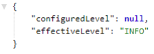
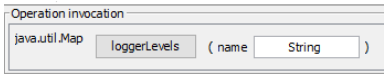
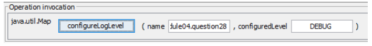

## Spring Boot

### What is Spring Boot?

Spring Boot is a Java Framework that allows you to easily create standalone, production-grade Spring based Java Applications. It is often used in Microservice Architecture because of simplicity that it allows.

Applications created with Spring Boot can be executed with simple `java -jar` command and also allows traditional war deployment. Spring Boot supports following embedded containers:
- Tomcat
- Jetty
- Undertow

Simplicity of deployment and execution has many advantages, for example, it allows for Dev/Prod parity (https://12factor.net/) which increases product quality.

Spring Boot provides number of features that can be used to fulfill non-functional requirements for the project (externalized configuration, security, metrics, health checks).

Spring Boot provides many modules under common umbrella:
- Spring Boot DevTools - live-reload to speed-up development
- Spring Boot Actuator - monitoring and management of application
- Spring Boot Starters - dependency set for technologies to minimize setup time
- Spring Boot Autoconfiguration - configuration templates for technologies to minimize setup time

On top of it, you can use all Spring Framework technologies, like:
- Spring Web - Spring MVC Framework
- Template Engines - server side rendering engines for web pages
- Spring Security - authentication and authorization framework
- Spring Data MongoDB - NoSQL database client
- ... and many more

### What are the advantages of using Spring Boot?

- Maximizes productivity
- Simplifies deployment, by allowing to create executable jar, and also supports traditional deployment on top of application server
- Provides automatic configuration which reduces boilerplate configuration, and allows easy customization when defaults are not sufficient
- Allows for Dev/Prod Parity (https://12factor.net/)
- Provides set of managed dependencies
- Provides Maven Plugins
- Provides non-functional features common for projects - externalized configuration, security, metrics, health checks
- Integrates with Micro Service Architecture Tools for building Highly Available and Fault Tolerant Applications - `Eureka`, `Ribbon`, `OpenFeign`
- Integrates with `systemd` and `init.d`, which allows to easily run applications as Linux Services
- Uses IoC/DI from Spring Framework

### Why is it "opinionated"?

Spring Boot is “opinionated” framework because it comes with general idea on how application should be organized, provides default configurations and modules setups for technology related aspect of application (embedded databases, mvc view resolvers, template rendering engines, ...)

In comparison with Spring Framework, Spring Boot provides starters and autoconfigurations which intelligently fits default configuration based on defined dependencies.

Main advantage on how Spring Boot approaches “opinionated” style, is that you can always override default configuration if it does not fit your use case.

“Opinionated” has following advantages:
- Simplifies application setup
- Maximizes productivity, by allowing you to focus on business code instead of setup of technology related code
- Allows you to write configuration only in case when defaults are not a good fit for your case
- Allows easy integration with technology modules (Embedded Databases, Containers ...)
- Minimizes amount of setup code

The main disadvantage of “opinionated” framework is that, if your application does not fall into most use cases supported by framework, you will have to override most of default setup, configurations and project organization, which might harm your productivity.

### What things affect what Spring Boot sets up?

Spring Boot uses autoconfiguration to detect dependencies on the class path, based on detected dependencies, spring beans are configured to allow integration with technologies, like JPA, Data Sources, Embedded Databases, Template Rendering engines etc.

Spring Boot searches for `META-INF/spring.factories` on classpath that should contain entry `org.springframework.boot.autoconfigure.EnableAutoConfiguration` that lists all autoconfiguration classes provided by the autoconfiguration module.

Autoconfiguration class is using `@ConditionalOn`... annotations to specify under which conditions, certain Autoconfiguration should be applied.

Spring Boot provides starter modules, which are empty jars with set of dependencies specified with correct dependencies versions to allow easy start with the library.

Starter module may provide only set of dependencies, or set of dependencies with autoconfiguration code.

Spring Boot supports following Conditional Annotations for AutoConfiguration classes:
- `ConditionalOnBean` - presence of Spring Bean
- `ConditionalOnMissingBean` - absence of Spring Bean
- `ConditionalOnClass` - presence of class on classpath
- `ConditionalOnMissingClass` - absence of class on classpath
- `ConditionalOnCloudPlatform` - if specified cloud platform is active for example Cloud Foundry
- `ConditionalOnExpression` - if SpEL expression is true
- `ConditionalOnJava` - presence of Java in specified version
- `ConditionalOnJndi` - if JNDI location exists
- `ConditionalOnWebApplication` - if a web application that uses WebApplicationContext or StandardServletEnvironment
- `ConditionalOnNotWebApplication` - application that is not a web application
- `ConditionalOnProperty` - presence of spring property
- `ConditionalOnResource` - presence of resource
- `ConditionalOnSingleCandidate` - only one candidate for the bean found

### What is a Spring Boot starter POM? Why is it useful?

Spring Starter POM is a maven module that represents empty jar with set of dependencies required to work with specified technology. Spring Starter may also provide autoconfiguration to create beans required to integrate project with technologies that you intend to use. 

Spring Starters are useful, because they simplify project setup by assuring that all dependencies in correct versions are set. If Starter provides autoconfiguration as well, it integrates technology with Spring Framework.

This allows you to focus on business code instead of having to spend time on identifying which dependency set is required and which versions are correct. Autoconfiguration allows you to use technology within Spring Framework without having to integrate technology with it manually.

### Spring Boot supports both properties and YML files. Would you recognize and understand them if you saw them?

Spring Boot allows you to externalize configuration for the application by using properties stored in properties files that can be in format:
- YAML
- Java Properties File

YAML is a superset of JSON and it is convenience for specifying hierarchical data. Spring Boot supports YAML properties with usage of SnakeYAML library, which is included by default by `spring-boot-starter`.

You can transform application properties between YAML and Java Properties format:

**YAML Example:**

```yaml
app:
  name: spring-boot-app
  description: Example Spring Boot Application

  servers:
    - server1
    - server2
    - server3

  environments:
    dev:
      name: Development Environment
      url: https://dev.example.com

    prod:
      name: Prod Environment
      url: https://prod.example.com
```

**Properties Example:**

```properties
app.name=spring-boot-app
app.description=Example Spring Boot Application
app.servers[0]=server1
app.servers[1]=server2
app.servers[2]=server3
app.environments['dev'].name=Development Environment
app.environments['dev'].url=https://dev.example.com
app.environments['prod'].name=Prod Environment
app.environments['prod'].url=https://prod.example.com
```

### Can you control logging with Spring Boot? How?

Spring Boot allows you to configure following aspects of logging:
- Logging Levels
- Logging Pattern
- Logging Colors
- Logging Output - console, file
- Logging Rotation
- Logging Groups
- Logging System
  - Logback - default
  - log4j2
  - JDK (Java Util Logging)
- Logging System specific configuration:
  - Logback - `logback-spring.xml`
  - log4j2 - `log4j2-spring.xml`
  - JDK (Java Util Logging) - `logging.properties`

**Logging Levels:**

Logging Levels can be set via `application.properties`:

```properties
logging.level.root=WARN
app.service.a.level=ALL
app.service.b.level=FINEST
app.service.c.level=FINER
```

or by using logging system specific configuration, `logback-spring.xml` example:

```xml
<logger name="app.service.a" level="INFO"/>
<logger name="app.service.b" level="DEBUG"/>
<logger name="app.service.c" level="WARN"/>
```

You can also use `--debug` or `--trace` argument when launching spring boot application:

`$ java -jar myapp.jar --debug`

It is also possible to specify `debug=true` or `trace=true` in `application.properties`.

**Logging patterns:**

Logging patterns can be set via `application.properties`:

```properties
logging.pattern.console=%clr(%d{yy-MM-dd E HH:mm:ss.SSS}) {blue} \
        %clr(${PID}) {faint} \
        %clr(---){faint} \
        %clr([%8.15t]){cyan} \
        %clr(%-40.40logger{0}) {blue} \
        %clr(:){red} \
        %clr(%m){faint}%n
```

or by using logging system specific configuration, `logback-spring.xml` example:

```xml
<appender name="CONSOLE" class="ch.qos.logback.core.ConsoleAppender">
    <encoder>
        <pattern>%d{yyyy-MM-dd} | %d{HH:mm:ss.SSS} | %thread | %5p | %logger{25} | %12(ID: %8mdc{id}) | m%n</pattern>
        <charset>utf8</charset>
    </encoder>
</appender>
```

**Logging Colors:**

When ANSI support for logging output is enabled, you can use colors to format your logs. Colors are used with %clr word.

*Example:* `%clr(%d{yyyy-MM-dd HH:mm:ss.SSS}){yellow}`

Example usage in `logback-spring.xml`

```xml
<appender name="2CONSOLE" class=" ch.qos.logback.core.ConsoleAppender">
    <encoder>
        <pattern>%clr(%thread){red} | %5p | %logger{25} | %m%n</pattern>
        <charset>utf8</charset>
    </encoder>
</appender>
```

Following colors are supported:
- blue
- cyan
- faint
- green
- magenta
- red
- yellow

**Logging Output:**

Spring Boot by default logs only to console. You can change this behavior via `application.properties` or by using logging system specific configuration.

If you want to change this behavior via `application.properties`, you need to set one of following property:
- logging.file
- logging.path

You can also do this via logging system specific configuration, for example `logback-spring.xml`:
```xml
...
<root level="INFO">
    <appender-ref ref="CONSOLE"/>
    <appender-ref ref="FILE"/>
    <appender-ref ref="ROLLING-APPENDER"/>
</root>
...
```

**Logging Rotation:**

Spring Boot allows you to control logs rotation by specifying maximum file size and maximum number of logs file to keep in history.

To achieve this behavior through `application.properties`, you need to set following properties:
- logging.file.max-size
- logging.file.max-history

You can also configure logging system specific settings, for example in `logback-spring.xml` you can configure rolling appender:

```xml
<rollingPolicy class="ch.qos.logback.core.rolling.SizeAndTimeBasedRollingPolicy">
    <fileNamePattern>${LOG_PATH}/archived/log_%d{dd-MM-yyyy}_%i.log</fileNamePattern>
    <maxFileSize>10MB</maxFileSize>
    <maxHistory>10</maxHistory>
    <totalSizeCap>100MB</totalSizeCap>
</rollingPolicy>
```

**Logging Groups:**

Spring Boot can group loggers into group, which simplifies log management.

You can do this on `application.properties` level in following way:

```properties
logging.group.service-d-and-e=app.service.d, app.service.e
logging.level.service-d-and-e=DEBUG
```

**Logging System:**

To use default **Logback**, you just need to use `spring-boot-starter` dependency, autoconfiguration will setup all required beans:

```xml
<dependencies>
    <dependency>
        <groupId>org.springframework.boot</groupId>
        <artifactId>spring-boot-starter</artifactId>
    </dependency>
</dependencies>
```

To use **log4j2**, you just need to exclude `spring-boot-starter-logging` and add dependency to `log4j2`:

```xml
<dependencies>
    <dependency>
        <groupId>org.springframework.boot</groupId>
        <artifactId>spring-boot-starter</artifactId>
        <exclusions>
            <exclusion>
                <groupId>org.springframework.boot</groupId>
                <artifactId>spring-boot-starter-logging</artifactId>
            </exclusion>
        </exclusions>
    </dependency>
    <dependency>
        <groupId>org.springframework.boot</groupId>
        <artifactId>spring-boot-starter-log4j2</artifactId>
    </dependency>
</dependencies>
```

To use **JDK (Java Util Logging)**, you need to exclude `spring-boot-starter-logging`:

```xml
<dependencies>
    <dependency>
        <groupId>org.springframework.boot</groupId>
        <artifactId>spring-boot-starter</artifactId>
        <exclusions>
            <exclusion>
                <groupId>org.springframework.boot</groupId>
                <artifactId>spring-boot-starter-logging</artifactId>
            </exclusion>
        </exclusions>
    </dependency>
</dependencies>
```

Then initialize JDK logging in the code:

```java
LogManager.getLogManager().readConfiguration(
    SpringBootConsoleApplication.class.getResourceAsStream("/logging.properties")
);
```

### Where does Spring Boot look for property file by default?

Spring Boot looks for `properties` in following locations:

- Profile Specific:
  - Outside of Jar:
    - `application-{profile}.properties` and `application-{profile}.yml` outside of jar in /config subdirectory
    - `application-{profile}.properties` and `application-{profile}.yml` outside of jar in current directory
  - Inside Jar:
    - `application-{profile}.properties` and `application-{profile}.yml` inside of jar in /config package on classpath
    - `application-{profile}.properties` and `application-{profile}.yml` inside of jar in classpath root package
- Application Specific:
  - Outside of Jar:
    - `application.properties` and `application.yml` outside of jar in /config subdirectory
    - `application.properties` and `application.yml` outside of jar in current directory
  - Inside Jar:
    - `application.properties` and `application.yml` inside of jar in /config package on classpath
    - `application.properties` and `application.yml` inside of jar in classpath root package

You can change name of default configuration file with usage of `spring.config.name` property:

`$ java -jar myproject.jar spring.config.name=myproject`

You can also explicitly point location of configuration file with usage of `spring.config.location` property:

`$ java -jar myproject.jar spring.config.location=classpath:/default.properties`

### How do you define profile specific property files?

Spring Boot allows you to define profile specific property files in two ways:
- Dedicated property file per profile:
  - application-{profile}.properties
  - application-{profile}.yml
    - You can also use `application-default.properties` or `application-default.yml` filename to specify property file that should be used when no profile is set
- Multi-profile YAML Document

    ```yaml
    server:
    url: https://local.service.com/
    ---
    spring:
    profiles: dev
    server:
    url: https://dev.service.com/
    ---
    spring:
    profiles: prod
    server:
    url: https://prod.service.com/
    ```

### How do you access the properties defined in the property files?

Spring Boot allows you to access properties defined in property files in following ways:
- You can inject properties into fields with usage of `@Value` annotation:
    ```java
    @Value("${app.propertyB}")
    private String propertyB;
    ```
- You can define Data Object which will hold properties for defined `prefix`, you also need to register Configuration Properties Data Object with usage of `@EnableConfigurationProperties`:
    ```java
    @ConfigurationProperties(prefix = "app")
    @Getter
    @Setter
    public class AppConfiguration {
        private String propertyA;
    }
    ```

    ```java
    @SpringBootApplication
    @EnableConfigurationProperties(AppConfiguration.class)
    public class SpringBootConsoleApplication implements CommandLineRunner {
        ...
    }
    ```

- Environment Property Resolver: Inject and use `Environment` object.
    ```java
    @Autowired
    private Environment environment;
    ```

    ```java
    environment.getProperty("app.propertyC")
    ```

### What properties do you have to define in order to configure external MySQL?

To configure external MySQL in Spring Boot you need to specify `URL`, `Username` and `Password` for Data Source by defining following properties:

```properties
spring.datasource.url=jdbc:mysql://localhost:3306/spring-tutorial
spring.datasource.username=spring-tutorial
spring.datasource.password=spring-tutorial
```

Optionally, you can also explicitly specify JDBC Driver:
```properties
spring.datasource.driver-class-name=com.mysql.cj.jdbc.Driver
```

To initialize Database during application startup via `data.sql` and `schema.sql` you also need to specify property:
```properties
spring.datasource.initialization-mode=always
```

You also need to specify connector dependency:
```xml
<dependency>
    <groupId>mysql</groupId>
    <artifactId>mysql-connector-java</artifactId>
</dependency>
```

You will also need a way to access database, simplest approach is to use JDBC:
```xml
<dependency>
    <groupId>org.springframework.boot</groupId>
    <artifactId>spring-boot-starter-data-jdbc</artifactId>
</dependency>
```

### How do you configure default schema and initial data?

Spring Boot uses following scripts to configure default schema and initial data:
- schema.sql - contains DDL for db objects creation
- data.sql - contains data that should be inserted upon db initialization

Spring Boot will also load:
- schema-${platform}.sql
- data-${platform}.sql

platform is the value of `spring.datasource.platform` property, this allows you to switch between database vendor specific scripts, for example platform may be `mysql`, `postgressql`, `oracle` etc.

Spring Boot will automatically initialize **only embedded** databases, if you want to initialize regular database as well, you need to set property `spring.datasource.initialization-mode` to `always`.

If you would like to change default `schema.sql` and `data.sql` script names, you can use `spring.datasource.schema` and `spring.datasource.data` properties to achieve this.

### What is a fat j ar ? How is it different from the original jar?

Fat jar, also called `executable jar`, is a jar that contains compiled code for your application and also all dependencies. Spring Boot uses nested jars approach, that means that fat jar contains all dependencies as nested jars. This differs from other approach, which is `uber jar` that packs all dependencies into single jar archive. Uber jar approach is problematic because it is hard to see application dependencies and also causes issues when same filename in the same context is used in different jars.

Fat jar is often called “executable jar” because Spring Boot will generate `MANIFEST.MF` file which contains `Main-Class` and `Start-Class` entries together with `JarLauncher` code. This manifest
together with launcher code will be used to execute standalone jar.

To create fat jar in your project, you need to use `spring-boot-maven-plugin`. Executing application is as simple as executing one command: 

`java -jar spring-boot-application-1.0-SNAPSHOT.jar`

The differences in comparison to original jar are following:
- Original jar does not contain all dependencies
- Original jar is not executable by default

### What is the difference between an embedded container and a WAR?

WAR (Web Application Archive) is a file that represents web module. WAR cannot be executed in standalone mode, it needs to be deployed to Application Server like Tomcat or WildFly.

Embedded container is used to execute executables jars. Embedded container is packed as dependency in executable jar and will be responsible for executing only single application. WAR approach on the other hand uses Application Server which might be used to execute multiple applications at the same time.

**WAR file has following structure:**
- Assembly root:
  - JSP pages, static html pages
  - META-INF/
    - MANIFEST.MF
  - WEB-INF/
    - web.xml (not required for Servlet 3+)
    - lib/
    - classes/
    - tags/

**Spring Boot Executable JAR has following structure:**
- Assembly root:
  - BOOT-INF/
    - classes/
    - lib/
      - ...
      - tomcat-embed-core-9.0.17.jar
      - ...
    - META-INF/
      - MANIFEST.MF
    - org.springframework.boot.loader
      - ...
      - JarLauncher.class
      - ...

**To create WAR file with Spring Boot, you need to:**

- Specify WAR packaging method:
    ```xml
    <packaging>war</packaging>
    ```
- Specify required dependencies:
    ```xml
    <dependencies>
        <dependency>
            <groupId>org.springframework.boot</groupId>
            <artifactId>spring-boot-starter-web</artifactId>
        </dependency>
        <dependency>
            <groupId>org.springframework.boot</groupId>
            <artifactId>spring-boot-starter-tomcat</artifactId>
            <scope>provided</scope>
        </dependency>
    </dependencies>
    ```
- Use WAR plugin (explicit specification of this plugin is optional):

    ```xml
    <build>
        <plugins>
            <plugin>
                <groupId>org.apache.maven.plugins</groupId>
                <artifactId>maven-war-plugin/artifactId>
                <version>provided</version>
            </plugin>
        </plugins>
    </build>
    ```

**To create Executable JAR file with embedded container in Spring Boot, you need to:**
- Specify required dependencies:
    ```xml
    <dependencies>
        <dependency>
            <groupId>org.springframework.boot</groupId>
            <artifactId>spring-boot-starter-web</artifactId>
        </dependency>
    </dependencies>
    ```
- Use Spring Boot Maven plugin:
    ```xml
    <build>
        <plugins>
            <plugin>
                <groupId>org.springframework.boot</groupId>
                <artifactId>spring-boot-maven-plugin</artifactId>
                <executions>
                    <execution>
                        <goals>
                            <goal>repackage</goal>
                        </goals>
                    </execution>
                </executions>
            </plugin>
        </plugins>
    </build>
    ```

### What embedded containers does Spring Boot support?

Spring Boot supports following embedded containers:
- Tomcat
- Jetty
- Undertow
  
Tomcat is used as default embedded container, it will be automatically included when application is using `spring-boot-starter-web`:

```xml
<dependencies>
    <dependency>
        <groupId>org.springframework.boot</groupId>
        <artifactId>spring-boot-starter-web</artifactId>
    </dependency>
</dependencies>

<build>
    <plugins>
        <plugin>
            <groupId>org.springframework.boot</groupId>
            <artifactId>spring-boot-maven-plugin</artifactId>
            <executions>
                <execution>
                    <goals>
                        <goal>repackage</goal>
                    </goals>
                </execution>
            </executions>
        </plugin>
    </plugins>
</build>
```

To use Jetty Embedded Container, you need to exclude `spring-boot-starter-tomcat` and include `spring-boot-starter-jetty`:

```xml
<dependencies>
    <dependency>
        <groupId>org.springframework.boot</groupId>
        <artifactId>spring-boot-starter-web</artifactId>
        <exclusions>
            <exclusion>
                <groupId>org.springframework.boot</groupId>
                <artifactId>spring-boot-starter-tomcat</artifactId>
            </exclusion>
        </exclusions>
    </dependency>
    <dependency>
        <groupId>org.springframework.boot</groupId>
        <artifactId>spring-boot-starter-jetty</artifactId>
    </dependency>
</dependencies>

<build>
    <plugins>
        <plugin>
            <groupId>org.springframework.boot</groupId>
            <artifactId>spring-boot-maven-plugin</artifactId>
            <executions>
                <execution>
                    <goals>
                        <goal>repackage</goal>
                    </goals>
                </execution>
            </executions>
        </plugin>
    </plugins>
</build>
```

## Spring Boot Auto Configuration

### How does Spring Boot know what to configure?

Spring Boot knows what to configure by usage of Auto Configuration Classes defined in starter modules. Spring Boot searches for `META-INF/spring.factories` on classpath, whenever entry `org.springframework.boot.autoconfigure.EnableAutoConfiguration` is encountered in this file, Auto Configuration Class pointed by this property is loaded.

Auto Configuration class is a regular `@Configuration` class annotated with `@ConditionalOn...` annotation which specifies under which conditions `@Configuration` class should be loaded.

When conditions from `@ConditionalOn...` annotation are matched, `@Configuration` class is loaded which provides beans that integrates your application with specified technology.

Auto Configuration is often used with starter modules. Starter module provides set of dependencies, and optionally may provide Auto Configuration classes.

Spring Boot supports following Conditional Annotations for AutoConfiguration classes:
- `ConditionalOnBean` - presence of Spring Bean
- `ConditionalOnMissingBean` - absence of Spring Bean
- `ConditionalOnClass` - presence of class on classpath
- `ConditionalOnMissingClass` - absence of class on classpath
- `ConditionalOnCloudPlatform` - if specified cloud platform is active - for example Cloud Foundry
- `ConditionalOnExpression` - if SpEL expression is true
- `ConditionalOnJava` - presence of Java in specified version
- `ConditionalOnJndi` - if JNDI location exists
- `ConditionalOnWebApplication` - if a web application that uses WebApplicationContext or StandardServletEnvironment
- `ConditionalOnNotWebApplication` - application that is not a web application
- `ConditionalOnProperty` - presence of spring property
- `ConditionalOnResource` - presence of resource
- `ConditionalOnSingleCandidate` - only one candidate for the bean found

### What does @EnableAutoConfiguration do?

`@EnableAutoConfiguration` annotation turns on auto-configuration of Spring Context. Auto-configuration tries to guess Spring Beans that should be created for your application based on configured dependencies and configurations with `@ConditionalOn...` annotations.

When auto-configuration is turned on, Spring will search for `META INF/spring.factories` on classpath, whenever entry `org.springframework.boot.autoconfigure.EnableAutoConfiguration` is encountered in this file, Auto Configuration Class pointed by this property is loaded. When condition present in `@ConditionalOn...` annotation is matched, beans pointed out by this configuration are created.

`@EnableAutoConfiguration` annotation should be applied to your application `@Configuration` class. But when using Spring Boot with `@SpringBootApplication` annotation, `@EnableAutoConfiguration` annotation is not required because auto-configuration is turned on by default.

### What does @ SpringBootApplication do?

`@SpringBootApplication` annotation is supposed to be used on top of the class and it was introduced for convenience. Usage of `@SpringBootApplication` annotation is equivalent to usage of following three annotations:
- `@Configuration` - allows additional bean registration
- `@EnableAutoConfiguration` - enables context auto-configuration
- `@ComponentScan` - turns on scanning for `@Component` annotated classes

### Does Spring Boot do component scanning? Where does it look by default?

Yes, Spring Boot is performing component scan, because `@SpringBootApplication` annotation is enabling component scanning with usage of `@ComponentScan` annotation.

By default, Spring Boot will search for `@Component` annotated classes within the same root package as `@SpringBootApplication` annotated class.

You can change this behavior by adding additional packages to scan with `scanBasePackages` or type-safe version of it `scanBasePackageClasses` within `@SpringBootApplication` annotation.

### How are DataSource and JdbcTemplate auto-configured?

`DataSource` and `JdbcTemplate` are configured by Auto Configuration Classes defined in `spring-boot-autoconfigure` module.

`DataSource` is configured by `DataSourceAutoConfiguration`, `JdbcTemplate` is configured by `JdbcTemplateAutoConfiguration`. `DataSourceAutoConfiguration` requires some properties to be defined, example below shows MySQL configuration:

```properties
spring.datasource.url=jdbc:mysql://localhost:3306/spring-tutorial
spring.datasource.username=spring-tutorial
spring.datasource.password=spring-tutorial
```

Above properties will be injected into `DataSourceProperties` by the prefix `spring.datasource` and used by `DataSourceAutoConfiguration`.

After having Auto Configuration enabled by default in Spring Boot, configured properties and Database Connector on your classpath, you can just use `@Autowire` to inject `DataSource` or `JdbcTemplate`.

### What is spring.factories file for?

`spring.factories` file, located in `META-INF/spring.factories` location on the classpath, is used by Auto Configuration mechanism to locate Auto Configuration Classes. Each module that provides Auto Configuration Class needs to have `META-INF/spring.factories` file with `org.springframework.boot.autoconfigure.EnableAutoConfiguration` entry that will point Auto Configuration Classes.

`META-INF/spring.factories` file is consumed by `SpringFactoriesLoader` class, which is used by `AutoConfigurationImportSelector` enabled by `@EnableAutoConfiguration` annotation used by default in
`@SpringBootApplication` annotation.

Each Auto Configuration Class lists conditions, in which it should be applied, usually based on existence of specific class on the classpath or bean in the context. When conditions are met, `@Configuration` class produced beans within application context to integrate your application with desired technology.

Auto Configuration use case for `spring.factories` file is probably most popular one, it also allows you to define other entries and achieve context customization with following classes:
- ApplicationContextInitializer
- ApplicationListener
- AutoConfigurationImportFilter
- AutoConfigurationImportListener
- BeanInfoFactory
- ContextCustomizer
- DefaultTestExecutionListenersPostProcessor
- EnableAutoConfiguration
- EnvironmentPostProcessor
- FailureAnalysisReporter
- FailureAnalyzer
- ManagementContextConfiguration
- PropertySourceLoader
- ProxyDetector
- RepositoryFactorySupport
- SpringApplicationRunListener
- SpringBootExceptionReporter
- TemplateAvailabilityProvider
- TestExecutionListener

### How do you customize Spring auto configuration?

You can customize Spring Auto Configuration by creating your own auto-configuration module with Auto Configuration Class.

To do that, you need to create java jar module which will contain `META-INF/spring.factories` file that contains `org.springframework.boot.autoconfigure.EnableAutoConfiguration` entry, which points to your Auto Configuration Class.

Auto Configuration Class is a class annotated with `@Configuration` annotation, usually used together with `@ConditionalOnClass` annotation. Additionally you can use `@PropertySource` annotation with `@EnableConfigurationProperties` and `@ConfigurationProperties` annotations to introduce custom properties for your auto-configuration module.

Inside Auto Configuration Class you should have `@Bean` annotated methods, which will provide configured beans when `@ConditionalOnClass` is met.

### What are the examples of @Conditional annotations? How are they used?

Spring Boot supports following Conditional Annotations for AutoConfiguration classes:
- `ConditionalOnBean` - presence of Spring Bean
- `ConditionalOnMissingBean` - absence of Spring Bean
- `ConditionalOnClass` - presence of class on classpath
- `ConditionalOnMissingClass` - absence of class on classpath
- `ConditionalOnCloudPlatform` - if specified cloud platform is active - for example Cloud Foundry
- `ConditionalOnExpression` - if SpEL expression is true
- `ConditionalOnJava` - presence of Java in specified version
- `ConditionalOnJndi` - if JNDI location exists
- `ConditionalOnWebApplication` - if a web application that uses WebApplicationContext or StandardServletEnvironment
- `ConditionalOnNotWebApplication` - application that is not a web application
- `ConditionalOnProperty` - presence of spring property
- `ConditionalOnResource` - presence of resource
- `ConditionalOnSingleCandidate` - only one candidate for the bean found

`@Conditional` annotations are used together with Auto Configuration Classes, to indicate under which conditions, specific `@Configuration` class should apply.

```java
@Configuration
@ConditionalOnProperty(name = "file.store", havingValue = "network")
public class NetworkFileStoreAutoConfiguration {
    @Bean
    public FileStore networkFileStore() {
        return new NetworkFileStore();
    }
}
```

## Spring Boot Actuator

### What value does Spring Boot Actuator provide?

Spring Boot Actuator provides features, that are required for your application to be viewed as production ready product, such as: 
- Monitoring
- Health checks
- Metrics
- Audit Events

Advantage of using Spring Boot Actuator is that you can use those features in your product, without having to code them on your own, and enabling it, is as simple as putting dependency in your project:

```xml
<dependency>
    <groupId>org.springframework.boot</groupId>
    <artifactId>spring-boot-starter-actuator</artifactId>
</dependency>
```

After that you can access endpoints available by default:
- /actuator/health
- /actuator/info

### What are the two protocols you can use to access actuator endpoints?

Spring Boot Actuator supports two protocols:
- HTTP
- JMX

HTTP endpoints can be accessed by any HTTP Client, like cURL or Web Browser, by default following are enabled:
- /actuator/info
- /actuator/health

JMX allows you to access Actuator MBeans under `org.springframework.boot` group. You can access it with any tool that supports JMX protocol. One of the tool that you can use is `JConsole` which comes with JDK. You can access JMX:
- Locally by PID (enabled by default since Java SE 6)
- Remotely via Socket after enabling it with following Java VM flags (below example setup is simple but unsecure, do not use in production):

```java
-Dcom.sun.management.jmxremote.local.only=false
-Dcom.sun.management.jmxremote.port=9010
-Dcom.sun.management.jmxremote.authenticate=false
-Dcom.sun.management.jmxremote.ssl=false
```

### What are the actuator endpoints that are provided out of the box?

|ID|Description|Enabled by default|Default Exposure via JMX|Default Exposure via Web|
|---|---|---|---|---|
|auditevents|Exposes audit events information for the current application.|Yes, but requires an AuditEventRepository bean|Yes|No|
|beans|Displays a complete list of all the Spring beans in your application.|Yes|Yes|No|
|caches|Exposes available caches.|Yes|Yes|No|
|conditions|Shows the conditions that were evaluated on configuration and auto-configuration classes and the reasons why they did or did not match.|Yes|Yes|No|
|configprops|Displays a collated list of all @ConfigurationProperties.|Yes|Yes|No|
|env|Exposes properties from Spring’s ConfigurableEnvironment.|Yes|Yes|No|
|flyway|Shows any Flyway database migrations that have been applied.|Yes|Yes|No|
|health|Shows application health information.|Yes|Yes|Yes|
|httptrace|Displays HTTP trace information (by default, the last 100 HTTP request-response exchanges).|Yes, but requires an HttpTraceRepository bean|Yes|No|
|info|Displays arbitrary application info. |Yes| Yes| Yes
|integrationgraph|Shows the Spring Integration graph.| Yes| Yes| No
|loggers |Shows and modifies the configuration of loggers in the application.| Yes| Yes| No|
|liquibase| Shows any Liquibase database migrations that have been applied. |Yes |Yes |No|
|metrics |Shows ‘metrics’ information for the current application. |Yes |Yes |No|
|mappings |Displays a collated list of all @RequestMapping paths. |Yes |Yes| No|
|scheduledtasks |Displays the scheduled tasks in your application. |Yes |Yes |No|
|sessions|Allows retrieval and deletion of user sessions from a Spring Session-backed session store. Not available when using Spring Session’s support for reactive web applications.|Yes |Yes |No|
|shutdown| Lets the application be gracefully shutdown. |No |Yes| No|
|threaddump| Performs a thread dump. |Yes |Yes |No|
|prometheus|Exposes metrics in a format that can be scraped by a Prometheus server. |Only for Web Application |N/A |No|
|heapdump|Returns an hprof heap dump file.| Only for Web Application |N/A |No|
|jolokia|Exposes JMX beans over HTTP (when Jolokia is on the classpath, not available for WebFlux). |Only for Web Application |N/A |No|
|logfile|Returns the contents of the logfile (if logging.file.name or logging.file.path properties have been set). Supports the use of the HTTP Range header to retrieve part of the log file’s content.|Only for Web Application|N/A|No|

You can enable or disable Actuator Endpoints with usage of property:

`management.endpoint.${ENDPOINT_NAME}.enabled=true`

For example:
- `management.endpoint.shutdown.enabled=true`
- `management.endpoint.beans.enabled=false`
- `management.endpoint.info.enabled=false`

You can also disable ‘Enabled by default’ behavior with usage of property:

`management.endpoints.enabled-by-default=false`

You can change endpoints exposure with usage of properties:
- `management.endpoints.jmx.exposure.exclude`
- `management.endpoints.jmx.exposure.include`
- `management.endpoints.web.exposure.exclude`
- `management.endpoints.web.exposure.include`

For example:

`management.endpoints.web.exposure.include=info, health, env, beans`

You can also expose all endpoints with usage of wildcard, for example:

`management.endpoints.web.exposure.include=*`

You can enable navigation through Actuator Endpoints, by usage of HATEOAS. 

To enable this navigation, all you have to do is to add dependency to your project:

```xml
<dependency>
    <groupId>org.springframework.boot</groupId>
    <artifactId>spring-boot-starter-hateoas</artifactId>
</dependency>
```

After having this dependency, visiting main Actuator page: 

`http://localhost:8080/actuator`

Will give you `_links` element in response, that can be used for navigation.

### What is info endpoint for? How do you supply data?

Spring Boot Actuator `info` endpoint is used to provide arbitrary, non-sensitive, custom defined data, available at runtime that can provide additional information about started application.

`info` endpoint is exposed by default via protocols:
- `HTTP` at `/actuator/info`
- `JMX` at `org.springframework.boot/Endpoint/Info`

`info` endpoint is usually used to expose information like:
- Application Name, Description, Version
- Java Runtime Used
- Git Information – see `git-commit-id-plugin`
    - Branch
    - Tag
    - Commit ID
- ...

You can supply data to Spring Boot by using following methods:
- With usage of property files, by defining `info.*` properties
    ```properties
    info.app.name=Spring Boot Application
    info.app.description=This application exposes Spring Boot Actuator Endpoints
    info.app.version=1.0.0
    info.java-vendor=${java.specification.vendor}
    ```
- By implementing InfoContributor bean
    ```java
    @Component
    public class SystemNameInfoContributor implements InfoContributor {
        @Override
        public void contribute(Info.Builder builder) {
            builder.withDetail("system-name", System.getProperty("os.name"));
        }
    }
    ```

### How do you change logging level of a package using loggers endpoint?

Spring Actuator allows you to list currently configured loggers with their levels in following ways:
- via `HTTP` by visiting `/actuator/loggers` endpoint
- via `JMX` by executing `org.springframework.boot/Endpoint/Loggers/Operations/loggers`

`loggers` endpoint is exposed by default via `JMX`, to use it via HTTP you need to expose it by setting following property in `application.properties`:

```properties
management.endpoints.web.exposure.include=loggers
```

You can also view logging level for individual logger:
- via `HTTP` by visiting `/actuator/loggers/${LOGGER_NAME}`, for example: `/actuator/loggers/com.app.pkgname`

    

- via `JMX` by executing `org.springframework.boot/Endpoint/Loggers/Operations/loggerLevels` with provided name parameter

    

You can change logging level for package by:
- `HTTP` via `POST` to `/actuator/loggers/${LOGGER_NAME}`
    ```sh
    curl -i -X POST -H 'Content-Type: application/json' -d '{"configuredLevel": "TRACE"}' http://localhost:8080/actuator/loggers/com.app.question28
    ```
- `JMX` via `org.springframework.boot/Endpoint/Loggers/Operations/configureLogLevel` with name and configuredLevel parameters set

    

### How do you access an endpoint using a tag?

You access an endpoint using a tag by defining it as part of the request in following way: `tag=KEY:VALUE`.

For example:

```
/actuator/metrics/http.server.requests?tag=status:200

/actuator/metrics/jvm.memory.max?tag=area:heap
```

You can also use multiple tags in one query with usage of & in following way: `tag=KEY1:VALUE1&tag=KEY2:VALUE2`

For example:
```
/actuator/metrics/http.server.requests?tag=status:200&tag=method:GET

/actuator/metrics/jvm.memory.max?tag=area:heap&tag=id:G1%20Old%20Gen
```

Tag is used to filter results of query by one or multiple dimensions. It is often used with metrics endpoint for data filtering.

### What is metrics for?

Spring Actuator provides `metrics` endpoint which can be used to examine metrics collected by the application during runtime.

`metrics` endpoint allows you to view information about specific metric by visiting metric dedicated URI, for example `/actuator/metrics/process.cpu.usage`

`metrics` endpoint allows you to drill down information further by usage of available tags, for example `/actuator/metrics/jvm.memory.used?tag=area:heap`

`metrics` endpoint allows you to view many out-of-the box defined metrics:
- CPU Usage, CPU Core Count
- Memory Usage, Max Memory Available
- Threads Info
- Garbage Collector Statistics
- HTTP Requests Info
- Embedded Tomcat Related Metrics
- ... (many more, also you can define custom metrics)

`metrics` endpoint is not exposed via Web by default, to have it available, you need to add following entry to `application.properties`: `management.endpoints.web.exposure.include=metrics`

### How do you create a custom metric with or without tags?

Spring Boot Actuator allows you to create custom metrics with usage of
`MeterRegistry` from Micrometer Application Metrics Facade.

Micrometer used by Spring Boot Actuator allows you to register following Meter Primitives that will be exposed via `/actuator/metrics` endpoint:
- Counter
- Gauge
- Timer
- TimeGauge
- DistributionSummary
- LongTaskTimer
- FunctionCounter
- FunctionTimer

You can get more information on Meter Primitives from Micrometer: [See Micrometer Documentation](https://docs.micrometer.io/micrometer/reference/)

Registration of metric can be done via method inside MeterRegistry:

```java
Counter objectsCount = meterRegistry.counter("storage.object.count", "type", "db");
```

or via usage of builder:

```java
Counter objectsCount = Counter.builder("storage.object.count")
        .tag("type", "db")
        .register(meterRegistry);
```

### What is Health Indicator?

Health Indicator is a component used by `/actuator/health` endpoint to check if system is in a state which can be used to successfully handle requests.

`/actuator/health` endpoint is returning aggregated information on system status by evaluating all Health Indicators registered in `HealthIndicatorRegistry`.

`/actuator/health` endpoint is exposed by default via both `JMX` and `Web`, however default configuration is exposing only minimal set of information.

This endpoint is used, usually by monitoring software, to periodically check system status, upon receiving failed status, automated alert is sent to product support team.

Monitoring endpoint like this, is also very useful when building Highly Available and Fault Tolerant Architecture, in this case such endpoint can be used by Load Balancer to check which instances are healthy and can accept traffic.

To change level of details exposed by `/actuator/health` endpoint, following properties can be used:
- `management.endpoint.health.show-details`
- `management.endpoint.health.show-components`

Both of them can support following values:
- `never` – detailed information are never shown (default value)
- `when-authorized` – show information to users with roles from property `management.endpoint.health.roles`
- `always` – detailed information are shown to all users

To create custom Health Indicator, Spring Bean has to be created that implements
`HealthIndicator` interface:

```java
@Component
public class CustomHealthIndicator implements HealthIndicator {
    @Override
    public Health health() {
        return Health.up()
                .withDetail("system-ready", true)
                .build();
    }
}
```

### What are the Health Indicators that are provided out of the box?

Spring Actuator provides following Health Indicators that are configured when proper dependencies are found:
- `ApplicationHealthIndicator` - Default Implementation, always up.
- `DiskSpaceHealthIndicator` - Checks for low disk space.
- `DataSourceHealthIndicator` - Checks the status of a DataSource and optionally
runs a test query.
- `CassandraHealthIndicator` - Checks that a Cassandra database is up.
- `CouchbaseHealthIndicator` - Checks that a Couchbase cluster is up.
- `ElasticsearchHealthIndicator` - Checks that an Elasticsearch cluster is up.
- `HazelcastHealthIndicator` - Checks that a Hazelcast server is up.
- `InfluxDbHealthIndicator` - Checks that an InfluxDB server is up.
- `JmsHealthIndicator` - Checks that a JMS broker is up.
- `MailHealthIndicator` - Checks that a mail server is up.
- `MongoHealthIndicator` - Checks that a Mongo database is up.
- `RabbitHealthIndicator` - Checks that a Rabbit server is up.
- `RedisHealthIndicator` - Checks that a Redis server is up.
- `SolrHealthIndicator` - Checks that a Solr server is up.
- `Neo4jHealthIndicator` - Checks the status of a Neo4j by executing a Cypher.

Spring Actuator also provides Reactive Health Indicators for reactive applications, like those using Spring WebFlux:
- `CassandraReactiveHealthIndicator` - Checks that a Cassandra database is up.
- `CouchbaseReactiveHealthIndicator` - Checks that a Couchbase cluster is up.
- `MongoReactiveHealthIndicator` - Checks that a Mongo database is up.
- `RedisReactiveHealthIndicator` - Checks that a Redis server is up.

### What is the Health Indicator status?

Health Indicator status is used by `Health Indicators` to inform Spring Actuator if system component checked by them is working correctly or not. 

Each Health Indicator is expected to return status that represents guarded component state, status can be one of following:
- `UP`
- `DOWN`
- `OUT_OF_SERVICE`
- `UNKNOWN`
- `Custom Defined`

Spring Actuator is also using `HealthAggregator`, especially `OrderedHealthAggregator` to aggregate statuses from all Health Indicators and decide on final status. `OrderedHealthAggregator` is taking statuses from all Health Indicators, sorts them by predefined order (`DOWN`, `OUT_OF_SERVICE`, `UP`, `UNKNOWN`), and takes first element after sorting, which represents highest priority status and becomes final status of the system.

### What are the Health Indicator statuses that are provided out of the box?

Spring Actuator provides following Health Indicator Statuses out of the box:
- `UP` - component or subsystem is functioning as expected
- `DOWN` - component or subsystem has suffered an unexpected failure
- `OUT_OF_SERVICE` - component or subsystem has been taken out of service and should not be used
- `UNKNOWN` - component or subsystem is in an unknown state

Based on Health Indicator Statuses from above, Spring will also perform default mapping of status to HTTP Response Code with usage of `HealthStatusHttpMapper` that follows this default configuration:
- `UP` -> HTTP 200
- `UNKNOWN` -> HTTP 200
- `DOWN` -> HTTP 503
- `OUT_OF_SERVICE` -> HTTP 503

You can change default mapping with usage of `management.health.status.httpmapping` property, for example:

```properties
management.health.status.http-mapping.DOWN=501
```

### How do you change the Health Indicator status severity order?

Spring Actuator allows you to change Health Indicator Status severity order with usage of property `management.health.status.order` for example:

```properties
management.health.status.order=system-halted, DOWN, OUT_OF_SERVICE, UNKNOWN, UP
```

This property will be injected into `HealthIndicatorProperties` and used by `OrderedHealthAggregator` to resolve final status for application by aggregating statuses from all Health Indicators available in the system.

### Why do you want to leverage 3rd-party external monitoring system?

It is a good idea to use external monitoring system, because this way you can use monitoring functionalities without having to spend time coding them.

External monitoring system usually provides:
- Durable persistent storage
- Tested way of ingesting massive amount of data
- A way to query for data
- A way to perform data visualization
- Configurable Dashboards
- Configurable alerting

Spring Actuator uses Micrometer Application Metrics Facade which integrates with number of external monitoring systems. Provided dependency management and auto-configuration makes it easy to integrate Micrometer into your project.

Spring Boot supports following monitoring systems:
- AppOptics
- Atlas
- Datadog
- Dynatrace
- Elastic
- Ganglia
- Graphite
- Humio
- Influx
- JMX
- KairosDB
- New Relic
- Prometheus
- SignalFx
- Simple (in-memory)
- StatsD
- Wavefront

Configuring external monitoring system is as easy as adding dependency:
```xml
<dependency>
    <groupId>io.micrometer</groupId>
    <artifactId>micrometer-registry-${monitoring-system-name}</artifactId>
</dependency>
```
You might also need to configure some properties, for example:

```properties
management.metrics.export.elastic.host=http://localhost:9200
```

## Spring Boot Testing

### When do you want to use @SpringBootTest annotation?

You should use `@SpringBootTest` annotation whenever writing JUnit Integration Test for product that is using Spring Boot.

Spring Boot approach to Integration Testing simplifies it by eliminating requirement of application deployment or establishing connection to other infrastructure.

`@SpringBootTest` annotation enables Spring Boot specific features on top of Spring Test that are useful for testing, like:
- Automated Context creation through `SpringApplication` class
- Web Environment for Testing – `Mocked` or `Embedded`
- Mocked Bean Injection via `@MockBean` annotation
- Spy Injection via `@SpyBean` annotation
- Ability to customize created context with `@TestConfiguration` annotated classes
- Auto configurations for:
    - MVC Testing
    - JSON Testing
    - JPA Tests
    - JDBC Tests
    - Mongo Db Tests
    - and much more...

To use `@SpringBootTest` annotation:
- for JUnit4, you will need to add `@RunWith(SpringRunner.class)` annotation on top of your test class
- for JUnit 5 `@ExtendWith(SpringExtension.class)` annotation is already contained in `@SpringBootTest` annotation.

Next you need to use `@SpringBootTest` annotation:

```java
@RunWith(SpringRunner.class)
@SpringBootTest
public class HelloControllerTest {
    @Test
    public void shouldPerformSomeActionCorrectly() throws Exception {
        ...
    }
}
```

### What does @SpringBootTest auto-configure?

`@SpringBootTest` annotation will auto-configure:
- `ApplicationContext` for testing
- Test itself with tools used for testing

`ApplicationContext` is configured by searching for `@SpringBootApplication` or `@SpringBootConfiguration` annotated classes, based on those bean definitions will be created.

It is also possible to test only slice of the application with usage one of following:
- `@SpringBootTest#classes`
- `@ContextConfiguration#classes`
- `@AutoConfigure…` annotations

`@AutoConfigure…` annotations allows you to configure specific environment and tools for testing, for example `@AutoConfigureMockMvc` will configure Mock Mvc that can be used for Controllers testing.

Spring Boot Test includes annotations that are wrapping `@AutoConfigure…` annotations and make test development simpler:
- `@JsonTest`
- `@WebMvcTest`
- `@WebFluxTest`
- `@DataJpaTest`
- `@JdbcTest`
- `@JooqTest`
- `@DataMongoTest`
- `@DataLdapTest`
- `@RestClientTest`
- ...

Each of this annotation uses `@AutoConfigure…` annotations and also `@ExtendWith(SpringExtension.class)` for JUnit 5, which makes test
development easier.

### What dependencies does spring-boot-starter-test brings to the classpath?

spring-boot-starter-test brings following dependencies:
- JUnit - Unit Testing for Java Applications
- Spring Test - Spring Framework Support for Testing
- Spring Boot Test - Utilities and Integration Test Support for Spring Boot
- AssertJ - Fluent Assertion Library
- Hamcrest - Matchers Library
- Mockito - Mocking Framework
- JSONassert - JSON Assertion Library
- JsonPath - XPath for JSON
- XMLUnit - Tools for XML verification

You can see list of all dependencies with versions for maven module by running following command: `mvn dependency:tree`

### How do you perform integration testing with @SpringBootTest for a web application?

Integration Test by definition, should check interactions between few components of the system (at least two real, not-mocked components) to check if those components are delivering expected functionalities when working together. In each case when writing Integration Test you should decide how many components should interact in the test for it to be meaningful. Usually you should decide on smallest possible amount of components that are enough to test specific functionality. Components that are not meaningful can be omitted, or mocked with usage of `@MockBean` annotation.

Web components tests (Controller Tests, Rest Controller Tests), if tested in Integration way, should be written in a way for test to make a HTTP Request and check HTTP Response. This kind of approach results in meaningful test, which delivers feedback that actually checks if component works correctly.

Spring Boot allows you to write Integration Tests for Web Components in two ways:
- MockMvc

    ```java
    @RunWith(SpringRunner.class)
    @SpringBootTest
    @AutoConfigureMockMvc
    public class CityControllerWebMockMvcTest {

        @Autowired
        private MockMvc mvc;

        @Test
        public void should...() throws Exception {
            ...
        }
    }
    ```

- Embedded Container

    ```java
    @RunWith(SpringRunner.class)
    @SpringBootTest(webEnvironment = SpringBootTest.WebEnvironment.RANDOM_PORT)
    public class CityControllerWebIntegrationTest {
        
        @LocalServerPort
        private int port;
        
        @Autowired
        private TestRestTemplate restTemplate;
        
        @Test
        public void should...() {
            ...
        }
    }
    ```

### When do you want to use @WebMvcTest? What does it auto-configure?

You should use `@WebMvcTest` annotation when you want to write Integration Test that is focused on web layer of your application. `@WebMvcTest` approach will create `ApplicationContext` that contains only web components and omits any other components that are not part of web layer. Other components, if required for the test, can be mocked with usage of `@MockBean` annotation or delivered by `@Configuration` annotated class imported with usage of `@Import` annotation. 

`@WebMvcTest` supports two cases:
- Single Controller Auto-Configuration – annotate test by providing Controller class - `@WebMvcTest(CityController.class)`
- Multiple (All found) Controllers Auto-Configuration – just annotate test with
`@WebMvcTest`

`@WebMvcTest` annotation will auto-configure:
- Mock Mvc
- `@Controller` annotated class
- `@ControllerAdvice` annotated class
- `@JsonComponent` annotated class
- `@Converter` annotated class
- `@GenericConverter` annotated class
- `@Filter` annotated class
- `@WebMvcConfigurer` annotated class
- `@HandlerMethodArgumentResolver` annotated class

### What are the differences between @MockBean and @Mock?

`@Mock` annotation comes from Mockito Framework which allows for easy Mock creation. This annotation is used by `MockitoJUnitRunner`, each field annotated with it will have Mock for specified class created. This annotation does not inject mocks into tested class on itself, to use injection you need to have target class annotated with `@InjectMocks` annotation.

`@MockBean` annotation comes from spring-boot-test, it creates Mockito Mock and also injects it into Application Context created by `@SpringBootTest`. All beans which refers to mocked class via `@Autowired` will get this mock injected instead of real class.

Main difference between `@MockBean` and `@Mock` annotation is that `@MockBean` creates mock and **injects it into Application Context**, while `@Mock` annotation only creates it, if you want to inject it, you can do it manually or with `@InjectMocks` annotation, however injection is being done **to the class not whole Application Context**.

### When do you want use @DataJpaTest for? What does it auto-configure?

You want to use `@DataJpaTest` annotation whenever writing an Integration Test for JPA related components of your application like `Entities` or `Repositories`.

`@DataJpaTest` annotation configures:
- In-memory embedded database – behavior can be disabled with `@AutoConfigureTestDatabase(replace = Replace.NONE)`
- Scans and configures `@Entity` beans
- Scans and configures Spring Data Repositories
- Configures `TestEntityManager`
- Does not load other components like `@Component`, `@Service`, `@Controller` etc.

Every `@DataJpaTest` is transactional by default, after each test transaction is rolled back. You can use @Transactional annotation to customize this behavior.

When using `@DataJpaTest` you can access `TestEntityManager`, which contains subset of `EntityManager` methods that are useful for testing.

