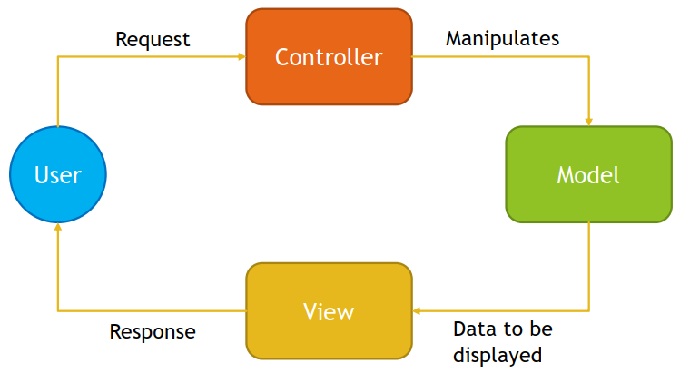
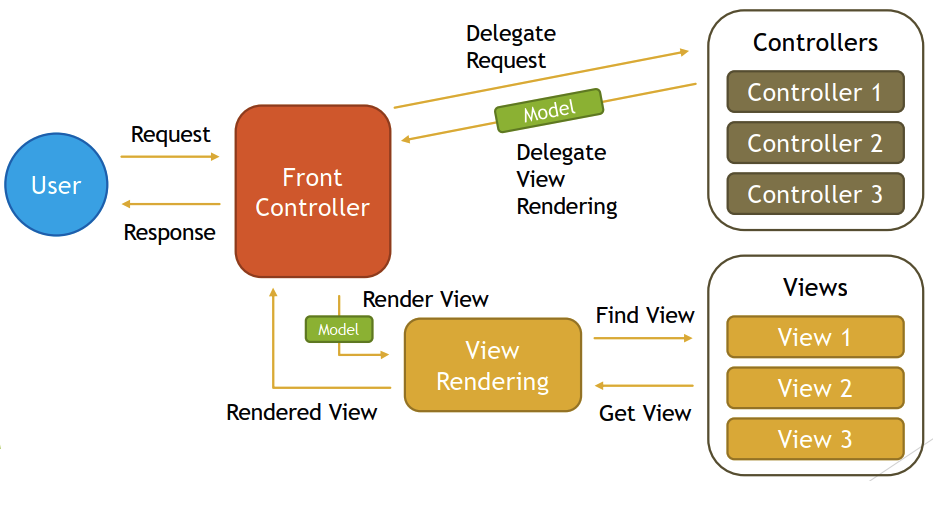
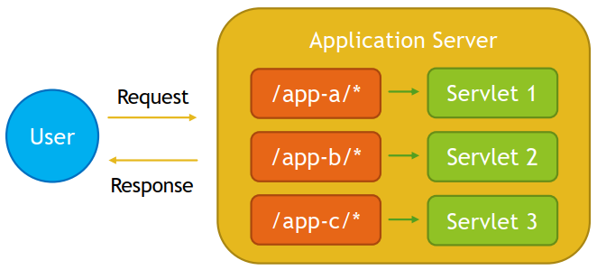

## Spring MVC and the Web Layer

### MVC is an abbreviation for a design pattern. What does it stand for and what is the idea behind it?

MVC stands for Model-View-Controller, it is a design pattern which divides application into three main interconnected component types.

**Model**
- Data Access
- Data Structures
- Business Logic
- CRUD Logic
    - C – Create
    - R – Read
    - U - Update
    - D - Delete
    
**View**
- Data representation to the user
- Multiple representations of the same data are possible

**Controller**
- Accepts requests from the users
- Issues command to Model
- Modifies the Model
- Decides on View to use



Usage of MVC design pattern has following advantages:
- Separation of concerns
- Increased code cohesion
- Increased code reusability
- Reduces coupling between data, logic and information representation
- Lowers maintenances costs
- Increases extendibility

### What is the DispatcherServlet and what is it used for?

DispatcherServlet is an internal Spring MVC component that implements HttpServlet from Java Servlet API and Front Controller Design Pattern. It is used to handle all requests to the application, based on servlet mapping, delegate those requests to controllers and produce response based on identified view.

DispatcherServlet has following responsibilities:
- Delegates received requests to Controllers
- Uses View Resolvers to resolve views pointed out by Controllers
- Produces Response that is sent to user
- Handles shared concerns, like exception mapping, error handling, security etc.

Front Controller Design Pattern allows you to implement shared algorithm for entire application responsible for request processing and handling shared concerns.



Servlet is a Java Technology used to create Web Applications on Java Platform with usage of Application Servers. It is a set of interfaces, classes and documentation allowing you to extend capabilities of Application Servers. Servlet is protocol independent, however usually it is used to process HTTP Requests with usage of custom implementation of HttpServlet class. Servlet can be registered via web.xml, or programmatically via annotations since Servlet 3. Servlet registration requires url-patterns which informs application server which requests should be mapped to your servlet.



### What is a web application context? What extra scopes does it offer?

Web Application Context is a Spring Application Context for Web Applications that runs under Embedded or Standalone Application Server that supports Servlet API and acts as Servlet Container.

Web Application Context is described by `WebApplicationContext` interface and it allows you to access `ServletContext` interface from Servlet API.

Web Application Context provides four additional scopes:
- Request Scope
- Session Scope
- Application Scope
- Websocket Scope

**Request Scope**
- Defined by `@RequestScope` annotation
- Bean lifecycle is tightly coupled with HTTP Request lifecycle
- New Bean instance is created for each request

    ```java
    @RequestScope
    @Component
    public class RequestScopeBean {

    }
    ```

**Session Scope**
- Defined by `@SessionScope` annotation
- Bean lifecycle is tightly coupled with HTTP Session lifecycle
- New Bean is created for each new session and Bean instance lives as long as HTTP Session is alive

    ```java
    @SessionScope
    @Component
    public class SessionScopeBean {

    }
    ```
**Application Scope**
- Defined by `@ApplicationScope` annotation
- Bean lifecycle is tightly coupled with `ServletContext`
- One Bean instance available per entire Web Application – `ServletContext`
- Differences compared to Singleton Bean:
    - Singleton per `ServletContext`, not per Spring Application Context (one Web Application may have several Spring Application Contexts)
    - Exposed via attribute of `ServletContext`

    ```java
    @ApplicationScope
    @Component
    public class ApplicationScopeBean {

    }
    ```

**Websocket Scope**
- Defined by `@Scope` annotation with specified properties:
    - `@Scope(scopeName = "websocket", proxyMode = ScopedProxyMode.TARGET_CLASS)`
- Bean lifecycle is coupled with lifecycle of WebSocket Session, however bean usually lives longer then WebSocket Session

    ```java
    @Scope(scopeName = "websocket", proxyMode = ScopedProxyMode.TARGET_CLASS)
    @Component
    public class WebSocketScopeBean {

    }
    ```

### What is the @Controller annotation used for?

`@Controller` annotation is used to indicate that annotated class is a Controller from Model-View-Controller Design Pattern, and should be considered a candidate for request handling when `DispatcherServlet` searches for component to which work can be delegated.

`@Controller` annotation is a specialization of `@Component` annotation, this allows Spring to autodetect controllers during classpath scanning.

Controllers in Spring do not have to implement any interface or extend any base class, Spring uses annotation-based programming model with `@Controller` annotation being part of it. Controllers have flexible methods signatures with mapping expressed via annotations like `@RequestMapping`, `@GetMapping`, `@PostMapping` etc.

```java
@Controller
public class HelloController {

}
```

### How is an incoming request mapped to a controller and mapped to a method?

Incoming request is mapped to a controller and a method by `DispatcherServlet`, which uses `HandlerMapping` and `HandlerAdapter` components for this purpose.

`HandlerMapping` components are used during Spring initialization to scan classpath for `@Controller` or `@RestController` classes with one of request mapping annotations that are part of annotation based programming model:
- `@RequestMapping`
- `@GetMapping`
- `@PostMapping`
- `@PutMapping`
- `@PatchMapping`
- `@DeleteMapping`

`HandlerAdapter` components are responsible for execution of method identified as handler candidate for the request.

When request is performed against the server following steps are executed:
1. Application Server (Standalone or Embedded) searches for Servlet that can handle request, `DispatcherServlet` is selected based on Servlet Registration and `url-pattern`.
2. `DispatcherServlet` uses `HandlerMapping` classes to get request mapping information and `HandlerAdapter`.
3. `DispatcherServlet` uses `HandlerAdapter` to execute controller method that will handle request.
4. `DispatcherServlet` interprets results of method execution and renders View with help of `ViewResolver` classes.

`@RequestMapping` allows you to specify conditions that request has to match for a method to be used as request handler. `@RequestMapping` can be used at class or method level, when used at the class level, all method level mappings inherit this primary mapping, narrowing it to a specific handler method.

For example, below controllers are supposed to map GET /say/hello requests, even though request mapping is defined differently, all are equal.

```java
@Controller
@RequestMapping("/say/hello")
public class HelloController {
    @RequestMapping(method = GET)
    public ResponseEntity<String> sayHello() {
        return ResponseEntity.ok().body("Hello");
    }
}
```

```java
@Controller
@RequestMapping(path = "/say", method = GET)
public class HelloController {
    @RequestMapping("/hello")
    public ResponseEntity<String> sayHello() {
        return ResponseEntity.ok().body("Hello");
    }
}
```

```java
@Controller
public class HelloController {
    @RequestMapping(path = "/say/hello", method = GET)
    public ResponseEntity<String> sayHello() {
        return ResponseEntity.ok().body("Hello");
    }
}
```

`@RequestMapping` annotation allows you to specify following criteria for request:
- `path` - uri path/paths for request, for example `/api/books`
- `method` – supported HTTP method/methods: `GET`, `POST`, `HEAD`, `OPTIONS`, `PUT`, `PATCH`, `DELETE`, `TRACE`
- `params` – required parameters of request, for example `key1=value1`, `key2!=value2`, `key1`, `!key1`
- `headers` – header needs to match specified condition, for example `header1=value1`, `header2!=value2`, `header1`, `!header1`, `content-type=text/*`
- `consumes` – media types that can be consumed by request, for example `application/json`
- `produces` – media types that are produced by method handling the request, for example `application/pdf`

Spring MVC also supports composed annotations for request mapping:
- `@GetMapping`
- `@PostMapping`
- `@PutMapping`
- `@PatchMapping`
- `@DeleteMapping`

Each of those annotations allows you to specify same conditions as `@RequestMapping` except for HTTP method field, following fields in `@*Mapping` are aliases to `@RequestMapping`: `path`, `params`, `headers`, `consumes`, `produces`.

In most of the cases it is possible to translate mappings between those annotations, one example when this is not possible is when creating HTTP HEAD request mapping.

```java
@Controller
public class HelloController {
    @RequestMapping(path = "/say/hello", method = GET)
    public ResponseEntity<String> sayHello() {
        return ResponseEntity.ok().body("Hello");
    }
}
```

```java
@Controller
public class HelloController {
    @GetMapping(path = "/say/hello")
    public ResponseEntity<String> sayHello() {
        return ResponseEntity.ok().body("Hello");
    }
}
```

### What is the difference between @RequestMapping and @GetMapping?

The main difference between `@RequestMapping` and @GetMapping is that first one can be used to map any HTTP method requests and second one can be used to map only HTTP GET method requests. `@GetMapping` is less flexible, but easier to use.

`@GetMapping` annotation is a composed annotation that is equal to `@RequestMapping(method = RequestMethod.GET)`.

Both annotations allows you to specify multiple criteria for request mapping, like uri path, required headers, consumable media types, producible media types, however only `@RequestMapping` allows you to specify HTTP method or HTTP methods through method field. If none HTTP methods are specified, all HTTP methods will be mapped.

Spring also includes other specialized versions of @RequestMapping:
- `@PostMapping`
- `@PutMapping`
- `@DeleteMapping`
- `@PatchMapping`

Usage of those simpler, specialized versions is recommended for simple HTTP method mappings.

### What is @RequestParam used for?

`@RequestParam` is used to bind web request parameters to controller method parameter. 

```
/index?name=John&city=NYC&country=US
```
```java
@GetMapping("/index")
public String index(@RequestParam("name") String name, @RequestParam("city") String city, @RequestParam("country") String country) {
    // here name = John, city = NY, country = US
    ...
}
```

Because Servlet API combines query parameters and form data into a single parameters map, it is possible to use `@RequestParam` annotation to map:
- query parameters
- form data
- parts in multipart requests

@RequestParam allows you to specify following parameters:
- `name` – the name of request parameter to bind
- `required` - whether the parameter is required or not
    - by default parameter is required and in case of it being absent exception will be thrown
    - If switched to false, in case of parameter being absent null value will be provided or value pointed out by defaultValue property
- `defaultValue` – allows you to specify default value to use in case of absence
of optional parameter

`@RequestParam` annotation also supports Java 8 Optional, so following will be equal:

```java
@RequestParam(value = "city", required = false) String city
```

```java
@RequestParam(value = "city") Optional<String> city
```

`@RequestParam` also supports additional use cases, like:
- Mapping all request parameters to Map

    ```
    /index?name=John&city=NYC&country=US
    ```

    ```java
    @GetMapping("/index")
    public String index(@RequestParam Map<String, String> parameters) {
        // all the request parameters will be present in the map "parameters"
        ...
    }
    ```
- Mapping all values to List

    ```
    /index?cities=1,2,3
    ```
    ```java
    @GetMapping("/index")
    public String index(@RequestParam("cities") List<String> cities) {
        // all the values of cities input param will be available in the List "cities"
        ...
    }
    ```

### What are the differences between @RequestParam and @PathVariable?

The main difference between `@RequestParam` and `@PathVariable` is the purpose of each annotation. 

`@PathVariable` is responsible for mapping parts of URI, marked with usage of URI templates variables to controller method parameters. URI templates are identifiers surrounded with curly brackets.

```
/countries/US/cities/DEN
```

```java
@GetMapping("/countries/{country}/cities/{city}")
public String countryAndCityByCode(@PathVariable("country") String country, @PathVariable(value = "city") String city) {
    // US -> {country} -> @PathVariable("country") String country
    // DEN -> {city} -> @PathVariable(value = "city") String city
    ...
}
```

`@RequestParam` is used to bind web request parameters to controller method parameter.

```
/index?name=John&city=NYC&country=US
```

```java
@GetMapping("/index")
public String index(@RequestParam("name") String name, @RequestParam("city") String city, @RequestParam("country") String country) {
    // name=John -> @RequestParam("name") String name
    // city=NYC -> @RequestParam("city") String city
    // country=US -> @RequestParam("country") String country
    ...
}
```

The other difference between `@RequestParam` and `@PathVariable` is following:
- `@RequestParam` allows you to specify defaultValue property, `@PathVariable` does not

Similarities are following, both allows you to:
- Specify name of variable to bind
- Mark variables as required or optional
- Use Java 8 Optional for optional values
- Map all parameters to Map
- Map list of values for parameter to collection

### What are some of the parameter types of a controller method?

- `WebRequest`, `NativeWebRequest` – Access to HTTP request details, parameters, also request and session attributes, without direct use of the Servlet API
- `javax.servlet.ServletRequest` - object to provide client request information, allows access to parameters, attributes and other request details without direct use of Spring Interfaces
- `javax.servlet.ServletResponse` – object created by servlet container, passed to service method of servlet, used by servlet to send a response to the client
- `javax.servlet.http.HttpSession` – allows access to session information and attributes, also enforces HTTP session for request
- `javax.servlet.http.PushBuilder` - Servlet 4.0 push builder API for programmatic HTTP/2 resource pushes, allows resources to be delivered in advance by the server, resulting in a faster load time
- `java.security.Principal` - currently authenticated user
- `HttpMethod` – HTTP method used for request, one of `GET`, `HEAD`, `POST`, `PUT`, `PATCH`, `DELETE`, `OPTIONS`, `TRACE`
- `java.util.Locale` - request locale, determined by the most specific LocaleResolver available
- `java.util.TimeZone + java.time.ZoneId` - time zone associated with the current request, as determined by a LocaleContextResolver.
- `java.io.InputStream`, `java.io.Reader` – allows access to raw request body as exposed by the Servlet API
- `java.io.OutputStream`, `java.io.Writer` – allows to create raw response as exposed by the Servlet API
- `HttpEntity<B>` - container object that exposes request headers and body, body is converted with usage of HttpMessageConverter
- `java.util.Map`, `org.springframework.ui.Model`, `org.springframework.ui.ModelMap` – used to expose data to templates as part of view rendering
- `RedirectAttributes` – specify attributes to use in case of redirect, regular attributes will be added to query string and flash attributes will be kept temporarily until end of request, flash attributes are kept typically in the session and are removed immediately after request is completed
- `Errors`, `BindingResult` – used to gain access to form validation and binding data results, can be used with `@ModelAttribute`, `@RequestBody` or `@RequestPart` argument, `Errors` and `BindingResult` argument must be declared immediately after the validated method argument
- `SessionStatus` + class-level `@SessionAttributes` – useful for multi step form processing, `@SessionAttributes` allows to keep `@ModelAttribute` objects between requests and `SessionStatus` allows to clean session variables when form processing is done
- `UriComponentsBuilder` – used to build URLs relative to current scheme, host, port, contextPath etc.
- Any other argument – if a method argument is not matched against types defined before, and it is a simply type, it is treated as `@RequestParam`, if it is a complex type, it is treated as `@ModelAttribute`

### What other annotations might you use on a controller method parameter?

- `@RequestParam` 
    - access to the Servlet request parameters, including multipart files
    - parameters will be automatically converted to declared method argument types, 
    - parameters can be made optional with usage of `required` attribute or `Optional` from Java 8, 
    - for optional request parameters `defaultValue` can be set as well
- `@PathVariable` 
    - access to URI template variables, 
    - parameters can be made optional with usage of `required` attribute or `Optional` from Java 8
- `@MatrixVariable`
    - access to name-value pairs in URI path segments as described in RFC 3986
    - allows mapping variables from requests like `/employees/id=1;name=John`
- `@CookieValue`
    - bind the value of an HTTP cookie to a method argument in a controller, 
    - you can bind against simple types or `Cookie` class, 
    - cookie can be set with usage of `HttpServletResponse`, 
    - cookie can be set as required or optional via required attribute or with `Optional` from Java 8, 
    - when using `required` attribute, `defaultValue` can be used as well
- `@RequestHeader` 
    - access request header values
    - access all header key and values when binding against a Map
- `@RequestBody`
    - allows access to HTTP request body, 
    - content will be converted to method controller type by `HttpMessageConverter`, 
    - request body can be made optional with usage of `required` attribute or Java 8 `Optional`, 
    - can be used with `@Valid` for bean validation
- `@RequestPart` 
    - allows to bind multipart HTTP requests to method parameter, 
    - content will be converted to method controller type, 
    - request part can be made optional with usage of required attribute or Java 8 `Optional`, 
    - can be used with `@Valid` for bean validation
- `@RequestAttribute` 
    - allows access to HTTP request attributes populated on serverside during HTTP request by filter or interceptor
    - can be made optional with usage of required attribute or Java 8 `Optional`
- `@ModelAttribute`
    - access to an existing attribute in the model (instantiated if not present) with data binding and validation applied
- `@SessionAttribute`
    - access to pre-existing session attributes that are managed globally
    - can be made optional with usage of required attribute or Java 8 `Optional`
- `@SessionAttributes`
    - used to store model attributes in the HTTP Servlet session between requests
    - useful for multi step from processing

### What are some of the valid return types of a controller method?

- `@ResponseBody`
    - binds method return value to web response body, complex types will be converted with usage of HttpMessageConverter
- `HttpEntity<B>`, `ResponseEntity<B>` 
    - allows to specify full response with headers and body, `ResponseEntity<B>` additionally allows you to specify HTTP status code
- `HttpHeaders` 
    - allows to return response only with headers, without body
- `String`
    - allows to return logical name of view to use when rendering response, view will be resolved by `ViewResolver`, usually used with implicit model through `@ModelAttribute` parameters or explicit model by declaring `Model` method parameter
- `View`
    - allows to return instance of view, like `JstlView`, `ThymeleafView`, `FreeMarkerView`
    - usually used with implicit model through `@ModelAttribute` parameters or explicit model by declaring `Model` method parameter
- `Map`, `Model` 
    - allows you to specify attributes to be added to the implicit model, with the view name implicitly determined through a `RequestToViewNameTranslator`
- `@ModelAttribute` 
    - allows you to specify an attribute to be added to the model, with the view name implicitly determined through a `RequestToViewNameTranslator`
- `ModelAndView`
    - view and model attributes to use and, optionally, a response status
    - view can be specified by logical name or instance of view can be passed
    - model can be specified as named object or `Map`
- `void`
    - method that returns void can correctly handle request by using `ServletResponse` or `OutputStream` as parameter, or `@ResponseStatus` annotation, if none of previous are used `RequestToViewNameTranslator` will identify view based on request
    - `void` return type can also indicate “no response body” for REST controllers
- `DeferredResult<V>`
    - allows to specify result for controller asynchronously from different Thread or as result of some event callback
    - part of integration with Servlet 3.0 asynchronous request
- `Callable<V>` 
    - allows to produce return value asynchronously in a Spring MVC - managed thread
- `ListenableFuture<V>`, `CompletableFuture<V>`, `CompletionStage<V>` 
    - allows to return set of chained, asynchronous operations, with callbacks and transformations
- `ResponseBodyEmitter`, `SseEmitter` 
    - allows to send objects in stream asynchronously, 
    - objects will be converted with usage of `HttpMessageConverter`, 
    - can be used with `ResponseEntity`, 
    - both classes have the same goal, however `SseEmitter` uses Server-Sent Events standardized with W3C SSE specification
- `StreamingResponseBody` 
    - allows to write to the response `OutputStream` asynchronously
- Reactive types
    - allows to use Reactive types for streaming scenarios, handled by `ReactiveAdapterRegistry`