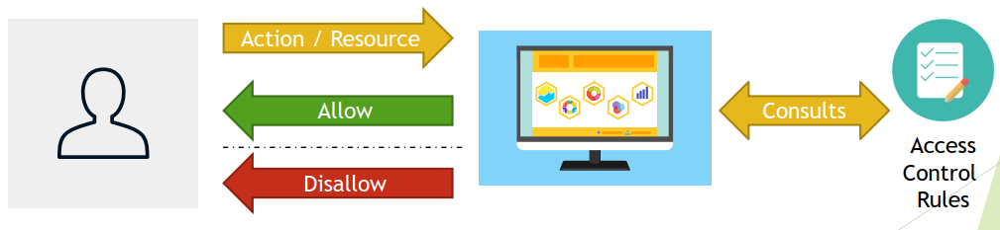

## Spring Security

### What are authentication and authorization?

Authentication is a process of verifying that user, device or external system is who he/she/it claims to be. It involves validation that submitted proof of identity is true.

In other words, authentication answers question “Who are you?”, and checks if provided answer is valid.

Process usually involves one side sending Identity and Credential that is used to validate that Identity statement is true, and other side that checks Credential and accepts or rejects claimed Identity based on Credential.


Authentication may take different forms, simplest one uses username as Identity and password as credential – proof of identity.


More sophisticated forms of authentication, may involve three parties for implementation of Central Authentication Service (CAS) to allow single sign-on.


Recently, Multi Factory Authentication is becoming more popular to provide greater degree of security.


Spring security provides following support for Authentication:
- Username/Password Authentication
    - Form Login
    - Basic Authentication
    - Digest Authentication
- Remember-Me Authentication
- OpenID Support
- CAS Authentication (single sign-on)
- X.509 Certificate Authentication
- OAuth 2.0 Login
- SAML2
- Storage Mechanism
    - Simple Storage with In-Memory Authentication
    - Relational Databases with JDBC Authentication
    - Custom data stores with UserDetailsService
    - LDAP storage with LDAP Authentication
- Password Encoders:
    - bcrypt
    - PBKDF2
    - scrypt
    - argon2
    - sha256
    - …

Authorization is a process of determining whether an authenticated user is allowed to access certain resources within the system or allowed to perform a certain action within the application.

In other words, authorization answers question “What are you allowed to do?”.

Authorization usually uses formalized policy specified as access control rules, to determine allowed and disallowed parts of the system that authenticated user can visit and act upon.



Spring Security allows you to implement authorization within your application on
two levels:
- Web Security Level with usage of Expression
    - mvcMatchers("/admin/**").hasRole("ADMIN")
- Method Security Level with usage of:
    - @Secured annotation
    - @PreAuthorize annotation
    - JSR 250 annotations
        - @RolesAllowed
        - @PermitAll
        - @DenyAll
        - ...

Access Control Rules can be expressed via:
- Roles
    - Represents a high-level set of privileges, for example ROLE_ADMIN, ROLE_STAFF, ROLE_CUSOMERS etc.
    - Used with expressions like hasRole
- Authorities
    - Represents a low-level, granular privilege/authority in the system for example READ_CUSTOMERS, DELETE_EMPLOYEE, ACCESS_API etc.
    - Used with expressions like hasAuthority
- Hierarchical Roles
    - Allows you to specify relationships between roles and express that one role includes all permissions granted to other role
    - Example:
        - ROLE_ADMIN > ROLE_STAFF - ROLE_ADMIN includes ROLE_STAFF

### Which must come first - Authentication or Authorization?

Authentication needs to be executed first, before authorization, because for authorization process to know which roles/authorities can be granted for particular user, system needs to be sure that user is who he/she claims to be.


### Is security a cross cutting concern? How is it implemented internally?

Yes, Security is a cross cutting concern.

Cross cutting concern – functionality of a program not immediately associated with the business logic, applicable throughout the application and affecting multiple parts of the system.

Security fits well into above definition, other examples of cross cutting concerns include functionalities like logging or transactions.


Security in Spring is implemented on two levels:
- Web Level – based on Servlet Filters
- Method Security Level – based on Spring AOP

Each aspect of Security – Authentication and Authorization is handled on both of
those levels with different set of components:
- Authenthicaiton
    - AuthenticationManager
    - ProviderManager
    - AuthenticationProvider
    - UserDetailsService
- Authorization
    - AccessDecisionManager
        - AccessDecisionVoter
    - AfterInvocationManager
    - Authorities

**Web Level Spring Security** uses Servlet Filters to analyze each request made to the system, and based on rules specified through `WebSecurityConfigurerAdapter` and `HttpSecurity` object, performs certain decision against authentication or authorization. Such decision may include redirecting request to login page, or rejecting request because of roles not being assigned to the user.


**Method Security Level** uses Spring AOP to proxy invocations to objects, applied advices ensures that during invocation, security rules are met to allow invocation, for example user needs to contain set of roles/authorities to execute method.

To enable method level security you need to use `@EnableGlobalMethodSecurity` annotation and enable support to one of annotation types:
- `prePostEnabled` - Security's pre post annotations - `@PreAuthorize`
- `securedEnabled` - @Secured annotation - Spring Security's `@Secured` annotations
- `jsr250Enabled` – JSR 250 annotations `@RolesAllowed`, `@PermitAll`, `@DenyAll`, ...

Spring Security uses many objects to implement security:
- `SecurityContextHolder` – heart of Spring Security authentication model, place were Spring stores the details of who is authenticated
- `SecurityContext` – held by `SecurityContextHolder`, gives access to Authentication object
- `Authentication` object – used as input to `AuthenticationManager` to provide the credentials that user has provided to authenticate, also represents the currently authenticated user, contains principal, credentials, authorities
- `GrantedAuthority` - high level permissions the user is granted, for example roles, `ROLE_ADMIN`, `ROLE_EDITOR`, `ROLE_VIEWER` etc.
- `AuthenticationManager` - API that defines how Spring Security’s Filters perform authentication, usually implemented by `ProviderManager`
- `ProviderManager` – is an `AuthenticationManager` that delegates to list
of `AuthenticationProviders`, if at least `AuthenticationProvider` will
successfully authenticate user, user is logged into the system

    

- `AccessDecisionManager` – called by `SecurityInterceptors` before executing method/action, used for authorization to check if user is allowed to perform certain action or access certain resource in the system based on `GrantedAuthority` objects

    

- `AfterInvocationManager` – called after executing method/action, used for authorization to ensure the principal is permitted to access the domain object instance returned by a service layer bean

    

Spring Security is able to access list of users and authorities based on
`UserDetailsService` abstraction, following storage types are supported:
- Simple Storage with In Memory Authentication
- Relational Databases with JDBC Authentication
- Custom data stores with UserDetailsService
- LDAP storage with LDAP Authentication

    

Here is an example scenario that Spring Security can handle with usage of
`Authenthiation` and `Authorization` components:
1. `User` tries to access protected resource.
2. Application requires the user to provide `username` and `password` (form login). Username is identifier, password is credential.
3. Credentials are verified by the `AuthenticationManager`, implemented by `ProviderManager`, which delegates to `AuthenthicationProviders`, user is granted access to the application, `SecurityContext` will hold authorization rights for this user.
4. User tries to edit some resource, which is implemented by method on controller level, `SecurityInterceptor` intercepts the request.
5. `SecurityInterceptor` extracts the user authorization data from the `SecurityContext`.
6. `AccessDecisionManager` is invoked to check if user is allowed to perform requested operation.
7. `AccessDecisionManager` delegates call to a list of `AccessDecisionVoters` to check if user is allowed to perform requested operation.
8. Access is `granted` or `denied`.

### What is the delegating filter proxy?

`DelegatingFilterProxy` is an internal Spring Framework class located in package `org.springframework.web.filter` of spring-web module. 

This class acts as a Proxy between standard Servlet Filter and Spring-managed Bean that implements Servlet Filter. `DelegatingFilterProxy` is registered within application container and delegates all calls to Bean registered within Spring Application Context.

We may say that it acts like a bridge between Servlet Container and Spring Application Context.

Bean to which all calls should be delegated to is located based on Filter Name provided within Filter Configuration, usually it is named `springSecurityFilterChain` and is an instance of `FilterChainProxy`.


`DelegatingFilterProxy` can be registered in following ways:
- Servlet 3 – via `AbstractSecurityWebApplicationInitializer`
    - Method `insertSpringSecurityFilterChain` will register `DelegatingFilterProxy`
- Servlet 2 – via web.xml

    ```xml
    <filter>
        <filter-name>springSecurityFilterChain</filter-name>
        <filter-class>org.springframework.web.filter.DelegatingFilterProxy</filter-class>
    </filter>
    <filter-mapping>
        <filter-name>springSecurityFilterChain</filter-name>
        <url-pattern>/*</url-pattern>
    </filter-mapping>
    ```

    `springSecurityFilterChain` is a default name for `FilterChainProxy` specified in `AbstractSecurityWebApplicationInitializer#DEFAULT_FILTER_NAME`

- Spring Boot
    - uses `DelegatingFilterProxyRegistrationBean` instead of regular `DelegatingFilterProxy` to create specialized version of `DelegatingFilterProxy`
    - Registered by `SecurityFilterAutoConfiguration`

Role of `DelegatingFilterProxy` is to delegate all calls to `FilterChainProxy`, which contains `SecurityFilterChain` responsible for Web Level `authentication` and `authorization`:


### What is the security filter chain?

Security Filter Chain is a collection of Spring Managed Filters that are responsible for authentication and authorization. Usually they include functionalities like Username & Password Authentication, Logout Management, Session Management, Security Interceptors etc.


`SecurityFilterChain` is an interface located in package `org.springframework.security.web` of `spring-web` module.

This interface specifies a contract for behavior that associates request URL to list of security filters.

Spring provides one implementation of this interface called `DefaultSecurityFilterChain` which uses request matchers to check if list of security filters should be applied to specified url.

Some of the request matchers that can be used include `AntPathRequestMatcher`, `MvcRequestMatcher`, `RequestHeaderRequestMatcher`, `MediaTypeRequestMatcher` etc.

Security Filters are implementation of Servlet Filter and are usually managed by Spring Context.

`FilterChainProxy` holds list of `SecurityFilterChains` and upon request searches for the first SecurityFilterChain that matches request.

Upon request being matched, `SecurityFilterChain` is picked up and list of Filters is being fetched from `SecurityFilterChain`.

After that `FilterChainProxy` executes `Filters` from `SecurityFilterChain`.

`FilterChainProxy` is a registered bean in Spring Context and takes default name specified inside `AbstractSecurityWebApplicationInitializer#DEFAULT_FILTER_NAME` which is `springSecurityFilterChain`.

`FilterChainProxy` is fetched from the context based on name within `DelegatingFilterProxy`.

Spring usually includes following Filters within Security Filter Chains:
- `WebAsyncManagerIntegrationFilter`
- `SecurityContextPersistenceFilter`
- `HeaderWriterFilter`
- `CsrfFilter`
- `LogoutFilter`
- `UsernamePasswordAuthenticationFilter`
- `RequestCacheAwareFilter`
- `SecurityContextHolderAwareRequestFilter`
- `AnonymousAuthenticationFilter`
- `SessionManagementFilter`
- `ExceptionTranslationFilter`
- `FilterSecurityInterceptor`

Spring provides API to customize list of used Security Filters, by extending `WebSecurityConfigurerAdapter` and overriding configure method.

```java
@Configuration
@EnableWebSecurity
public class WebSecurityConfig extends WebSecurityConfigureAdapter {
    
    @Override
    public void configure(WebSecurity web) throws Exception {
        ...
    }

    @Override
    protected void configure(HttpSecurity http) {
        ...
    }

    @Override
    protected void configure(AuthenticationManagerBuilder auth) {
        ...
    }
}
```

### What is security context?

`SecurityContext` is an interface, allowing you to access security information associated with the current thread of execution. Interface provides two methods:
- `getAuthentication` - provides currently authenticated principal, or an authentication request token
- `setAuthentication` - sets currently authenticated principal, or removes the authentication

`SecurityContext` can be accessed via `SecurityContextHolder`, which allows access in three modes:
- `MODE_THREADLOCAL`
- `MODE_INHERITABLETHREADLOCAL`
- `MODE_GLOBAL`

`SecurityContextHolder` is set to `MODE_THREADLOCAL` by default, it allows each Thread to access it’s own dedicated `SecurityContext`.


When `SecurityContextHolder` is set to `MODE_INHERITABLETHREADLOCAL`, then child threads are allowed to access same `SecurityContext` as parent Thread.


When `SecurityContextHolder` is set to `MODE_GLOBAL`, then all threads within JVM are accessing same `SecurityContext`, this mode is usually used by standalone desktop applications, such as Java Swing based clients.


Mode of `SecurityContextHolder` can be changed via:
- Property - `spring.security.strategy`
- Programmatically - `SecurityContextHolder#setStrategyName`

Allowed values are:
- `MODE_THREADLOCAL` (default)
- `MODE_INHERITABLETHREADLOCAL`
- `MODE_GLOBAL`

`SecurityContext` allows you to access or set currently used `Authentication` object.

`Authentication` object represents the token for an authentication request or an authenticated principal, once the authentication request has been processed. `Authentication` object contains following methods:
- `getPrincipal` - identity of the principal being authenticated
- `getAuthorities` – collection of authorities granted to the principal
- `getCredentials` - credentials that prove the principal is correct
- `getDetails` - additional details about the authentication request, address, certificate, serial number etc.
- `isAuthenticated`, `setAuthenticated` – for internal use by `AbstractSecurityInterceptor`, `AuthenticationManager` to control required amount of for re-authentications

### What does the ** pattern in an antMatcher or mvcMatcher do?

** pattern in `antMatcher` and `mvcMatcher` matches zero or more path segments
until the end of the path.

`antMatcher` and `mvcMatcher` support following rules:
- ? - matches one character
- \* - matches zero or more characters within a path segment
- ** - matches zero or more path segments until the end of the path
- Regexps are supported for Path Variables
    - `{spring:[a-z]+}` matches the regexp `[a-z]+` as a path variable named `"spring"`

For example, having following URI `/departments/delete/5:`
- `/departments/delete/*` - matches
- `/departments/delete/**` - matches
- `/*/5` – does not match
- `/**/5` – matches
- `/departments/dele??/*` - matches

### Why is the usage of mvcMatcher recommended over antMatcher?

`mvcMatcher` is more flexible and forgiving when writing down rules for Spring Security Configuration, thus making mistakes when securing application is harder.

As an example let’s consider following matcher rules:
- `.mvcMatchers("/employees")`
- `.antMatchers("/employees")`

Although they look very similar, they will work differently when executed against URI `/employees` and `/employees/`
- /employees
    - `.mvcMatchers("/employees")` – matches
    - `.antMatchers("/employees")` - matches
- /employees/
    - `.mvcMatchers("/employees")` – matches
    - `.antMatchers("/employees")` – **does not match**

So in above example, when using `antMatchers` it is very easy to omit last slash, giving attackers possibility to bypass application security rules.

### Does Spring Security support password hashing? What is salting?

Yes, Spring Security supports password hashing through `PasswordEncoder` interface and has built-in support for following encoders:
- bcrypt
- pbkdf2
- scrypt
- argon2
- sha256
- ...

`PasswordEncoder` interface contains following methods:
- `encode` - encode the raw password
- `matches` – verifies if raw password provided as input matches encoded password, password is never decoded, one-way algorithms are used

**Password hashing upon registration**

Upon registration password is encoded (hashed) and never stored in cleartext.


**Password verification upon login**

Upon login, provided password is encoded again and compared with one stored in
database.


Spring Security also provides `DelegatingPasswordEncoder`, which uses one of the
selected `PasswordEncoder` to encode password, and list of provided passwords
decoders to verify password upon login.

`DelegatingPasswordEncoder` is useful as it provides flexibility and ability to
easily switch between `PasswordEncoders` while keeping backward compatibility,
for already stored hash values of passwords.

`DelegatingPasswordEncoder` stores hash values for password as calculated by
selected `PasswordEncoder` with identifier stored as prefix, for example:

```
{bcrypt}$2a$10$dXJ3SW6G7P50lGmMkkmwe.20cQQubK3.HZWzG3YB1tlRy.fqvM/BG
```

If storage contains other algorithms used as well, prefix is used to delegate password verification to correct `PasswordEncoder`, for example:

```
{bcrypt}$2a$10$dXJ3SW6G7P50lGmMkkmwe.20cQQubK3.HZWzG3YB1tlRy.fqvM/BG
{pbkdf2}5d923b44a6d129f3ddf3e3c8d29412723dcbde72445e8ef6bf3b508fbf17fa4ed4d6b99ca763d8dc
{sha256}97cde38028ad898ebc02e690819fa220e88c62e0699403e94fff291cfffaf8410849f27605abcbc0
```

Password salting is a security mechanism invented to protect against reversing cryptographic hash functions, with usage of a precomputed tables like Rainbow Tables.

Password Salting assumes that whenever hash for password is computed, a sequence of random bytes, known as salt is added to cleartext password before calculating hash value. This way database will not contain same hash values for the same passwords.

When password is verified, salt that is stored in clear text alongside hash value for password is used again to verify if provided password matches hash value.


As an example, let’s look at how `BCrypt` will handle process of password encoding and verification:
- Password ‘secretpassword’ is encoded and stored in database as following:
    ```
    $2a$10$4Hw.ix095n8Hs3pPf6E5UOfJk/ym9R0WY6u58OIt9pzRhZPV3F1DS
    ```

    

- Password ‘secretpassword’ is verified
    - Raw password ‘secretpassword’ is being sent for comparison
    - Stored password is retrieved as - `$2a$10$4Hw.ix095n8Hs3pPf6E5UOfJk/ym9R0WY6u58OIt9pzRhZPV3F1DS`
    - Algorithm identified is checked - `$2a$`
    - Number of rounds is retrieved – `10`
    - Salt is retrieved - `4Hw.ix095n8Hs3pPf6E5UO`
    - Hash for provided password is computed
        - Hash(‘secretpassword’, ‘4Hw.ix095n8Hs3pPf6E5UO’, 10)
    - Newly generated hash is compared with stored hash

### Why do you need method security? What type of object is typically secured at the method level (think of its purpose not its Java type).

Method level security is needed whenever more granular security rules needs to be expressed for the application. In some cases having web based rules, written based on URI patterns, might not be detailed enough, and additional set of rules needs to be applied to the application service layer of application that is being built. In that case method level security is helpful.

Method level security is typically applied at Application Service Layer.


Spring supports following method level security annotations:
- `@Secured`
- `@RolesAllowed (JSR 250)`
- `@PreAuthorize`, `@PostAuthorize`, `@PreFilter`, `@PostFilter`

Annotations above will work if Method Level Security is enabled by annotation `@EnableGlobalMethodSecurity`, additionally you can choose which type of annotations you want to enable:
- `@Secured` 
    - `@EnableGlobalMethodSecurity(securedEnabled = true)`
- `@RolesAllowed` 
    - `@EnableGlobalMethodSecurity(jsr250Enabled = true)`
- `@PreAuthorize`, `@PostAuthorize`, `@PreFilter`, `@PostFilter`
    - `@EnableGlobalMethodSecurity(prePostEnabled = true)`

### What @PreAuthorized and @RolesAllowed annotations do? What is the difference between them?

`@PreAuthorized` and `@RolesAllowed` annotations are part of Method Security Model implemented in Spring Security. Both of those annotations are evaluated before method is executed, to check if user is allowed to execute desired method.

`@RolesAllowed` annotation, is very similar to `@Secured` annotation, and both of those allows you to specify list of roles that currently authenticated user needs to have assigned to be allowed to execute guarded method. `@RolesAllowed` annotation is part of JSR 250 standard. Annotation is enabled by:
```java
@EnableGlobalMethodSecurity(jsr250Enabled = true)
```

`@PreAuthorized` annotation allows you to specify, conditions under which user is allowed to execute method, with usage of SpEL expressions. Expression is evaluated before method is executed. Annotation support is enabled by:
```java
@EnableGlobalMethodSecurity(prePostEnabled = true)
```

Difference between those annotation is that `@RolesAllowed` allows you to specify list of required roles, and `@PreAuthorized` annotation allows you to specify security rule with usage of SpEL expression.

SpEL expressions that can be used with `@PreAuthorized` annotation allow for many different conditions and logic to be expressed, commonly used functions are:
- `hasRole`
- `hasAnyRole`
- `hasAuthority`
- `hasAnyAuthority`
- `isAnonymous`
- `isAuthenticated`
- `isRememberMe`

Example usage:
```java
@PreAuthorize("hasRole('ROLE_EMPLOYEES_CREATE') && isAuthenticated() && !isAnonymous()")
```

### How are @PreAuthorized and @RolesAllowed annotations implemented?

`@PreAuthorized` and `@RolesAllowed` annotations are implemented with usage of Spring AOP and `AccessDecisionVoter(s)`.

`AccessDecisionVoter(s)` are called by `AccessDecisionManager`, which is called by `MethodSecurityInterceptor`, which are registered by one of `AdvisorAutoProxyCreator`. Pointcuts and Advices for AOP are pointed by `MethodSecurityMetadataSourceAdvisor`. Currently used `MethodSecurityInterceptor` is pointed by `GlobalMethodSecurityConfiguration#methodSecurityInterceptor`.

`@RolesAllowed` annotation is implemented by `Jsr250Voter`.

`@PreAuthorized` annotation is implemented by `PreInvocationAuthorizationAdviceVoter`.

### In which security annotation are you allowed to use SpEL?
Spring Security supports SpEL expressions in following annotations:
- `@PreAuthorize`
```java
@PreAuthorize("hasRole('ROLE_EMPLOYEES_CREATE') || 'TEST'.equals(#employee.getFirstName())")
```
- `@PostAuthorize`
```java
@PostAuthorize("hasRole('ROLE_CUSTOMERS_QA') && returnObject.firstName.equals('TEST’)”)
```
- `@PreFilter`
```java
@PreFilter("hasRole('ROLE_CUSTOMERS_QA') && filterObject.firstName.equals('TEST’)”)
```
- `@PostFilter`
```java
@PostFilter("hasRole('ROLE_CUSTOMERS_QA') && filterObject.firstName.equals('TEST’)”)
```

Main difference between `@PreAuthorize / @PostAuthorize` and `@PreFilter / @PostFilter` annotations is that `@PreAuthorize / @PostAuthorize` are used to create expression that will check if method can be executed, `@PreFilter / @PostFilter` on the other hand are used to filter collections based on security rules.

**Filtering Example:**

```java
@PostFilter("hasRole('ROLE_CUSTOMERS_QA') && filterObject.firstName.equals('TEST')")
Iterable<Customer> findAll();
```

**Method execution security example:**

```java
@PreAuthorize("hasRole('ROLE_CUSTOMERS_READ')")
@GetMapping("/customers")
public ModelAndView index() {
...
}
```