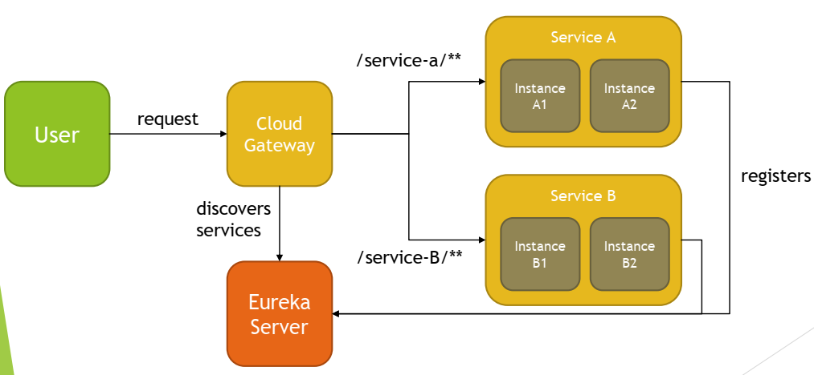
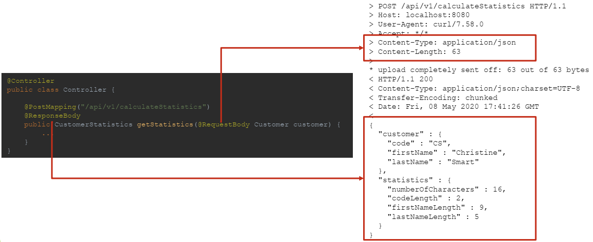
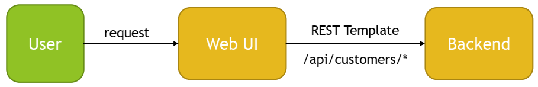

## Spring REST

### What does REST stand for?

REST stands for REpresentational State Transfer.

It is an architectural style of designing distributed applications, in which requesting system accesses and manipulates textual representations of Web resources by using a uniform and predefined set of stateless operations, given a set of constraints.

Web resources are made available through URIs (Uniform Resource Identifiers) and are accessed or modified, usually through HTTP operations.

For example:
- GET /customers
- GET /customers/1
- PUT /customers/6
- DELETE /customers/3

Most implementations of REST services are using HTTP as the application protocol, and JSON as format that moves data between caller and callee. However REST is not necessarily tied to HTTP or JSON.

REST defines constraints to be used for creating Web services, aligning with those constraints results in gaining non-functional properties of system, such as performance, scalability, simplicity, modifiability, visibility, portability, and reliability:
- Client-server architecture and Separation of Client-Server concerns
- Statelessness
- Cacheability
- Uniform interface
    - Resource identification in requests
    - Resource manipulation through representations
    - Self-descriptive messages
    - Hypermedia as the engine of application state
- Layered system
- Code on demand (optional)

Requesting system interacts with the target system, usually by HTTP requests which should follow those semantics:

HTTP Method + URI
verb + noun (plural form)

    GET     /customers
    GET     /customers/1
    PUT     /customers/6
    PATCH   /customers/7
    DELETE  /customers/3

REST services often allow you to perform all CRUD operations for specified resources:
- C – create
- R – read
- U – update
- D - delete

Following HTTP Methods are usually used with REST services:
- GET – fetch resource or collection of resources at the specified URI
- PUT – create new resource, or update existing resource at the specified URI
- PATCH – partially updates existing resource at the specified URI, for example update only firstName of Customer
- DELETE – delete resource at the specified URI
- POST – triggers operation at server or creates a new resource at the specified URI

Other HTTP Methods that REST service can support are: HEAD, CONNECT, OPTIONS, TRACE.

In case of request processing error, REST service should respond in a way for it to be easily to understand cause of issue. Error return to requester usually includes:
- HTTP Status Code
- Code ID
- Human readable error message that explains error

HTTP Status Code should fall within one of the groups:
- 1xx – Informational
- 2xx – Success
    - 200 OK
    - 201 Created
    - 204 No Content
- 3xx – Redirection
- 4xx - Client Error
    - 400 Bad Request
    - 401 Unauthorized
    - 403 Forbidden
    - 404 Not Found
- 5xx - Server Error
    - 500 Internal Server Error
    - 501 Not ImplementedQuestion

REST API should be backward compatible as long as possible, in case of introducing breaking change, one of versioning methods should be used:
- URI versioning
    - /api/v1/products
- Query string versioning
    - /api/products?version=1
- Header versioning
    - /api/products
    - Header - Accepts-version: 1.0
- Media type content negotiation versioning
    - /api/products
    - Header - Accept: application/vnd.my-app.v1+json

### What is a resource?

Resource is a named information available via URI. It can be a document, image, video, text file, etc. REST uses different form of presentation of resources, and client can specify format in which Resource should be made available, for example JSON, XML, Text, Html etc.

Resource can be made available as single resource or collection of resources. Resources can also have relationship with each other, often used relation is “contained in” expressed by sub-collections.

REST usually provides set of methods that can be used to manipulate resources, like HTTP GET, POST, PUT, DELETE etc.

    http://localhost:8080/customers/1
    http://localhost:8080/customers/1/addresses
    http://localhost:8080/customers/1/addresses/2
    http://localhost:8080/addresses/2/customer

### What does CRUD mean?

CRUD stands for:
- Create
- Read
- Update
- Delete

those are basic operations of data store. All of those, or subset of them may be implemented in REST service.

When using HTTP as application layer in REST, following HTTP methods are used for implementation:
- Create -> HTTP POST / HTTP PUT
- Read -> HTTP GET
- Update -> HTTP PUT / HTTP PATCH
- Delete -> HTTP DELETE

Here are example conventions often used when implementing CRUD in REST.
|URI| GET| POST| PUT| DELETE|
|---|---|---|---|---|
|/customers| Retrieve all customers| Create new customer|Bulk update customers|Delete all customers|
|/customers/1 |Retrieve specific customer|N/A |Update existing customer|Delete specific customer|
|/customers/1/addresses | Retrieve addresses assigned to customer|Create new address assigned to customer|Bulk update addresses for customer|Delete all addresses assigned to customer|

### Is REST secure? What can you do to secure it?

REST as an architectural style of developing distributed applications, does not enforce any security rules or solutions on it’s own, so by default REST is not secured.

However, since it suggests layered approach to system design, security can be added later in the process.

In Spring, this can be easily achieved by using Spring REST and Spring Security module.

To secure REST API, you can do following:
- Protect in-transit traffic by using HTTPS protocol
- Use some form of Authentication (Basic, JSON Tokens, ...)
- Use some form of Authorization (Spring Roles)

### Is REST scalable and/or interoperable?

Is REST scalable? - YES
Is REST interoperable? - YES

Scalability of RESTful Service is a result of developing software with following characteristics in mind:
- **Statelessness** - each request to the system, should be design in a way, for it to be processed without having to keep any state at the backend side, for example, we want to avoid keeping information in HTTP Session related to user conversation with the system, this way we can delegate request to any backend node that can process the request without having to introduce share state between nodes
- **Layered Approach** – layered approach to the system design means that we can introduce new parts of the system in a way for it to be transparent to the client, resulting in ability to change system without having to modify client, example of this can be introduction of Application Load Balancer, API Gateway, Security Layers, Web Application Firewall without having to change client at all
- **Cacheability** – allows to create response for repeatable requests, without having to process them on service side, caching is introduced to improve response time and to reduce load on the service

Scalability that can be achieved by statelessness of RESTful Service is especially visible in Microservice Architecture, that can be created with usage of Spring Cloud Components. Layered Approach allows introduction of additional components without changing client application.



REST Service is interoperable because:
- Access to REST Service and resources available by URIs is standardized and not coupled with any specific technology, allowing you to consume REST Service in any technology of choice, like JavaScript, Python, Java, C++ etc.
- Data for the requested resource can be sent to client in different formats specified by the client, in case of HTTP protocol this can be done with usage of Accept header, for example `Accept: application/json` or `Accept: application/xml`
- All CRUD operations can be handled with standardized approach, in case of RESTful Service implemented with HTTP protocol, standardized HTTP methods `GET`, `PUT`, `PATCH`, `POST`, `DELETE` are used

### Which HTTP methods does REST use?

REST uses following HTTP methods:
- GET – used to implement Read Operations – fetch existing resource or list of resources
- POST – used to implement Create Operations – adding new element
- PUT – used to implement Create or Update Operations – Bulk Update or Update of existing resource
- PATCH – partial update of existing resource of the system, for example, when wanting to update only First Name of Customer entity
- DELETE – delete existing resource in the system

REST assumes some conventions when implementing HTTP methods handlers.
|URI| GET| POST| PUT| DELETE|
|---|---|---|---|---|
|/customers| Retrieve all customers| Create new customer|Bulk update customers|Delete all customers|
|/customers/1 |Retrieve specific customer|N/A |Update existing customer|Delete specific customer|
|/customers/1/addresses | Retrieve addresses assigned to customer|Create new address assigned to customer|Bulk update addresses for customer|Delete all addresses assigned to customer|

### What is an HttpMessageConverter?

`HttpMessageConverter` is an interface used by Spring to convert data between different formats.

REST client can specify expected format in which data should be retrieved by usage of `Accept Header`, for example `Accept: application/json`. Client can also specify format in which data will be send by usage of `Content-Type Header`, for example `Content-Type: application/xml`.

Spring keeps list of `HttpMessageConverters` and for each request, data formats requested are being analyzed and cross referenced with methods implemented in Controllers. Whenever match is found Spring executes proper Controller Method and picks HttpMessageConverter to perform data conversion.

Request Mapping annotations contains `produces` and `consumes` fields which can be used to specify `MediaType` which method can handle. 

Having method identified `HttpMessageConverter` is used to:
- Convert `HttpInputMessage` to desired Type
- Convert Type to `HttpOutputMessage`

`HttpMessageConverter` interface specifies contract for following behaviors:
- `canRead` - indicates whether given MediaType can be read by converter
- `canWrite` - indicates whether given MediaType can be written by converter
- `getSupportedMediaTypes` - returns supported list of MediaTypes
- `read` – Converts HttpInputMessage to Type
- `write` – Converts Type to HttpOutputMessage

You can register custom `HttpMessageConverters` by implementing `WebMvcConfigurer`.

```java
@Configuration
public class WebConfiguration implements WebMvcConfigurer {
    @Override
    public void configureMessageConverters(List<HttpMessageConverter<?>> converters) {
    ...
    }
}
```

When using Spring Boot, most `HttpMessageConverters` will be registered automatically. Automatic registration is implemented in `HttpMessageConvertersAutoConfiguration`, and default list of converters is created inside `WebMvcConfigurationSupport.addDefaultHttpMessageConverters`.

Commonly used `HttpMessageConverters` are:
- MappingJackson2HttpMessageConverter
- MappingJackson2XmlHttpMessageConverter
- Jaxb2RootElementHttpMessageConverter
- FormHttpMessageConverter
- RssChannelHttpMessageConverter
- AtomFeedHttpMessageConverter
- StringHttpMessageConverter
- ByteArrayHttpMessageConverter

### Is REST normally stateless?

Yes, REST is normally stateless.

Statelessness is one of the basic constraints for Systems following RESTful Architecture.

Each request from client should contain all required information to handle the request.

If system is unable to process each request independently, because of state being required on server side, then such system is no longer RESTful System since it violates one of the basic principal of RESTful Architecture. 

If some kind of state is required for the request, client should send this state with each request, however this state should not be kept on server side, for example, state should not be kept in HTTP session.

### What does @RequestMapping do?

@RequestMapping allows you to specify conditions that request has to match for a method to be used as request handler. @RequestMapping can be used at class or method level, when used at the class level, all method level mappings inherit this primary mapping, narrowing it to a specific handler method.

For example, below controllers are supposed to map GET /say/hello requests, even though request mapping is defined differently, all are equal.

```java
@RestController
@RequestMapping("/say/hello")
public class HelloController {
    @RequestMapping(method = GET)
    public ResponseEntity<String> sayHello() {
        return ResponseEntity.ok().body("Hello");
    }
}
```

```java
@RestController
@RequestMapping(path = "/say", method = GET)
public class HelloController {
    @RequestMapping("/hello")
    public ResponseEntity<String> sayHello() {
        return ResponseEntity.ok().body("Hello");
    }
}
```

```java
@RestController
public class HelloController {
    @RequestMapping(path = "/say/hello", method = GET)
    public ResponseEntity<String> sayHello() {
        return ResponseEntity.ok().body("Hello");
    }
}
```

`@RequestMapping` annotation allows you to specify following criteria for request:
- `path` - uri path/paths for request, for example `/api/books`
- `method` – supported HTTP method/methods: `GET`, `POST`, `HEAD`, `OPTIONS`, `PUT`, `PATCH`, `DELETE`, `TRACE`
- `params` – required parameters of request, for example `key1=value1, key2!=value2, key1, !key1`
- `headers` – header needs to match specified condition, for example `header1=value1, header2!=value2, header1, !header1, content-type=text/*`
- `consumes` – media types that can be consumed by request, for example `application/json`
- `produces` – media types that are produced by method handling the request, for example `application/pdf`

Spring also supports composed annotations for request mapping:
- `@GetMapping`
- `@PostMapping`
- `@PutMapping`
- `@PatchMapping`
- `@DeleteMapping`

Each of those annotations allows you to specify same conditions as `@RequestMapping` except for HTTP method field, following fields in `@*Mapping` are aliases to `@RequestMapping`: `path`, `params`, `headers`, `consumes`, `produces`.

In most of the cases it is possible to translate mappings between those annotations, one example when this is not possible is when creating `HTTP HEAD` request mapping.

```java
@RestController
public class HelloController {
    @RequestMapping(path = "/say/hello", method = GET)
    public ResponseEntity<String> sayHello() {
        return ResponseEntity.ok().body("Hello");
    }
}
```

```java
@RestController
public class HelloController {
    @GetMapping(path = "/say/hello")
    public ResponseEntity<String> sayHello() {
        return ResponseEntity.ok().body("Hello");
    }
}
```

### Is @Controller a stereotype? Is @RestController a stereotype? What is a stereotype annotation? What does that mean?

`@Controller` annotation and `@RestController` annotation are stereotypes.

Stereotypes are annotations applied to classes to describe role which will be performed by this class.

Types of stereotypes:
- `@Component` - generic component in the system, root stereotype, candidate for autoscanning
- `@Service` - class will contain business logic
- `@Repository` - class is a data repository (used for data access objects, persistence)
- `@Controller` - class is a controller, usually a web controller
- `@RestController` – class is a controller that will implement REST Service Endpoints, usually consuming and producing json

### What is the difference between @Controller and @RestController?

`@Controller` annotation indicates that class will be assigned with Controller role of MVC pattern, and usually it is expected from it to return Model and View that will be used to render response, with usage of configured template engine (Thymeleaf).

`@RestController` annotation indicates that class will be used to handle REST Service Endpoint requests, it is expected from it to correctly handle requests input and produce outputs in acceptable format like JSON/XML etc. Serialized output is sent directly to the client.
```
@RestController = @Controller + @ResponseBody
```
`@ResponseBody` annotation indicates that method return value should be bound to the web response body, it’s return value will be serialized into response in requested format.

### When do you need @ResponseBody?

`@ResponseBody` annotation is needed whenever you want spring to return serialized response of controller method return value, instead of returning model and view that will be used by template engine to produce response. `@ResponseBody` annotation bounds method return value to the web response body, produced by `HttpMessageConverter`.

`@ResponseBody` annotation can be used:
- On top of class
- On top of method
- On top of other annotations

`@ResponseBody` annotation is useful when implementing backend service API, for example REST Service. Usage of this annotation is not needed when using `@RestController` annotation, since this one already contains `@ResponseBody` annotation.

### What are the HTTP status return codes for a successful GET, POST, PUT or DELETE operation?
- GET
    - 200 (OK) – when asked about existing resource for which content is returned
- POST
    - 201 (Created) – when new resources was created
    - 200 (OK) – when some processing was executed but resources were not created
    - 204 (No Content) – when some processing was executed, but no response is retrieved
- PUT
    - 201 (Created) – when new resources was created
    - 200 (OK) – when resources was updated, and updated content is returned
    - 204 (No Content) – when resource was updated, and no content is returned
- DELETE
    - 204 (No Content) – when resource was successfully deleted

In case of asynchronous operations, 202 (Accepted) may be retuned with Location header indicating URI that can be used for pooling.

### When do you need @ResponseStatus?

`@ResponseStatus` annotation is required whenever you want to override default HTTP status returned from controller handler method.

This can be achieved by applying `@ResponseStatus` annotation to:
- Controller class
- Controller method
- Exception being thrown from controller

@ResponseStatus annotation allows you to set:
- HTTP Status Code
- Reason message to be used in response in case of error

### Where do you need @ResponseBody and @RequestBody?

`@ResponseBody` annotation is needed whenever you want to return serialized response of controller handler method, instead of returning model and view that will be used by template engine to produce response. `@ResponseBody` annotation will bind method return value to web response body and will use `HttpMessageConverter`. (also consider using `@RestController` annotation).

`@RequestBody` annotation is needed whenever you want to bind web request body to controller parameter. `HttpMessageConverter` is used to convert content of request body. Optionally can be used with `@Valid` annotation to invoke automatic Bean Validation (JSR 303/JSR 380). Also, `@RequestBody` annotation allows you to set required field to indicate if parameter is required or not.

`@ResponseBody` annotation can be used:
- On top of class
- On top of method
- On top of other annotations

`@RequestBody` annotation can be used:
- On top of controller method parameter



### If you saw example Controller code, would you understand what it is doing? Could you tell if it was annotated correctly?

Controller can be defined in one of following ways:
- `@Controller` – Spring MVC Controller, should return view name and model
- `@RestController` – REST API Controller

    ```
    @RestController = @Controller + @ResponseBody
    ```

Controller mapping can be defined with usage of one of following annotations:
- `@RequestMapping`
- Composed annotation:
    - `@GetMapping`
    - `@PostMappping`
    - `@PutMapping`
    - `@PatchMapping`
    - `@DeleteMapping`

Request parameter body can be mapped with usage of:
- `@RequstBody`
    - Additionally `@Valid` annotation can be used to trigger Bean Validation

Response can be bound to web response by:
- Usage of `@ResponseBody` annotation on top of `@Controller` or `@Controller` method
- Usage of `@RestController` annotation

Custom HTTP status can be provided for controller methods and exception with usage of `@ResponseStatus` annotation.

Request and URI parameters can be accessed with:
- `@RequestParam` - Servlet request parameters
- `@PathVariable` – access to URI template variables
- `@MatrixVariable` - access to name-value pairs in URI path segments, allows mapping variables from requests like `/employees/id=1;name=John`
- `@CookieValue` - bind the value of an HTTP cookie to a method argument in a controller
- `@RequestHeader` - access request header values or all header key and values when binding against a Map

Calls to controller can be intercepted, and custom exception handling can be implemented with one of:
- `@ExceptionHandler` – when applied at controller level method, acts as controller level exception handler
- `@ControllerAdvice` used together with `@ExceptionHandler` – global exception handler for all controllers, acts as global annotation driven call interceptor

```java
@RestController 
// @RestController annotation makes class discoverable Spring Bean
// that will handle API calls, also it informs spring that each value
// returned from method needs to be serialized

@RequestMapping("/api")
// @RequestMapping sets URI root for this REST controller

public class ApiController {

    // Controller should not contain any heavy logic, most of work
    // should be delegated to components/services/dao, Controllers
    // usually have colloborators injected
    @Autowired
    private CustomersDao customersDao;

    // Handler methods that handles calls to specific URIs registered
    // with one of request mapping annotation.
    @GetMapping("/customers")
    public Iterable<Customer> list() {
        ...
    }

    @PostMapping("/customers")
    public ResponseEntity<Customer> create(@RequestBody @Valid Customer customer, ...) {

    }
}
```

### Do you need Spring MVC in your classpath?

Yes, you need Spring MVC on classpath for REST API to work correctly.

Spring MVC is not required for compilation time, but is required during runtime.

REST API in Spring is build with usage of annotations like:
- `RestController`
- `RequestBody`
- `RequestMapping`
- `GetMapping`
- ...

All of those annotations are available in `spring-web` module which is not dependent on `spring-webmvc` module.

However for request to be mapped to `RestController`, `DispatcherServlet` has to be initialized, which is part of `spring-webmvc` module. This is the reason why `spring-webmvc` module is required on classpath.

### What Spring Boot starter would you use for a Spring REST application?

To create Spring REST application, use Spring Boot Web Starter.

```xml
<dependency>
    <groupId>org.springframework.boot</groupId>
    <artifactId>spring-boot-starter-web</artifactId>
</dependency>
```

Spring Boot Web Starter Maven pom.xml has following description:
```
Starter for building web, including RESTful, applications using Spring MVC. Uses Tomcat as the default embedded container.
```
Spring Boot Web Starter will automatically include:
- spring-web
- spring-webmvc
- spring-boot-starter-json
    - jackson-databind
    - ...
- spring-boot-starter-tomcat
    - tomcat-embed-core
    - ...
- ...

### What are the advantages of the RestTemplate?

RestTemplate is a synchronous HTTP client wrapper to perform HTTP requests. It exposes simple API over underlying HTTP client libraries:
- JDK HttpURLConnection
- Apache HttpComponents
- OkHttp
- ...

It supports:
- Automatic Object Serialization/Deserialization:
    - JAXB2, Jackson2, GSON, JSONB, ...
- Automatic HttpMessageConverters registration
- URI Templates
- Exchange Operation – send and retrieve, for example HTTP POST that takes input object and returns object
- HTTP GET for Object
- HTTP HEAD for Headers
- HTTP POST for Object
- HTTP PUT with Object
- HTTP PATCH for Object
- HTTP DELETE

RestTemplate has following advantages:
- Simplicity
- Automatic Object Serialization/Deserialization
- High-Level API allows you to focus on business side of operations
- Provides support for common HTTP GET, POST, PUT, PATCH, HEAD, OPTIONS, DELETE operations
- Flexibility:
    - Allows Custom Error Management with usage of ResponseErrorHandler
- Extendibility:
    - Allows to register custom HttpMessageConverters
    - Allows to register custom ClientHttpRequestFactory
- URI Templates Support
- Minimal amount of code required
- Automatic content type detection

Because of it’s simplicity, REST Template is often used in testing code, however it can be used as general purpose HTTP Client.
- Whenever using REST Template as HTTP Client, also consider Spring Cloud components if the purpose is to build distributed system



### If you saw an example using RestTemplate would you understand what it is doing?
RestTemplate API allows you to receive answer from Service being called by returning:
- Object that represents transferred data
- ResponseEntity
    - Status Code
    - HTTP Headers
    - Response Body
- HTTP Headers
- URI of created/posted object
- List of Allowed HttpMethods by using HTTP OPTIONS request

RestTemplate API can be categorized by HTTP request type, below is a list of commonly used operations:

- Generic (flexible)
    - exchange
        - executes HTTP request against given URI, sends request HttpEntity and returns the response as ResponseEntity
    - execute
        - executes HTTP request against given URI, prepares the request with the RequestCallback and reads response with ResponseExtractor
- HTTP GET
    - getForObject
    - getForEntity
- HTTP HEAD
    - headForHeaders
- HTTP POST
    - postForLocation
    - postForObject
    - postForEntity
- HTTP PUT
    - put
- HTTP PATCH
    - patchForObject
- HTTP DELETE
    -  delete
- HTTP OPTIONS
    - optionsForAllow

https://docs.spring.io/spring-framework/docs/5.1.6.RELEASE/javadoc-api/org/springframework/web/client/RestOperations.html

https://docs.spring.io/spring-framework/docs/5.1.6.RELEASE/javadoc-api/org/springframework/web/client/RestTemplate.html
