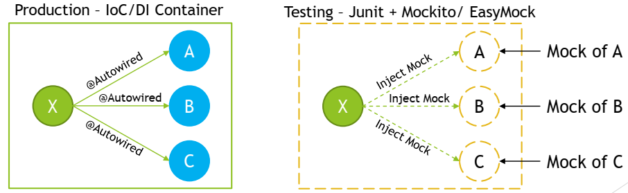
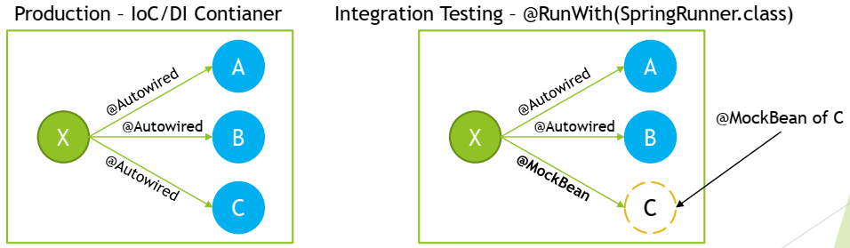
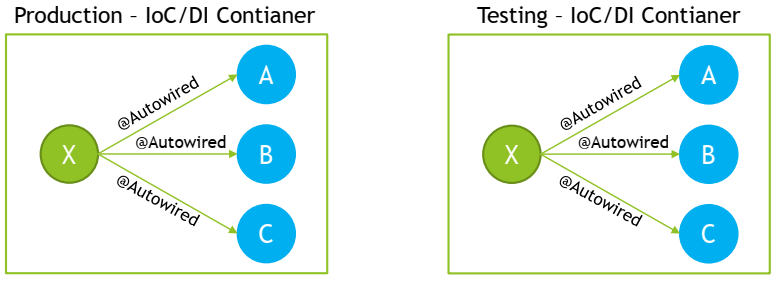
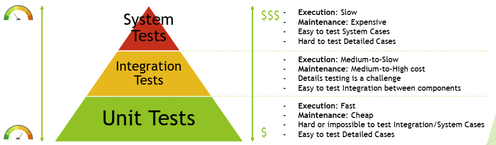
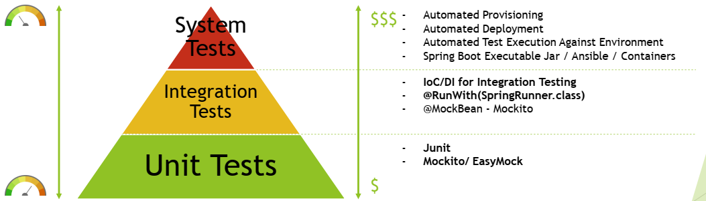
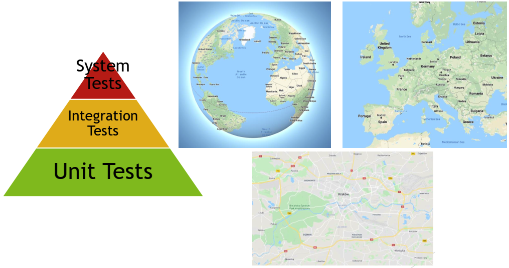
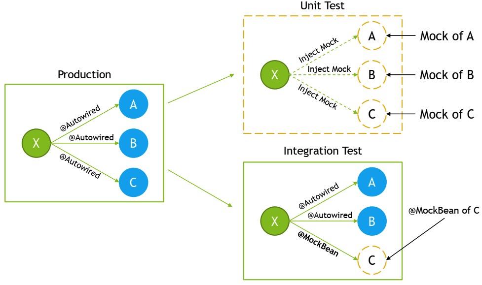

## Spring Test

### Do you use Spring in a unit test?

Spring Framework is usually not used in unit tests, however Spring contains some support for unit testing within following packages:
- `org.springframework.test.util`
    - `ReflectionTestUtils`
        - ORM Entities related testing – set value for private field, normally handled by ORM
        - Manual dependency injection into private field, normally handled by `@Autowired`, `@Inject`
        - `@PostConstruct` and `@PreDestroy` lifecycle callback methods testing
    - `AopTestUtils` – Aspect Oriented Programming Related Testing
- `org.springframework.test.web`
    - `ModelAndViewAssert` – Unit Testing for Spring MVC Controllers
- `org.springframework.mock.env`
    - mock implementations of the Environment and PropertySource
    - `MockEnvironment`, `MockPropertySource`
- `org.springframework.mock.jndi`
    - Mock implementation of JNDI SPI – usually used for Java EE
- `org.springframework.mock.web`
    - Servlet API mock objects

To get full understanding on why Spring is usually not used for unit tests,however some support for unit testing exists within framework, we need to get deeper into testing subject and understand differences between:
- Unit Tests
- Integration Tests
- System Tests

Having understanding on purpose and range of testing performed on each level will make it clear to know at which type of test Spring IoC/DI should be used and at which level only Spring Mocks should be used, without involving Spring IoC/DI.

Unit Tests should test one unit of functionality in isolation. This unit of functionality can be defined as single method, class, module, component. In Object Oriented Programming, unit of functionality is usually defined as single class. Testing in isolation, means that environment of execution is not initiated during testing and should not affect testing process, any dependencies on environment should be mocked. All class collaborators should be mocked as well. Testing should be performed outside of container, that means that IoC/DI should not be required to create instances of objects under test. Tests should execute successfully as out-of-container tests. 



Integration Tests should test multiple modules or components that are combined together. Those modules should be already unit tested, and on Integration Test level some subset of functionalities should be checked, to test if modules provide requested functionalities when cooperating together under environment that should be close to production one, however with assumptions that some of components might still be mocked. When performing Integration Test we want to initiate subset of system and execute test against it. IoC/DI Container is used for this kind of testing, with some simplification upon deployment or container execution.



System Tests should check required system functionality on fully running system, consisting of all modules and environment that is as close as possible to production one. System under System Tests level should already be checked on unit and integration test level, and on System level only subset of functionalities should be checked to fill the gaps that were not possible to test on unit and integration testing level. IoC/DI container is used with assumption that it is used in the same way as production environment.



In practice, large scale enterprise systems needs to have testing strategy defined to test system that is being developed in efficient manner. Often used strategy for test automation is “Testing Pyramid”. It assumes that Unit, Integration and System Tests are implemented, with right ratio on number of tests on each level.



On each level right set of tools should be used to perform testing, minimize costs and maximize feedback from automated tests.



In large scale projects, you need to have all types of tests implemented, as on each level you can look at different level of details of the system.



### What type of tests typically use Spring?

Integration Tests are type of tests that typically use Spring. Reason for it is that on Integrate Test level we want to test multiple components that are combined together, and we want to check if those components provide requested functionalities when cooperating together under environment that should be close to production one, however with assumptions that some of components might still be mocked. When performing Integration Test we want to initiate subset of system and execute test against it. IoC/DI Container is used for this kind of testing, with some simplification upon deployment or container execution. Dependencies are resolved and injected by Spring.



Spring provides great support for integration testing, with main goals of the support being:
- Management of Spring IoC container and IoC container caching between tests
    - Spring will create and manage IoC container for tests
    - Context can be reused between tests
    - Main purpose of context being reused is to improve tests execution time
    - Execution times of integration tests might be long mainly because of Embedded Database, Hibernate and other components that are created once context is created
- Dependency Injection in tests
    - Allows for easy Spring Test definition with usage of @RunWith(SpringRunner.class)
    - @ContextConfiguration can be used in tests to configure context
    - Support for @Autowired, @Inject ...
    - Allows customization with @TestExecutionListener
- Transaction management appropriate to integration testing
    - Resolves issue with test affecting each other on data level by implementing proper transaction management
    - By default, all transactions are roll-back transactions
    - Gives ability to commit transactions if required

Additionally Spring provides following tools to simplify Integration Testing:
- JDBC Testing Support
    - JdbcTestUtils provides JDBC related utility functions
    - countRowsInTable, countRowsInTableWhere, deleteFromTables, deleteFromTableWhere, ...
- Spring MVC Testing Support
    - Allow for easy setup with:
        - @RunWith(SpringRunner.class)
        - @WebAppConfiguration
        - @ContextConfiguration
    - Automatically creates MockMvc
- HtmlUnit Integration
    - Simplifies end-to-end testing for HTML views
- Client-Side REST Tests
    - Allows you to test Client code that interacts with mocked REST Service
    - Use RestTemplate with MockRestServiceServer to make assertions on mock

**Spring annotations for Integration Testing**

- **@ContextConfiguration**
    - Allows you to specify how to load and configure an ApplicationContext for integration tests
    - You can specify @Configuration classes that will be used during ApplicationContext loading
    - Optionally, you can specify XML configuration files locations, if you are using it instead of annotated @Configuration classes

    ```java
    @RunWith(SpringRunner.class)
    @ContextConfiguration(classes = ApplicationConfiguration.class)
    public class ApplicationServiceIntegrationTest {
        ...
    }
    ```

- **@BootstrapWith**
    - Allows for low-level control on how Context for Tests is created
    - To implement custom bootstrapped, it is best to extend AbstractTestContextBootstrapper
    - Used at class-level

- **@DirtiesContext**
    - Marks test as one that modifies state of context, and it means that context should be recreated prior next test execution because otherwise modified context state might affect test execution
        ```java
        @Test
        @DirtiesContext
        public void shouldBookAnyRoomForNewGuest() {
        ...
        }
        ```

    - When used at class-level you can specify following modes:
        - BEFORE_CLASS
        - BEFORE_EACH_TEST_METHOD
        - AFTER_EACH_TEST_METHOD
        - AFTER_CLASS
        
        ```java
        @DirtiesContext(classMode = AFTER_EACH_TEST_METHOD)
        ```

    - When used at method-level you can specify following modes:
        - BEFORE_METHOD
        - AFTER_METHOD

        ```java
        @DirtiesContext(methodMode = AFTER_METHOD)
        ```

- **@ActiveProfiles**
    - class-level annotation that is used to declare which bean definition profiles should be active when loading an ApplicationContext

        ```java
        @RunWith(SpringRunner.class)
        @ContextConfiguration(classes = ApplicationConfiguration.class)
        @ActiveProfiles({"test", "example-data"})
        public class ApplicationServiceIntegrationTest {
            ...
        }
        ```

- **@TestPropertySource**
    - class-level annotation that you can use to configure the locations of properties files and inlined properties

        ```java
        @TestPropertySource("/application-test.properties")
        ```
        ```java
        @TestPropertySource(properties = { "user = test-user", "group = test-group" })
        ```

- **@WebAppConfiguration**
    - class-level annotation that triggers creation of MockServletContext, which serves as the ServletContext for the test’s WebApplicationContext
    - Indicates that ApplicationContext loaded for an integration test should be a WebApplicationContext

        ```java
        @RunWith(SpringRunner.class)
        @ContextConfiguration
        @WebAppConfiguration
        public class ApplicationServiceIntegrationTest {
            ...
        }
        ```
- **@ContextHierarchy**
    - Used when hierarchy of application contexts has to be used for integration test
        ```java
        @RunWith(SpringRunner.class)
        @WebAppConfiguration
        @ContextHierarchy({
        @ContextConfiguration(classes = AppConfig.class),
        @ContextConfiguration(classes = WebConfig.class)
        })
        public class WebIntegrationTests {
        ...
        }
        ```

- **@TestExecutionListeners**
    - Allows registration of TestExecutionListener which allows for customization of test execution
    - Example of TestExecutionListener that is registered by default is DirtiesContextTestExecutionListener

        ```java
        @RunWith(SpringRunner.class)
        @ContextConfiguration(classes = ApplicationConfiguration.class)
        @TestExecutionListeners({
            CustomTestExecutionListener1.class,
            CustomTestExecutionListener2.class
        })
        public class ApplicationServiceIntegrationTest {
            ...
        }
        ```
- **@Commit**
    - class or method level annotation
    - indicates that after test execution, transaction should be committed
        ```java
        @Test
        @Commit
        public void shouldBookAnyRoomForNewGuest() {
            ...
        }
        ```

- **@Rollback**
    - class or method level annotation that indicates that transaction should be rolled back after test execution
    - Even if @Rollback is not explicitly defined, all transactions under tests will be rolled backed by default
        ```java
        @Test
        @Rollback
        public void shouldBookAnyRoomForNewGuest() {
        ...
        }
        ```
- **@BeforeTransaction**
    - Indicates method that should be executed before transaction is started
- **@AfterTransaction**
    - Indicates method that should be executed after transaction is started

- **@Sql**
    - Indicates SQL scripts that should be executed against database during integration test

        ```java
        @Test
        @Sql({
            "/test-schema.sql",
            "/test-data.sql"
        })
        public void shouldBookAnyRoomForNewGuest() {
            ...
        }
        ```
- **@SqlConfig**
    - Defines metadata used for SQL script parsing
        ```java
        @Test
        @Sql(
            scripts = "/test-user-data.sql",
            config = @SqlConfig(commentPrefix = "`", 
            separator = "@@")
        )
        public void shouldBookAnyRoomForNewGuest() {
            ...
        }
        ```

- **@SqlGroup**
    - Allows you to use multiple @Sql annotations
        ```java
        @Test
        @SqlGroup({
            @Sql(scripts = "/test-schema.sql", config = @SqlConfig(separator = "@@")),
            @Sql("/test-data.sql")
        })
        public void shouldBookAnyRoomForNewGuest() {
            ...
        }
        ```

### How can you create a shared application context in a JUnit integration test?

“Shared Application Context” can be considered as:
- Sharing Context Definition
- Sharing Context Instance

Context Definition can be shared between tests in following way:
- Use Base Class for All Tests which will contain `@ContextConfiguration` and other annotations, like for example `@ActiveProfiles` etc.
- Use Custom Annotation that will contain context configuration
- Use Test Configuration that Inherits Application Configuration
- Use Base Interface for all Tests that will contain context configuration

Context Instance is shared by default between all tests, as long as requested context matches one that is already cached.

Context will be reused as long as `@ContextConfiguration` (locations, classes, initializers, ...), `@ActiveProfiles`, `@TestPropertySource` attributes are matched. To see full list of attributes that needs to be matched, you can look at `MergedContextConfiguration` class that is used as key to `ContextCache`. You can use `@DirtiesContext` annotation to force Spring to create new instance of context for test.

### When and where do you use @Transactional in testing?
**When** - you use `@Transactional` annotation in testing whenever you want to run some part of the code that can alter state of transactional resource, for example database. Usage of this annotation allows you to mark code that should execute under transaction and allows to rollback all changes made by test, allowing other tests to pick from clear state.

By default, transaction will be rolled-back for each test which was executed with @Transactional annotation.

You can gain additional control over transaction when using @Transactional annotation with:
- @Rollback – explicitly state to rollback transaction
- @Commit - indicates that after test execution, transaction should be committed
- @BeforeTransaction - indicates method that should be executed before transaction is started
- @AfterTransaction - indicates method that should be executed after transaction is started

**Where** - @Transactional can be used:
- On top of the class – each test method in class will be executed in transaction
    ```java
    @RunWith(SpringRunner.class)
    @ContextConfiguration(classes = ApplicationConfiguration.class)
    @Transactional
    public class ApplicationServiceIntegrationTest {
        ...
    }
    ```
- On top of the method – test method will be executed in transaction

    ```java
    @RunWith(SpringRunner.class)
    @ContextConfiguration(classes = ApplicationConfiguration.class)
    public class ApplicationServiceIntegrationTest {
        @Transactional
        @Test
        public void shouldRegisterGuests() {
            ...
        }
    }
    ```
### How are mock frameworks such as Mockito or EasyMock used?

Mock Frameworks like Mockito or EasyMock are used mainly during Unit Testing to mock collaborators of classes under test. Mockito or EasyMock can be also used during Integration Testing when goal is to check cooperation between different objects, while still mocking part of the system.

Mock created with Mockito or EasyMock is a dynamic object, which can “pretend” real object and return predefined results when invoking method on it. Additionally Mock allows you to verify if expected method were indeed called with expected arguments.

Above frameworks also allows you to inject mocks to classes under test in convenient way, with usage of annotations, with style similar to IoC/DI without having to run within container at all, which is one of the reason why unit tests are so fast and lightweight.


Mockito usage in Unit Test – for full documentation go to https://site.mockito.org/

```java
// Specify Mockito Runner that will handle annotations
@RunWith(MockitoJUnitRunner.class) 
public class ApplicationServiceTest {
    ...

    // Specify Object under test to which mocks will be injected
    @InjectMocks
    private ApplicationService applicationService;

    // mocks
    @Mock
    private GuestRegistrationService guestRegistrationService;
    
    // mocks
    @Mock
    private BookingService bookingService;

    ...

    @Test
    public void shouldBookRoomAfterRegisteringUserAndConfirmingRoomAvailability() {
        // Stub Answers with when(...)
        when(bookingService.findAvailableRoom(DATE_2020_JULY_20)).thenReturn(Optional.of(room));
        when(guestRegistrationService.registerGuest(GUEST_TO_REGISTER)).thenReturn(registeredGuest);
        when(bookingService.bookRoom(room, registeredGuest, DATE_2020_JULY_20)).thenReturn(Optional.of(reservation));
        
        //Execute code
        BookingResult bookingResult = applicationService.bookAnyRoomForNewGuest(JOHN, DOE, DATE_2020_JULY_20);

        // verify(...) interactions
        verify(guestRegistrationService).registerGuest(GUEST_TO_REGISTER);
        verify(bookingService).bookRoom(room, registeredGuest, DATE_2020_JULY_20);
        assertEquals(ROOM_BOOKED, bookingResult.getBookingState());
        assertEquals(Optional.of(reservation), bookingResult.getReservation());
    }
}
```

Mockito usage in Integration Test – prefer usage of @MockBean when using Spring Boot

```java
//Use Spring IoC/DI for Integration Test
@RunWith(SpringRunner.class)
@ContextConfiguration(classes = ApplicationConfiguration.class)
public class ApplicationServiceIntegrationTest {
    
    // inject all dependencies from context
    @Autowired
    private ApplicationService applicationService;
    
    @Autowired
    private RoomRepository roomRepository;
    
    @Autowired
    private ReservationRepository reservationRepository;
    
    // Inject Mock from Configuration with Mock
    @Autowired
    private GuestSharableDataService guestSharableDataServiceMock;
    
    @Test
    public void shouldFetchGuestSharableData() {
        when(guestSharableDataServiceMock.getGuestSharableData()).thenReturn(SHARABLE_DATA);
        String guestSharableData = applicationService.getGuestSharableData();
        verify(guestSharableDataServiceMock).getGuestSharableData();
        assertEquals(SHARABLE_DATA, guestSharableData);
    }

    @Configuration
    public static class ApplicationServiceIntegrationTestMockConfiguration {
        
        // Create Mock manually as @Bean
        @Bean
        public GuestSharableDataService guestSharableDataService() {
            return mock(GuestSharableDataService.class);
        }
    }
}
```

EasyMock usage in Unit Test – for full documentation go to https://easymock.org/

```java
// Specify EasyMockRunner that will handle annotations
@RunWith(EasyMockRunner.class)
public class ApplicationServiceTest {
    
    ...

    // Specify Object under test to which mocks will be injected
    @TestSubject
    private ApplicationService applicationService;

    // Mocks
    @Mock
    private GuestRegistrationService guestRegistrationService;

    @Mock
    private BookingService bookingService;

    ...

    @Test
    public void shouldBookRoomAfterRegisteringUserAndConfirmingRoomAvailability() {
        // Stub Answers with expect()
        expect(bookingService.findAvailableRoom(DATE_2020_JULY_20)).andReturn(Optional.of(room));
        expect(guestRegistrationService.registerGuest(GUEST_TO_REGISTER)).andReturn(registeredGuest);
        expect(bookingService.bookRoom(room, registeredGuest, DATE_2020_JULY_20)).andReturn(Optional.of(reservation));

        replay(guestRegistrationService, bookingService);

        // Execute code
        BookingResult bookingResult = applicationService.bookAnyRoomForNewGuest(JOHN, DOE, DATE_2020_JULY_20);
        
        // verify(...) interactions
        verify(guestRegistrationService, bookingService);
        assertEquals(ROOM_BOOKED, bookingResult.getBookingState());
        assertEquals(Optional.of(reservation), bookingResult.getReservation());
    }
}
```

EasyMock usage in Integration Test

```java
// Use Spring IoC/DI for Integration test
@RunWith(SpringRunner.class)
@ContextConfiguration(classes = ApplicationConfiguration.class)
public class ApplicationServiceIntegrationTest {

    // Inject all dependencies from context
    @Autowired
    private ApplicationService applicationService;

    @Autowired
    private RoomRepository roomRepository;

    @Autowired
    private ReservationRepository reservationRepository;

    // Inject Mock from Configuration with Mock
    @Autowired
    private GuestSharableDataService guestSharableDataServiceMock;

    @Test
    @DirtiesContext
    public void shouldFetchGuestSharableData() {
        expect(guestSharableDataServiceMock.getGuestSharableData()).andReturn(SHARABLE_DATA);
        replay(guestSharableDataServiceMock);
        String guestSharableData = applicationService.getGuestSharableData();
        verify(guestSharableDataServiceMock);
        assertEquals(SHARABLE_DATA, guestSharableData);
    }

    @Configuration
    public static class ApplicationServiceIntegrationTestMockConfiguration {
        
        // Create Mock manually as @Bean
        @Bean
        public GuestSharableDataService guestSharableDataService() {
            return mock(GuestSharableDataService.class);
        }
    }
}
```

### How is @ContextConfiguration used?
`@ContextConfiguration` annotation is used on top of the class that represents Integration Test, and it’s purpose is to specify how to load and configure Application Context for Integration Test.

```java
@RunWith(SpringRunner.class)
@ContextConfiguration(classes = ApplicationConfiguration.class)
public class ApplicationServiceIntegrationTest {
    ...
}
```

`@ContextConfiguration` annotation can be used in two basic modes:
- Annotated Classes Based Approach
- XML Based Approach

When `@ContextConfiguration` annotation is used with Annotated Classes Approach, it is expected for classes field to point to class or list of classes that represents `@Configuration` classes, which will contain information about `@ComponentScan` or will provide @Bean(s).

```java
@RunWith(SpringRunner.class)
@ContextConfiguration(classes = ApplicationConfiguration.class)
public class ApplicationServiceIntegrationTest {
    ...
}
```

```java
@Configuration
@ComponentScan("com.app.example")
public class ApplicationConfiguration {
    
    ...
    
    @Bean
    public DataSource dataSource() {
    return new EmbeddedDatabaseBuilder()
        .generateUniqueName(true)
        .build();
    }
    
    ...
}
```

When `@ContextConfiguration` annotation is used with XML Based Approach, it is expected for `locations` field to point to context xml definitions or list of context xml definitions.

```java
@RunWith(SpringRunner.class)
@ContextConfiguration(locations = "/application-configuration.xml")
public class ApplicationServiceIntegrationTest {
    ...
}
```

```xml
<?xml version="1.0" encoding="UTF-8"?>
<beans xmlns="http://www.springframework.org/schema/beans"
    xmlns:xsi="http://www.w3.org/2001/XMLSchema-instance"
    xmlns:context="http://www.springframework.org/schema/context"
    xsi:schemaLocation="http://www.springframework.org/schema/beans
        http://www.springframework.org/schema/beans/spring-beans.xsd
        http://www.springframework.org/schema/context
        http://www.springframework.org/schema/context/spring-context.xsd">

    <context:component-scan base-package="com.app.example"/>

</beans>
```

Additionally `@ContextConfiguration` annotation also allows you to specify:
- initializers – list of `ApplicationContextInitializer`, used within cases that require some programmatic initialization of the application context
- loader – usually not used and default `DelegatingSmartContextLoader` is used, if required, this field allows you to specify custom context loader or one of the following:
    - GenericXmlContextLoader
    - GenericGroovyXmlContextLoader
    - AnnotationConfigContextLoader
    - GenericXmlWebContextLoader
    - GenericGroovyXmlWebContextLoader
    - AnnotationConfigWebContextLoader
    - ...
- name - name of the context hierarchy level represented by this configuration, only applicable when used within a test class hierarchy configured using `@ContextHierarchy`
- inheritLocations - whether or not xml locations or annotated classes from test superclasses should be inherited, default true
- inheritInitializers - whether or not context initializers from test superclasses should be inherited, default true

### How does Spring Boot simplify writing tests?

Spring Boot simplifies writing tests in following way:
- Provides `@SpringBootTest` annotation - alternative to `@ContextConfiguration`, creates `ApplicationContext` through `SpringApplication`, Enables Tests Auto-Configuration, Enables Spring Boot Test Features
- Provides `@MockBean` annotation – easy creation and injection of Mockito mock
- Provides `@SpyBean` annotation - easy creation and injection of Mockito spy
- Provides `@WebMvcTest` annotation - useful when test focuses only on Spring MVC components, disables full auto-configuration and applies only configuration relevant to MVC tests
- Provides Web Environments
    - MOCK (default)
    - RANDOM_PORT
    - DEFINED_PORT
    - NONE
- Provides algorithm for Tests Environment Auto-Configuration
    - Based on defined dependencies, beans, properties, resources provides beans necessary for integration tests
    - Allows you to focus on test content instead of focusing on how to configure specified technology for integration test
- Allows to explicitly use Auto-Configurations:
    - `@JsonTest` - Auto-configured JSON Tests
    - `@WebMvcTest` - Auto-configured Spring MVC Tests (context limited to MVC)
    - `@JdbcTest` - Auto-configured JDBC Tests
    - `@DataJpaTest` - Auto-configured Data JPA Tests
    - `@JooqTest` - Auto-configured jOOQ Tests
    - `@DataMongoTest` - Auto-configured Data MongoDB Tests
    - `@RestClientTest` - Auto-configured REST Clients
    - ...
- Provides `spring-boot-starter-test` module, which includes:
    - JUnit
    - Spring Test
    - Spring Boot Test
    - AssertJ - fluent assertion library.
    - Hamcrest - library of matcher objects
    - Mockito - mocking framework.
    - JSONassert - An assertion library for JSON
    - JsonPath - XPath for JSON
- Provides `@Conditional` annotations
    - `@ConditionalOnClass`
    - `@ConditionalOnMissingBean`
    - `@ConditionalOnProperty`
    - `@ConditionalOnResource`
    - `@ConditionalOnExpression`

### What does @SpringBootTest do? How does it interact with @SpringBootApplication and @SpringBootConfiguration?

`@SpringBootTest` annotation provides following features over regular Spring Test Context:
- Automatically searches for `@SpringBootConfiguration`
    - ...unless nested `@Configuration` is detected or explicit `@SpringBootTest(classes=...)` is specified
    - In most cases `@SpringBootConfiguration` is not explicitly used, it is inherited from `@SpringBootApplication` used in production code to indicate starting place for application
    - `@SpringBootConfiguration` is an alternative to standard `@Configuration`, advantage is that `@SpringBootConfiguration` can be found automatically in tests
- Sets default `ContextLoader` to `SpringBootContextLoader`
    - ...unless one is explicitly specified in `@ContextConfiguration(loader=...)`
    - `SpringBootContextLoader` is specific ContextLoader that starts tests using `SpringApplication`
- Provides Web Environments
    - MOCK (default)
    - RANDOM_PORT
    - DEFINED_PORT
    - NONE
- Allows to easily define `Environment` properties
    - properties field of `@SpringBootTest` annotation can be used to define `key=value` pairs that will be added to `Environment` before tests execution
- Registers `TestRestTemplate` and `WebTestClient`

`@SpringBootTest` annotation allows you to set following fields:
- `classes` - annotated classes to use for loading an `ApplicationContext`
    - If not set, `@SpringBootTest` will automatically search for `@SpringBootConfiguration` which is usually inherited from `@SpringBootApplication`
- `properties` - `key=value` pairs that will be added to `Environment` before tests execution
- `webEnvironment` – one of specified web environment used for web layer testing:
    - MOCK (default)
    - RANDOM_PORT
    - DEFINED_PORT
    - NONE

`@SpringBootTest` annotation interacts with `@SpringBootApplication` and `@SpringBootConfiguration` through `SpringBootTestContextBootstrapper` and SpringBootContextLoader.

Goal of `SpringBootContextLoader` is to transform initial `ContextConfiguration` to `ApplicationContext`. `SpringBootContextLoader` will get as input class annotated with `@SpringBootConfiguration`, which will be located by `SpringBootTestContextBootstrapper`.

Algorithm that searches for class annotated with `@SpringBootConfiguration` will start at package where test class is located and will scan this package and all parent packages in search for `@SpringBootApplication`.

`@SpringBootTest` annotation is used in following way:

```java
@RunWith(SpringRunner.class)
@SpringBootTest // Discovers @SpringBootApplication in the next code snippet
public class ApplicationServiceIntegrationTest {
    ...
}
```

```java
@SpringBootApplication
public class Runner {
    public static void main(String[] args) {
        SpringApplication.run(Runner.class, args);
    }
}
```

`@SpringBootApplication` definition - `@SpringBootApplication` inherits `@SpringBootConfiguration`

```java
...
@SpringBootConfiguration
...
public @interface SpringBootApplication {
    ...
}
```